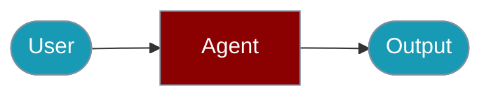

# Voice CLI Commands

The `praisonai-ts` CLI provides the `voice` command for text-to-speech and speech-to-text operations using OpenAI.


## Quick Start

<Steps>

<Step title="Simple Usage">

```typescript
import { createOpenAIVoice } from 'praisonai';

const voice = createOpenAIVoice();

// Text to speech
const audio = await voice.speak("Hello world", { voice: 'nova' });

// Speech to text
const text = await voice.listen(audioBuffer);
```

</Step>

<Step title="With Configuration">

See the sections below for advanced options.

</Step>

</Steps>

---

## Commands Overview

| Command | Description |
|---------|-------------|
| `voice speak <text>` | Convert text to speech |
| `voice transcribe <file>` | Transcribe audio file to text |
| `voice voices` | List available voices |
| `voice providers` | List voice providers |
| `voice help` | Show help |

## Text-to-Speech

Convert text to audio:

```bash
# Basic speech generation
praisonai-ts voice speak "Hello, how are you today?"

# Specify a voice
praisonai-ts voice speak "Welcome to PraisonAI" --voice nova

# Specify output file
praisonai-ts voice speak "Hello world" --file greeting.mp3

# JSON output
praisonai-ts voice speak "Test message" --json
```

**Example Output:**
```
✓ Speech saved to: speech_1705123456789.mp3
  Size: 45632 bytes
```

**JSON Output:**
```json
{
  "success": true,
  "data": {
    "text": "Hello world",
    "voice": "alloy",
    "file": "greeting.mp3",
    "size": 45632
  }
}
```

## Speech-to-Text

Transcribe audio files:

```bash
# Transcribe an audio file
praisonai-ts voice transcribe recording.mp3

# JSON output
praisonai-ts voice transcribe meeting.wav --json
```

**Example Output:**
```
Transcription

Hello, this is a test recording for the voice transcription feature.
```

**JSON Output:**
```json
{
  "success": true,
  "data": {
    "file": "recording.mp3",
    "text": "Hello, this is a test recording..."
  }
}
```

## List Voices

View available voice options:

```bash
praisonai-ts voice voices
praisonai-ts voice voices --json
```

**Available Voices:**

| Voice | Style | Best For |
|-------|-------|----------|
| `alloy` | Neutral, balanced | General purpose |
| `echo` | Warm, engaging | Conversational |
| `fable` | Expressive, dynamic | Storytelling |
| `onyx` | Deep, authoritative | Professional |
| `nova` | Friendly, bright | Customer service |
| `shimmer` | Clear, optimistic | Tutorials |

## Options

| Option | Description | Default |
|--------|-------------|---------|
| `--voice <name>` | Voice to use | `alloy` |
| `--file <path>` | Output file path | Auto-generated |
| `--json` | JSON output | `false` |

## Environment Variables

```bash
# Required for voice features
export OPENAI_API_KEY=sk-...
```

## SDK Usage

For programmatic voice usage:

```typescript
import { createOpenAIVoice } from 'praisonai';

const voice = createOpenAIVoice();

// Text to speech
const audio = await voice.speak("Hello world", { voice: 'nova' });

// Speech to text
const text = await voice.listen(audioBuffer);
```

For more details, see the [Voice SDK documentation](/docs/js/voice).

## Related

<CardGroup cols={2}>
  <Card title="Voice" icon="book" href="/docs/js/voice">Voice overview</Card>
  <Card title="Audio" icon="robot" href="/docs/js/audio">Audio overview</Card>
</CardGroup>
