Agents can browse the web - search, read pages, and extract information.

```mermaid
graph LR
    subgraph "Web Browsing"
        A[👤 User] --> B[🤖 Agent]
        B --> C[🌐 Web]
        C --> D[📝 Content]
    end
    
    classDef user fill:#6366F1,stroke:#7C90A0,color:#fff
    classDef agent fill:#F59E0B,stroke:#7C90A0,color:#fff
    classDef web fill:#10B981,stroke:#7C90A0,color:#fff
    
    class A user
    class B agent
    class C,D web
```



## Quick Start

<Steps>

<Step title="Search the Web">
```typescript
import { Agent } from 'praisonai';

const agent = new Agent({
  instructions: 'You research topics online',
  tools: ['web_search']
});

await agent.chat('What are the latest AI developments?');
// Agent searches and summarizes findings
```
</Step>

<Step title="Read Web Pages">
```typescript
const agent = new Agent({
  tools: ['web_search', 'read_url']
});

await agent.chat('Summarize the article at example.com/news');
// Agent reads and summarizes the page
```
</Step>

</Steps>

---

## User Interaction Flow


---

## Configuration Levels

```typescript
// Level 1: Array - Enable web tools
const agent = new Agent({
  tools: ['web_search']
});

// Level 2: String - Specify provider
const agent = new Agent({
  tools: ['web_search'],
  searchProvider: 'google'  // or 'bing', 'duckduckgo'
});

// Level 3: Dict - Full options
const agent = new Agent({
  web: {
    search: true,
    browse: true,
    maxResults: 10,
    timeout: 30000,
    allowedDomains: ['*.wikipedia.org', '*.github.com']
  }
});
```

---

## Web Tools

| Tool | Description |
|------|-------------|
| `web_search` | Search the internet |
| `read_url` | Read a specific webpage |
| `browse` | Navigate and interact |
| `screenshot` | Capture page images |

---

## Best Practices

<AccordionGroup>
  <Accordion title="Limit search results">
    10 results is usually enough - more adds noise.
  </Accordion>
  
  <Accordion title="Set timeouts">
    Slow pages shouldn't block the agent forever.
  </Accordion>
  
  <Accordion title="Filter domains">
    Restrict to trusted domains when possible.
  </Accordion>
</AccordionGroup>

---

## Related

<CardGroup cols={2}>
  <Card title="Tools" icon="wrench" href="/docs/js/tools">
    Agent tools
  </Card>
  <Card title="Knowledge" icon="brain" href="/docs/js/knowledge">
    Knowledge base
  </Card>
</CardGroup>
