Web tools let agents browse websites, scrape content, and interact with web pages.

```mermaid
graph LR
    subgraph "Web Capabilities"
        A[🤖 Agent] --> B[📄 Read Pages]
        A --> C[🔍 Search]
        A --> D[📊 Extract Data]
    end
    
    classDef agent fill:#6366F1,stroke:#7C90A0,color:#fff
    classDef web fill:#10B981,stroke:#7C90A0,color:#fff
    
    class A agent
    class B,C,D web
```



## Quick Start

<Steps>

<Step title="Add Web Tools">
```typescript
import { Agent, webTools } from 'praisonai';

const agent = new Agent({
  instructions: 'You can browse the web',
  tools: [webTools]
});
```
</Step>

<Step title="Read Web Pages">
```typescript
const summary = await agent.chat(
  'Read https://example.com and summarize the main points'
);
```
</Step>

<Step title="Web Search">
```typescript
const results = await agent.chat(
  'Search the web for "AI trends 2024" and summarize findings'
);
```
</Step>

</Steps>

---

## Web Capabilities

| Capability | Purpose |
|-----------|---------|
| Read pages | Get content from any URL |
| Search | Find information online |
| Extract data | Pull specific data from pages |
| Screenshots | Capture page visuals |

---

## Common Examples

### Research Task

```typescript
await agent.chat(`
  Research competitor pricing by visiting:
  - competitor1.com/pricing
  - competitor2.com/plans
  Create a comparison table.
`);
```

### News Monitoring

```typescript
await agent.chat('Check these news sites and alert me to any AI-related stories');
```

### Data Extraction

```typescript
await agent.chat('Extract all product names and prices from this catalog page');
```

---

## Best Practices

<AccordionGroup>
  <Accordion title="Respect rate limits">
    Don't make too many requests too quickly to avoid being blocked.
  </Accordion>
  
  <Accordion title="Handle dynamic content">
    Some pages require JavaScript. Use appropriate tools for dynamic sites.
  </Accordion>
</AccordionGroup>

---

## Related

<CardGroup cols={2}>
  <Card title="Tools" icon="wrench" href="/docs/js/tools">
    All agent tools
  </Card>
  <Card title="Knowledge" icon="brain" href="/docs/js/knowledge">
    Store extracted data
  </Card>
</CardGroup>
