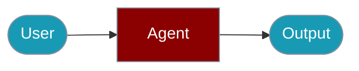

# Workflows CLI Commands

The `praisonai-ts` CLI provides the `workflow` command for executing multi-agent workflows.


## Quick Start

<Steps>

<Step title="Simple Usage">

```typescript
import { AgentFlow } from 'praisonai';

const flow = new AgentFlow('My Workflow')
  .step('research', async (input) => researcher.chat(`Research: ${input}`))
  .step('write', async (research) => writer.chat(`Write summary: ${research}`));

const { output } = await flow.run('AI trends');
```

</Step>

<Step title="With Configuration">

See the sections below for advanced options.

</Step>

</Steps>

---

## Execute Workflow

```bash
# Execute a workflow from YAML file
praisonai-ts workflow workflow.yaml

# Execute with parallel processing
praisonai-ts workflow workflow.yaml --parallel

# Get JSON output
praisonai-ts workflow workflow.yaml --json
```

## Workflow YAML Format

```yaml
# workflow.yaml
name: Research Workflow
agents:
  - name: Researcher
    instructions: Research the topic
  - name: Writer
    instructions: Write a summary

steps:
  - agent: Researcher
    task: Research AI trends
  - agent: Writer
    task: Summarize findings
```

## SDK Usage

For programmatic workflow execution:

```typescript
import { AgentFlow } from 'praisonai';

const flow = new AgentFlow('My Workflow')
  .step('research', async (input) => researcher.chat(`Research: ${input}`))
  .step('write', async (research) => writer.chat(`Write summary: ${research}`));

const { output } = await flow.run('AI trends');
```

For more details, see the [Workflows SDK documentation](/docs/js/workflows).

## Related

<CardGroup cols={2}>
  <Card title="Workflows" icon="book" href="/docs/js/workflows">Workflows overview</Card>
  <Card title="Agent Flow" icon="robot" href="/docs/js/agent-flow">Agent Flow overview</Card>
</CardGroup>
