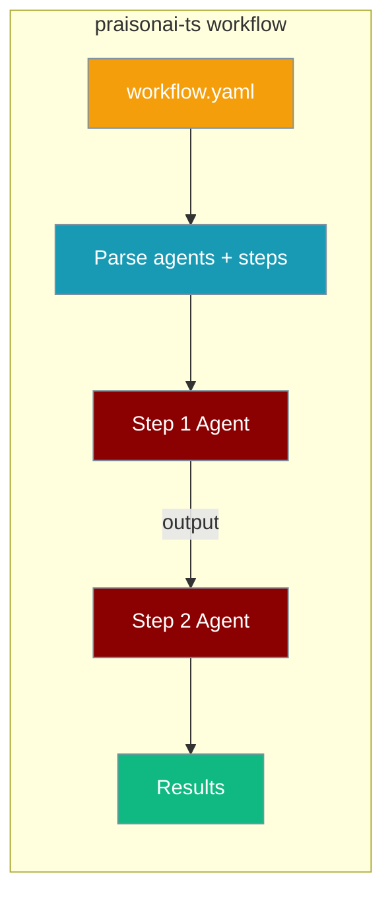
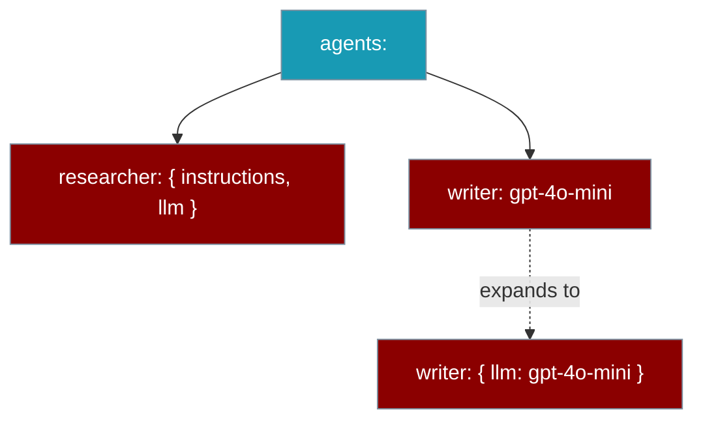
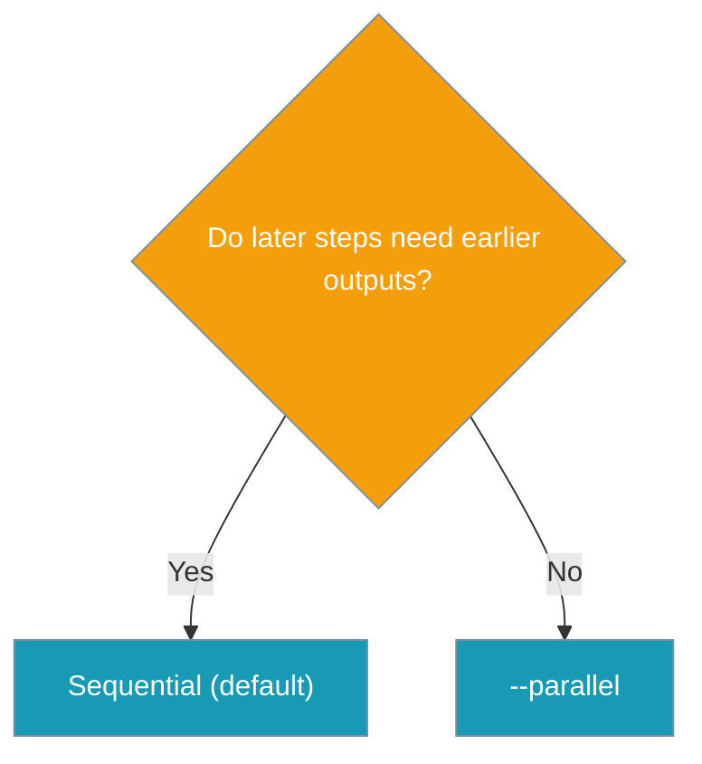

The `praisonai-ts workflow` command reads a YAML file, builds one agent per step, and runs each step against your model.


```mermaid
graph LR
    subgraph "praisonai-ts workflow"
        YAML["workflow.yaml"] --> Parse["Parse agents + steps"]
        Parse --> Step1["Step 1 Agent"]
        Step1 -->|output| Step2["Step 2 Agent"]
        Step2 --> Out["Results"]
    end

    classDef file fill:#F59E0B,stroke:#7C90A0,color:#fff
    classDef parse fill:#189AB4,stroke:#7C90A0,color:#fff
    classDef agent fill:#8B0000,stroke:#7C90A0,color:#fff
    classDef out fill:#10B981,stroke:#7C90A0,color:#fff

    class YAML file
    class Parse parse
    class Step1,Step2 agent
    class Out out
```

## Quick Start

<Steps>

<Step title="Write a workflow">

Save a minimal `wf.yaml` with one agent and one step.

```yaml
name: My Workflow
agents:
  writer: gpt-4o-mini
steps:
  - name: write
    agent: writer
    task: Write a two-line poem about the sea
```

</Step>

<Step title="Run it">

```bash
export OPENAI_API_KEY=...   # steps fail per-step without a key
praisonai-ts workflow wf.yaml
```

</Step>

</Steps>

---

## Workflow YAML

A workflow file has top-level metadata, an `agents:` map, and a `steps:` list.

```yaml
name: Research Workflow
description: Research and summarise a topic

# agents: is a MAP of agent-name -> definition (not a list).
agents:
  # Long form: instructions + llm (both optional).
  researcher:
    instructions: Research the topic and gather information.
    llm: gpt-4o
  # Shorthand: `<agent-name>: <llm>` is the same as `writer: { llm: <llm> }`.
  writer: gpt-4o-mini

steps:
  - name: research
    agent: researcher
    task: Research AI trends in healthcare
  - name: write
    agent: writer
    task: Write a two-paragraph summary
    # depends_on limits which prior outputs feed this step's prompt.
    depends_on: [research]
```

| Key | Type | Description |
|-----|------|-------------|
| `name` | `string` | Workflow name shown in output. |
| `description` | `string` | Optional summary printed before the run. |
| `agents` | `map` | Agent-name to definition. **Not a list.** |
| `steps` | `list` | Ordered steps, each with an `agent` and a `task`. |

<Warning>
`agents:` is a **map**, not a list. A list-of-`-` form such as `- name: Writer` will not register any agent, and every step that names a list-shaped agent is rejected.
</Warning>

---

## Agents block

Each entry maps an agent name to its definition, in long form or shorthand.


```mermaid
graph TB
    Agents["agents:"] --> Long["researcher: { instructions, llm }"]
    Agents --> Short["writer: gpt-4o-mini"]
    Short -.->|expands to| Short2["writer: { llm: gpt-4o-mini }"]

    classDef map fill:#189AB4,stroke:#7C90A0,color:#fff
    classDef agent fill:#8B0000,stroke:#7C90A0,color:#fff

    class Agents map
    class Long,Short,Short2 agent
```

| Field | Type | Default | Description |
|-------|------|---------|-------------|
| `instructions` | `string` | generic assistant prompt | Agent instructions. Falls back to `role`, then a generic fallback. |
| `llm` | `string` | CLI resolved `--model` | Model for this agent. Falls back to the CLI's resolved model. |

The shorthand `writer: gpt-4o-mini` is equivalent to `writer: { llm: gpt-4o-mini }`.

---

## Steps block

Each step names an agent, gives it a task, and optionally declares dependencies.

| Field | Type | Description |
|-------|------|-------------|
| `name` | `string` | Step name, used in output and as a `depends_on` target. |
| `agent` | `string` | Agent from the `agents:` map. If `agents:` is set, an unknown name is rejected. |
| `task` | `string` | The instruction for this step. Required. |
| `depends_on` | `list` | Prior step names whose outputs feed this step's prompt. |

Use inline-array syntax for dependencies. A bare `depends_on:` is an empty list.

```yaml
steps:
  - name: write
    agent: writer
    task: Write the summary
    depends_on: [research, outline]   # inline array
```

---

## Sequential vs parallel

Steps run in order by default; `--parallel` runs them all at once without shared context.


```mermaid
graph TB
    Q{Do later steps need earlier outputs?}
    Q -->|Yes| Seq["Sequential (default)"]
    Q -->|No| Par["--parallel"]

    classDef q fill:#F59E0B,stroke:#7C90A0,color:#fff
    classDef mode fill:#189AB4,stroke:#7C90A0,color:#fff

    class Q q
    class Seq,Par mode
```

| Mode | Behaviour |
|------|-----------|
| **Sequential** (default) | Steps run in declaration order. Each step's prompt is prefixed with its `depends_on` outputs if declared, otherwise with every earlier step's output. A failed step **stops** the run. |
| **`--parallel`** | All steps run together, **without shared context** — each step sees only its own `task`. Outcomes are recorded independently and one failure does not cancel the others. |

```bash
# Sequential (default)
praisonai-ts workflow wf.yaml

# Parallel, no shared context
praisonai-ts workflow wf.yaml --parallel
```

---

## Failure and exit codes

The command rejects wrong-schema files and reports step failures with specific exit codes.

| Situation | Exit | Message shape |
|-----------|------|---------------|
| One or more sequential steps failed | `5` / `4` / `3` / `1` | `"N of M step(s) failed: step_name: <error>; ..."` |
| File yields no steps (bad YAML, wrong shape, empty `steps:`) | `1` | `"No steps found in <file>. A workflow needs a 'steps:' list, each entry naming an 'agent' and a 'task'."` |
| Scalar `steps: not-a-list` value | `1` | Same "no steps" message |
| A step references an agent not in `agents:` | `1` | `"Step '<name>' references agent '<x>', which is not defined in the workflow's 'agents:' block."` |
| A step has no `task` | `1` | `"Step '<name>' has no 'task' to run"` |
| All steps succeed | `0` | Success output |

<Note>
Step-failure exit codes are classified from the underlying error message: a missing API key (the common case) maps to `5`, a network error to `4`, a config error to `3`, and anything else to `1`. Schema rejections always exit `1` before any agent is built — so in CI, a non-`1` failure means the file was valid but a step failed at runtime.
</Note>

---

## Command reference

Run a workflow file with optional parallel and JSON flags.

```bash
praisonai-ts workflow <file> [--parallel] [--json] [--verbose] [--model <model>]
```

| Option | Description |
|--------|-------------|
| `<file>` | Path to the workflow YAML file (positional, required). |
| `--parallel` | Run all steps at once without shared context. |
| `--json` | Emit JSON, including per-step `{ status, output }` or `{ status, error }`. |
| `--verbose` | Print extra detail, including stack traces on failure. |
| `--model` | Override the resolved model for steps that omit `llm`. |

JSON output records each step under `results`:

```json
{
  "success": true,
  "data": {
    "workflow": "Research Workflow",
    "steps": 2,
    "results": {
      "research": { "status": "completed", "output": "..." },
      "write": { "status": "completed", "output": "..." }
    }
  }
}
```

---

## Related

<CardGroup cols={2}>
  <Card title="Workflows (SDK)" icon="book" href="/js/workflows">Build workflows in code with AgentFlow and the YAML workflow engine.</Card>
  <Card title="Agent Flow" icon="robot" href="/js/agent-flow">Chain steps programmatically with AgentFlow.</Card>
  <Card title="Python Workflow CLI" icon="terminal" href="/cli/workflow">The Python `praisonai workflow` command for cross-language users.</Card>
</CardGroup>
