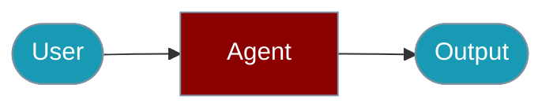

# Agent Workflows

<Note>
`AgentFlow` is now the primary class name (v1.5.5+). `Workflow` and `Pipeline` are silent aliases. See [AgentFlow](/js/agent-flow) for the latest documentation.
</Note>

Workflows let you orchestrate multiple Agents in complex pipelines. Chain Agents sequentially, run them in parallel, or route to different Agents based on conditions.


## Quick Start

<Steps>

<Step title="Simple Usage">

```typescript
import { Agent, AgentFlow } from 'praisonai';

const researcher = new Agent({
  name: 'Researcher',
  instructions: 'Research topics and gather information.'
});

const writer = new Agent({
  name: 'Writer',
  instructions: 'Write clear, engaging content.'
});

const editor = new Agent({
  name: 'Editor',
  instructions: 'Review and improve writing quality.'
});

// Chain Agents in a workflow
const contentPipeline = new AgentFlow('content-creation')
  .step('research', async (topic) => {
    return await researcher.chat(`Research: ${topic}`);
  })
  .step('write', async (research) => {
    return await writer.chat(`Write an article based on: ${research}`);
  })
// ...
```

</Step>

<Step title="With Configuration">

See the sections below for advanced options.

</Step>

</Steps>

---

## Sequential Agent Pipeline

```typescript
import { Agent, AgentFlow } from 'praisonai';

const researcher = new Agent({
  name: 'Researcher',
  instructions: 'Research topics and gather information.'
});

const writer = new Agent({
  name: 'Writer',
  instructions: 'Write clear, engaging content.'
});

const editor = new Agent({
  name: 'Editor',
  instructions: 'Review and improve writing quality.'
});

// Chain Agents in a workflow
const contentPipeline = new AgentFlow('content-creation')
  .step('research', async (topic) => {
    return await researcher.chat(`Research: ${topic}`);
  })
  .step('write', async (research) => {
    return await writer.chat(`Write an article based on: ${research}`);
  })
  .step('edit', async (draft) => {
    return await editor.chat(`Edit and improve: ${draft}`);
  });

const { output } = await contentPipeline.run('AI in healthcare');
// Output: Polished article that went through research → writing → editing
```

## Parallel Agent Execution

Run multiple Agents simultaneously:

```typescript
import { Agent, parallel } from 'praisonai';

const sentimentAgent = new Agent({
  name: 'Sentiment Analyzer',
  instructions: 'Analyze sentiment of text.'
});

const summaryAgent = new Agent({
  name: 'Summarizer',
  instructions: 'Create concise summaries.'
});

const keywordAgent = new Agent({
  name: 'Keyword Extractor',
  instructions: 'Extract key topics and keywords.'
});

// All three Agents run concurrently
async function analyzeDocument(document: string) {
  const [sentiment, summary, keywords] = await parallel([
    async () => sentimentAgent.chat(document),
    async () => summaryAgent.chat(document),
    async () => keywordAgent.chat(document)
  ]);
  
  return { sentiment, summary, keywords };
}

const analysis = await analyzeDocument('Long document text...');
// All three analyses complete in parallel
```

## Agent Router Workflow

Route to different Agents based on conditions:

```typescript
import { Agent, route } from 'praisonai';

const techAgent = new Agent({
  name: 'Tech Support',
  instructions: 'Handle technical issues.'
});

const billingAgent = new Agent({
  name: 'Billing Support',
  instructions: 'Handle billing inquiries.'
});

const generalAgent = new Agent({
  name: 'General Support',
  instructions: 'Handle general questions.'
});

const classifierAgent = new Agent({
  name: 'Classifier',
  instructions: 'Classify queries as: technical, billing, or general. Return only the category.'
});

async function routeQuery(query: string) {
  // First, classify the query
  const category = await classifierAgent.chat(query);
  
  // Route to appropriate Agent
  return await route([
    {
      condition: () => category.includes('technical'),
      execute: async () => techAgent.chat(query)
    },
    {
      condition: () => category.includes('billing'),
      execute: async () => billingAgent.chat(query)
    }
  ], async () => generalAgent.chat(query)); // Default
}

await routeQuery('My payment failed'); // → Billing Agent
await routeQuery('App keeps crashing'); // → Tech Agent
```

## Agent Loop (Iterative Refinement)

Have an Agent iterate until satisfied:

```typescript
import { Agent, loop } from 'praisonai';

const writerAgent = new Agent({
  name: 'Writer',
  instructions: 'Write content based on feedback.'
});

const reviewerAgent = new Agent({
  name: 'Reviewer',
  instructions: 'Review content. Return "APPROVED" if good, or specific feedback for improvement.'
});

async function iterativeWriting(topic: string) {
  let draft = await writerAgent.chat(`Write about: ${topic}`);
  
  const finalDraft = await loop(
    async (iteration) => {
      const review = await reviewerAgent.chat(`Review this draft:\n${draft}`);
      
      if (review.includes('APPROVED')) {
        return { draft, approved: true };
      }
      
      // Refine based on feedback
      draft = await writerAgent.chat(`Improve this draft based on feedback:\nDraft: ${draft}\nFeedback: ${review}`);
      return { draft, approved: false };
    },
    (result, iteration) => !result.approved && iteration < 5 // Max 5 iterations
  );
  
  return finalDraft[finalDraft.length - 1].draft;
}
```

## Multi-Agent Workflow with Context

Share context between Agents in a workflow:

```typescript
import { Agent, AgentFlow } from 'praisonai';

const dataAgent = new Agent({
  name: 'Data Analyst',
  instructions: 'Analyze data and extract insights.'
});

const strategyAgent = new Agent({
  name: 'Strategist',
  instructions: 'Create strategies based on data insights.'
});

const reportAgent = new Agent({
  name: 'Report Writer',
  instructions: 'Write executive reports.'
});

const analysisWorkflow = new AgentFlow('business-analysis')
  .addStep({
    name: 'analyze',
    execute: async (data, context) => {
      const insights = await dataAgent.chat(`Analyze: ${JSON.stringify(data)}`);
      context.set('insights', insights);
      return insights;
    }
  })
  .addStep({
    name: 'strategize',
    execute: async (insights, context) => {
      const strategy = await strategyAgent.chat(`Create strategy for: ${insights}`);
      context.set('strategy', strategy);
      return strategy;
    }
  })
  .addStep({
    name: 'report',
    execute: async (strategy, context) => {
      const insights = context.get('insights');
      return await reportAgent.chat(`
        Write executive report:
        Insights: ${insights}
        Strategy: ${strategy}
      `);
    }
  });

const { output, context } = await analysisWorkflow.run(salesData);
```

## Conditional Agent Steps

Skip Agents based on conditions:

```typescript
import { Agent, AgentFlow } from 'praisonai';

const translatorAgent = new Agent({
  name: 'Translator',
  instructions: 'Translate content to English.'
});

const processorAgent = new Agent({
  name: 'Processor',
  instructions: 'Process the content.'
});

const workflow = new AgentFlow('conditional-processing')
  .addStep({
    name: 'translate',
    condition: (context) => context.metadata.language !== 'en',
    execute: async (input) => translatorAgent.chat(`Translate to English: ${input}`)
  })
  .addStep({
    name: 'process',
    execute: async (input) => processorAgent.chat(input)
  });

// Translation step skipped for English content
await workflow.run('Hello world', { metadata: { language: 'en' } });

// Translation step runs for non-English
await workflow.run('Bonjour le monde', { metadata: { language: 'fr' } });
```

## Agent Workflow with Error Handling

Handle Agent failures gracefully:

```typescript
import { Agent, AgentFlow } from 'praisonai';

const primaryAgent = new Agent({
  name: 'Primary',
  instructions: 'Handle requests.'
});

const fallbackAgent = new Agent({
  name: 'Fallback',
  instructions: 'Handle requests when primary fails.'
});

const resilientWorkflow = new AgentFlow('resilient')
  .addStep({
    name: 'primary',
    execute: async (input) => primaryAgent.chat(input),
    onError: 'skip',
    maxRetries: 2
  })
  .addStep({
    name: 'fallback',
    condition: (context) => context.get('primary') === undefined,
    execute: async (input) => fallbackAgent.chat(input)
  });
```

## Workflow Patterns

| Pattern | Use Case |
|---------|----------|
| **Sequential** | Research → Write → Edit |
| **Parallel** | Analyze sentiment + Extract keywords + Summarize |
| **Router** | Route to Tech/Billing/General support |
| **Loop** | Iterative refinement until quality threshold |
| **Conditional** | Skip translation for English content |

## Control-Flow Patterns

The control-flow patterns from the Python SDK (`when`, `if_`, `include`, `Route`, `Parallel`) are real classes in TypeScript. Import the friendly helpers top-level from `praisonai` — never from a deep `dist/` path — and drop them straight into an `AgentFlow` step list.

```typescript
import { AgentFlow, Parallel, Route, when } from 'praisonai';

const summariser = new Agent({ name: 'Summariser', instructions: 'Summarise the input.' });
const factChecker = new Agent({ name: 'FactChecker', instructions: 'Check the claims.' });
const approve = new Agent({ name: 'Approver', instructions: 'Approve the draft.' });
const reject = new Agent({ name: 'Rejecter', instructions: 'Explain the rejection.' });

const flow = new AgentFlow({
  name: 'review',
  variables: { score: 90 },
  steps: [
    // Fan out: max 2 concurrent branches, keep going if one fails.
    new Parallel([summariser, factChecker], 2, 'partial_ok'),
    // Branch on a "{{var}} > 80" condition string.
    when('{{score}} > 80', [approve], [reject]),
    // Decision-based routing on the previous step's output.
    new Route({ approve: [approve], reject: [reject] }),
  ],
});

const { output } = await flow.run('Review the Q3 report');
console.log(output);
```

<AccordionGroup>
<Accordion title="Conditional branching with when / if_ / ifStep">
`when(condition, thenSteps, elseSteps?)` is the preferred spelling; `if_` and `ifStep` are aliases that build the same `If` step. Conditions are strings evaluated against the flow `variables` — numeric comparisons (`{{score}} > 80`), string equality (`{{status}} == approved`), `in`/`contains` membership, and truthy checks (`{{flag}}`). An unparseable condition fails safe to `false`.
</Accordion>
<Accordion title="include() — run a recipe or nested workflow as a step">
`include(recipe?, workflow?, input?)` runs another recipe (resolved via `setRecipeResolver`) or a nested workflow inline. Either `recipe` or `workflow` must be provided. The optional `input` supports `{{var}}`, `{{previous_output}}` and `{{input}}` substitution.
</Accordion>
<Accordion title="Parallel failure modes and MAX_NESTING_DEPTH">
`new Parallel(steps, maxWorkers?, onFailure?)` accepts `'partial_ok'` (default — failed branches contribute `null`), `'fail_fast'` (throw on first failure), or `'fail_all'` (wait, then throw if any failed). Patterns may nest up to `MAX_NESTING_DEPTH` (5); deeper nesting raises `NestingDepthError`.
</Accordion>
<Accordion title="YAMLWorkflowParser — load a workflow from YAML">
`YAMLWorkflowParser` (and the `parseYAMLWorkflow` / `loadWorkflowFromFile` helpers) build a workflow from a YAML definition, including handoff shapes, so you can keep pipelines in config rather than code.
</Accordion>
</AccordionGroup>

## Workflow Patterns

| Pattern | Use Case |
|---------|----------|
| **Sequential** | Research → Write → Edit |
| **Parallel** | Analyze sentiment + Extract keywords + Summarize |
| **Router** | Route to Tech/Billing/General support |
| **Loop** | Iterative refinement until quality threshold |
| **Conditional** | Skip translation for English content |

## Related

<CardGroup cols={2}>
  <Card title="Multi-Agent" icon="book" href="/js/agents">Multi-Agent</Card>
  <Card title="Guardrails" icon="robot" href="/js/guardrails">Guardrails</Card>
</CardGroup>
