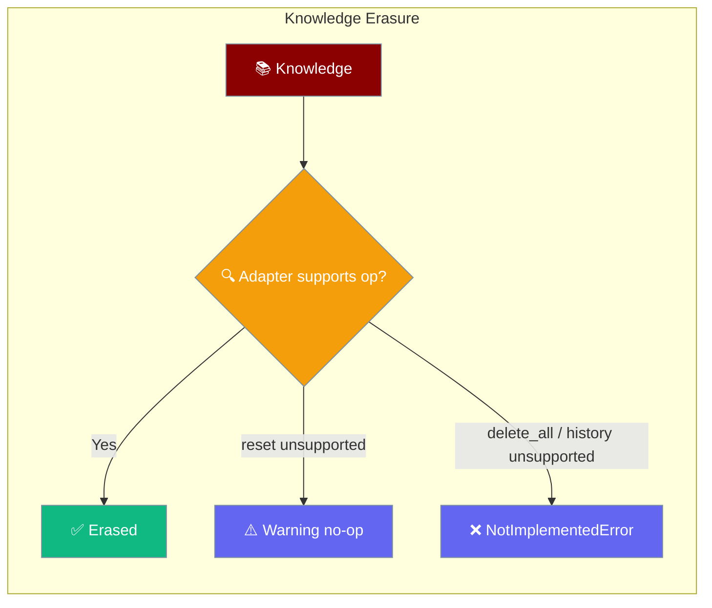
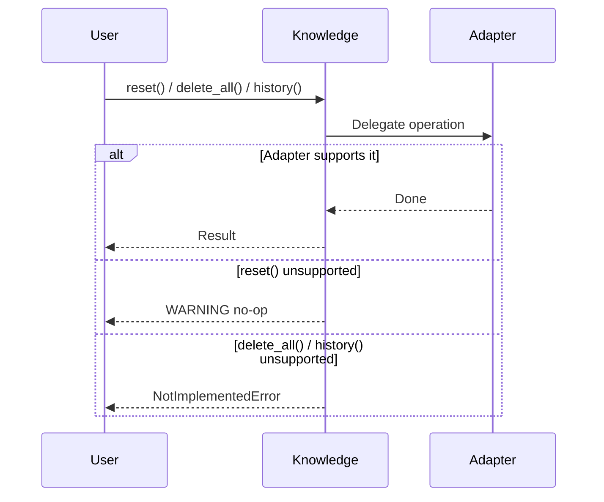

Erasure clears an agent's knowledge base between sessions, with clear errors when an adapter can't support an operation.

```python
from praisonaiagents import Agent

agent = Agent(name="privacy-aware", instructions="Answer, then clear context between sessions.", knowledge=["policy.md"])
agent.start("Summarise the policy")
agent.knowledge.reset()   # clears the knowledge base between sessions
```



## Quick Start

<Steps>
<Step title="Reset the knowledge base">
```python
from praisonaiagents import Agent

agent = Agent(name="assistant", instructions="Answer from the docs", knowledge=["policy.md"])
agent.start("Summarise the policy")

# Clear the knowledge base between sessions
agent.knowledge.reset()
```
</Step>

<Step title="Delete all scoped memories">
```python
# Delete everything for a given scope
agent.knowledge.delete_all(user_id="user-123")
```
</Step>

<Step title="Inspect change history">
```python
# History is only available on Mem0-backed knowledge
changes = agent.knowledge.history(memory_id="mem-abc")
```
</Step>
</Steps>

---

## How It Works

`Knowledge` erasure calls route to the underlying `memory` adapter. Unsupported operations fail loudly instead of raising `AttributeError`.



| Operation | Behaviour when unsupported |
|-----------|---------------------------|
| `reset()` | Logs a `WARNING` and no-ops |
| `delete_all()` | Raises `NotImplementedError` |
| `history(memory_id)` | Raises `NotImplementedError` |

---

## Adapter Capabilities

Support differs per adapter — verify against `praisonaiagents/knowledge/adapters/` before relying on an operation.

| Operation | Chroma | SQLite | Mongo | Mem0 |
| --- | --- | --- | --- | --- |
| `reset()` | ✅ | ✅ | ⚠️ warning + no-op | ✅ |
| `delete_all()` | ✅ | ✅ | ❌ `NotImplementedError` | ✅ |
| `history(id)` | ❌ `NotImplementedError` | ❌ `NotImplementedError` | ❌ `NotImplementedError` | ✅ |

<Note>
**Since PraisonAI PR [#4020](https://github.com/MervinPraison/PraisonAI/pull/4020)**, `Knowledge.reset()` warns instead of raising `AttributeError`, and `delete_all()` / `history()` raise `NotImplementedError` on unsupported adapters instead of `AttributeError`. Wrap `history()` and `delete_all()` in try/except when your code should work across adapters.
</Note>

---

## Common Patterns

Guard erasure calls so your code works across adapters:

```python
from praisonaiagents import Agent

agent = Agent(name="assistant", instructions="Answer from the docs", knowledge=["policy.md"])

# reset() is always safe — it warns instead of raising
agent.knowledge.reset()

# delete_all() / history() may not be supported
try:
    agent.knowledge.delete_all(user_id="user-123")
except NotImplementedError:
    # Fall back to reset() on adapters without scoped delete
    agent.knowledge.reset()
```

---

## Best Practices

<AccordionGroup>
<Accordion title="Reset between sessions">
Call `agent.knowledge.reset()` at the end of a session to clear context for privacy-sensitive workflows. It always succeeds — on adapters without native reset, it warns and no-ops.
</Accordion>

<Accordion title="Wrap delete_all() and history()">
Both raise `NotImplementedError` on adapters that don't support them. Wrap them in try/except so multi-adapter code degrades gracefully.
</Accordion>

<Accordion title="Use Mem0 for history">
Only Mem0-backed knowledge implements `history(memory_id)`. Choose Mem0 when you need an audit trail of memory changes.
</Accordion>

<Accordion title="Check logs after upgrade">
`reset()` now logs a warning when the adapter can't reset. Watch your logs to confirm the tier was actually cleared.
</Accordion>
</AccordionGroup>

---

## Related

<CardGroup cols={2}>
  <Card title="Knowledge Overview" icon="book" href="/knowledge/overview">
    Load files and documents into an agent's knowledge base.
  </Card>
  <Card title="Knowledge Storage" icon="database" href="/knowledge/storage">
    Configure the storage backend for knowledge.
  </Card>
</CardGroup>
