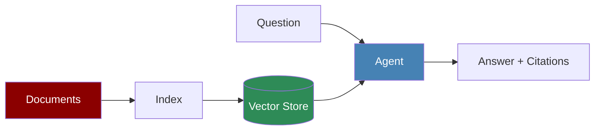

# Knowledge Overview

Knowledge allows your agents to answer questions using your own documents - PDFs, text files, web pages, and more.

## How It Works



1. **Add documents** → Chunked and indexed
2. **Ask questions** → Agent retrieves relevant context
3. **Get answers** → With source citations

## Quick Start

```python
from praisonaiagents import Agent

agent = Agent(
    name="Research Assistant",
    knowledge=["research.pdf", "docs/"]
)

response = agent.start("What are the key findings?")
```

That's it! The agent can now answer questions using your documents.

## When to Use

| Approach | Best For | Link |
|----------|----------|------|
| `Agent(knowledge=[...])` | Most use cases | [Quick Start →](/docs/knowledge/quickstart) |
| `Knowledge()` class | Custom indexing | [Knowledge API →](/docs/sdk/praisonaiagents/knowledge/knowledge) |
| `RAG()` class | Custom pipelines | [RAG Module →](/docs/rag/module) |

## Knowledge vs Memory vs RAG

| Feature | Knowledge | Memory | RAG |
|---------|-----------|--------|-----|
| **Purpose** | Answer from documents | Remember conversations | Retrieve + Generate |
| **Data Source** | Files, URLs | Conversations | Knowledge base |
| **Updates** | Manual (re-index) | Automatic | Uses Knowledge |
| **Best For** | Q&A, research | Chat continuity | Citations, search |

## Next Steps

<CardGroup cols={2}>
  <Card title="Quick Start" icon="rocket" href="/docs/knowledge/quickstart">
    Get started in 5 minutes
  </Card>
  <Card title="Storage Options" icon="database" href="/docs/knowledge/storage">
    Configure vector stores
  </Card>
  <Card title="Chat with PDFs" icon="file-pdf" href="/docs/knowledge/chat-with-pdf">
    Build a PDF chat agent
  </Card>
  <Card title="RAG" icon="magnifying-glass" href="/docs/rag/overview">
    Advanced retrieval
  </Card>
</CardGroup>
