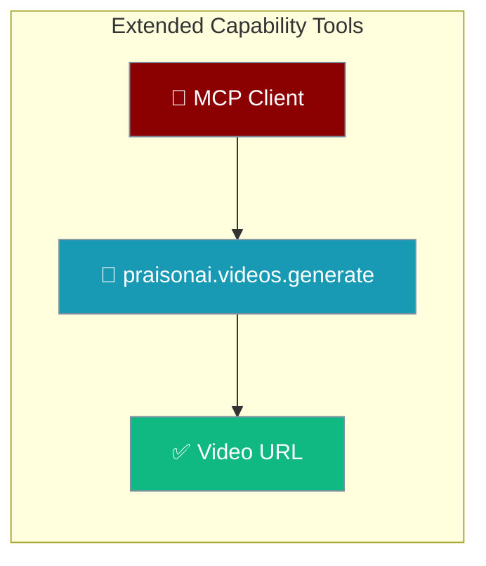

The PraisonAI MCP server exposes extended-capability tools that any MCP client can call, including video generation.



## Quick Start

<Steps>
<Step title="Call the video tool">
An MCP client invokes `praisonai.videos.generate` with a prompt. Omit `model` to use the canonical default `openai/sora-2`.

```json
{
  "name": "praisonai.videos.generate",
  "arguments": {
    "prompt": "A cat playing with yarn"
  }
}
```
</Step>

<Step title="Override the model">
```json
{
  "name": "praisonai.videos.generate",
  "arguments": {
    "prompt": "A city skyline at night",
    "model": "openai/sora-2-pro",
    "duration": 8
  }
}
```
</Step>
</Steps>

---

## Tool: `praisonai.videos.generate`

Generate a video from a text prompt and return the video URL.

| Parameter | Type | Default | Description |
|-----------|------|---------|-------------|
| `prompt` | `str` | Required | Text description of the video |
| `model` | `str` | `"openai/sora-2"` | Provider-prefixed LiteLLM route |
| `duration` | `int` | `4` | Video length in seconds |

<Note>
The default `model` is `openai/sora-2`, the canonical default shared by the SDK `VideoAgent`, the `video_generate` capability, and the `praisonai videos` CLI command.
</Note>

---

## Best Practices

<AccordionGroup>
<Accordion title="Rely on the default model">
Omit `model` to use `openai/sora-2`. Set it only when you need a different provider route such as `openai/sora-2-pro`.
</Accordion>

<Accordion title="Use provider-prefixed routes">
Always pass a full LiteLLM route. Bare names like `sora` are not valid routes and cause routing errors.
</Accordion>
</AccordionGroup>

---

## Related

<CardGroup cols={2}>
<Card title="Videos Capability" icon="video" href="/capabilities/videos">
The Python `video_generate` API behind this tool.
</Card>
<Card title="MCP Tools" icon="plug" href="/mcp/mcp-tools">
Integrate MCP tools with agents.
</Card>
</CardGroup>
