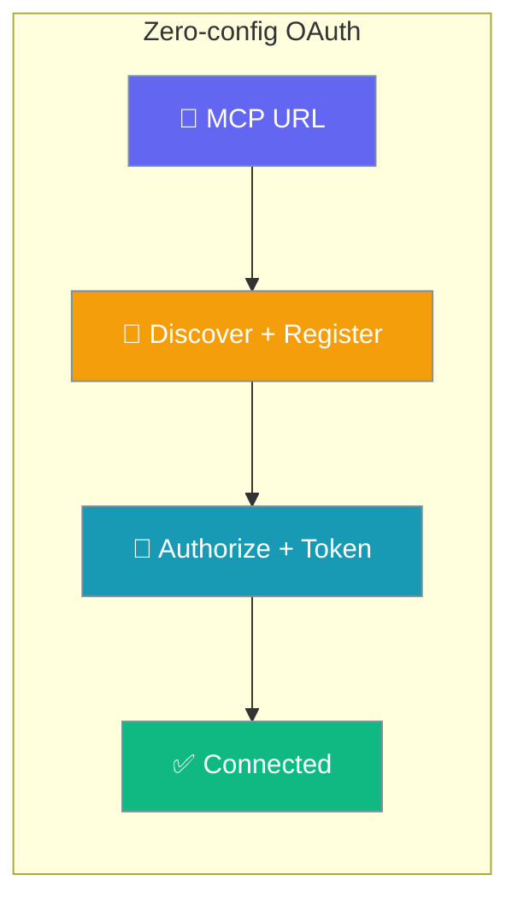
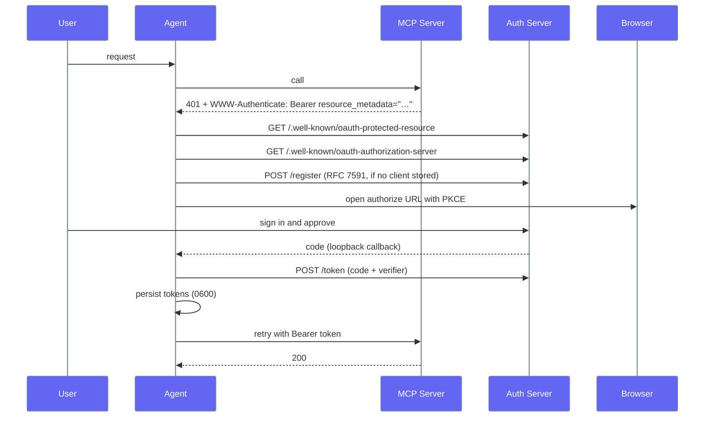
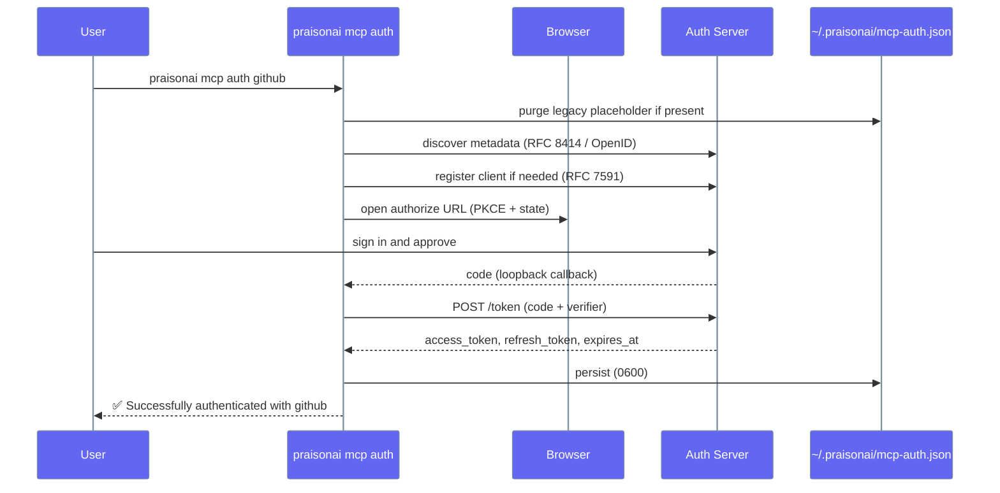

OAuth-protected remote MCP servers now Just Work — point at the URL, approve once in your browser, and tokens are cached and refreshed automatically.

<Note>
No `client_id` is required. When a server exposes standard authorization-server metadata (RFC 8414) and dynamic client registration (RFC 7591), PraisonAI discovers the endpoints, registers a client, runs the PKCE flow, and refreshes tokens on its own.
</Note>



## Status

| Capability | Status |
|---|---|
| OAuth utilities (PKCE, state, callback) | ✅ |
| Token storage (`~/.praisonai/mcp-auth.json`, 0600 perms) | ✅ |
| Metadata discovery (RFC 8414 + OpenID fallback) | ✅ |
| Dynamic Client Registration (RFC 7591) | ✅ |
| PKCE authorize + token exchange | ✅ |
| Transparent token refresh | ✅ |
| Headless / CI signal (`InteractiveAuthRequired`) | ✅ |
| `praisonai mcp auth` CLI flow | ✅ |

## Quick Start

<Steps>
  <Step>
    ```python
    from praisonaiagents import Agent, MCP

    agent = Agent(
        instructions="You help with GitHub tasks",
        tools=MCP("https://api.githubcopilot.com/mcp/")
    )

    agent.start("List my open pull requests")
    ```
    The first call opens your browser once so you can approve access. Tokens are cached for future runs — no `client_id` or scopes to configure.
  </Step>
  <Step>
    ```python
    agent.start("Close pull request 42")
    ```
    Cached tokens are re-used, and expired ones are refreshed transparently.
  </Step>
  <Step title="Or pre-seed from the CLI">
    ```bash
    # One-time interactive login; tokens cached at ~/.praisonai/mcp-auth.json
    praisonai mcp auth github
    ```
    Run this once on a workstation, then copy `~/.praisonai/mcp-auth.json` to a CI runner for headless environments.
  </Step>
</Steps>

## How Zero-config OAuth Works

A `401` with a `WWW-Authenticate` challenge triggers discovery, registration, and the PKCE flow — all automatic.



| Step | What happens |
|------|--------------|
| Discovery | Parses the `WWW-Authenticate` challenge, fetches protected-resource + authorization-server metadata (RFC 8414, OpenID fallback). |
| Registration | Registers a public client via RFC 7591 if none is stored. |
| Authorize | Opens the browser with PKCE and a loopback callback. |
| Token | Exchanges the code for tokens and persists them (0600). |
| Refresh | Renews expired tokens automatically on the next request. |

## Interactive vs Headless

Interactive sessions open a browser; headless environments raise a single actionable exception.

<Tabs>
  <Tab title="Interactive (default)">
    ```python
    from praisonaiagents.mcp import MCPOAuthProvider

    provider = MCPOAuthProvider(
        mcp_name="github",
        server_url="https://api.githubcopilot.com/mcp/",
    )
    token = provider.ensure_authenticated()  # opens a browser the first time
    ```
  </Tab>
  <Tab title="Headless / CI">
    ```python
    from praisonaiagents.mcp import MCPOAuthProvider, InteractiveAuthRequired

    provider = MCPOAuthProvider(
        mcp_name="github",
        server_url="https://api.githubcopilot.com/mcp/",
        open_browser=False,
    )

    try:
        token = provider.ensure_authenticated()
    except InteractiveAuthRequired:
        print("Seed ~/.praisonai/mcp-auth.json interactively first.")
    ```
  </Tab>
</Tabs>

<Tip>
For CI, run `praisonai mcp auth <server-name>` once interactively on a workstation to seed `~/.praisonai/mcp-auth.json`, then copy that file to the CI runner (or mount it as a secret). The CLI runs the exact same OAuth 2.1 flow as the Python client, so it's a valid way to satisfy the `InteractiveAuthRequired` prerequisite. With `open_browser=False`, a missing token raises `InteractiveAuthRequired` instead of hanging.
</Tip>

## Configuration Schema

The `oauth:` block is now **optional**. For servers that advertise standard metadata, just supply `type: remote` and `url`.

```yaml
mcp:
  servers:
    github:
      type: remote
      url: https://api.githubcopilot.com/mcp/
```

Keep the explicit block only as an escape hatch for servers without RFC 8414 metadata or dynamic registration:

```yaml
mcp:
  servers:
    my-server:
      type: remote
      url: https://mcp.example.com/mcp
      enabled: true
      timeout: 30000  # milliseconds
      oauth:
        client_id: your_client_id
        client_secret: your_client_secret  # optional
        scopes:
          - read
          - write
```

### Remote Server with API Key

```yaml
mcp:
  servers:
    tavily:
      type: remote
      url: https://mcp.tavily.com/mcp
      headers:
        Authorization: Bearer ${TAVILY_API_KEY}
```

## Python SDK

All OAuth helpers are lazy-loaded from `praisonaiagents.mcp`.

### MCPOAuthProvider

Orchestrates discovery, registration, the PKCE flow, and refresh for one server.

```python
from praisonaiagents.mcp import MCPOAuthProvider

provider = MCPOAuthProvider(
    mcp_name="github",
    server_url="https://api.githubcopilot.com/mcp/",
)
token = provider.ensure_authenticated()  # opens a browser the first time
```

| Parameter | Type | Default | Description |
|-----------|------|---------|-------------|
| `mcp_name` | `str` | — | Stable identifier used as the storage key. |
| `server_url` | `str` | — | The MCP server URL. |
| `storage` | `Any` | `None` | Optional pre-built `MCPAuthStorage` (created lazily otherwise). |
| `open_browser` | `bool` | `True` | Set `False` for headless/CI to raise `InteractiveAuthRequired`. |

| Method | Signature | Returns |
|--------|-----------|---------|
| `get_valid_token` | `get_valid_token()` | `str \| None` — a non-expired token, refreshing if possible. |
| `ensure_authenticated` | `ensure_authenticated(www_authenticate=None, timeout=10.0)` | `str` — a valid bearer token, running the full flow if needed. |

### Discovery and Registration Helpers

```python
from praisonaiagents.mcp import (
    discover_oauth_metadata,
    parse_www_authenticate,
    register_client,
)

challenge = parse_www_authenticate(
    'Bearer resource_metadata="https://auth.example.com/.well-known/oauth-protected-resource"'
)

metadata = discover_oauth_metadata("https://api.githubcopilot.com/mcp/")
# {authorization_endpoint, token_endpoint, registration_endpoint, scopes_supported, resource}
```

| Function | Signature | Returns |
|----------|-----------|---------|
| `discover_oauth_metadata` | `discover_oauth_metadata(server_url, www_authenticate=None, timeout=10.0)` | `dict \| None` |
| `parse_www_authenticate` | `parse_www_authenticate(header)` | `dict` — `resource_metadata`, `scope`, `error`, etc. |
| `register_client` | `register_client(registration_endpoint, redirect_uris, client_name="PraisonAI Agent", scope=None, timeout=10.0)` | `dict` — at least `{"client_id": …}` (RFC 7591). |

### InteractiveAuthRequired

Raised by `ensure_authenticated()` when interactive auth is required but `open_browser=False`.

```python
from praisonaiagents.mcp import InteractiveAuthRequired
```

### Auth Storage

```python
from praisonaiagents.mcp import MCPAuthStorage

storage = MCPAuthStorage()

entry = storage.get("github")
if entry and entry.get("tokens"):
    print("Authenticated!")

if storage.is_token_expired("github"):
    print("Token expired, need to re-authenticate")
```

### PKCE Utilities

```python
from praisonaiagents.mcp import (
    generate_state,
    generate_code_verifier,
    generate_code_challenge,
    get_redirect_url,
)

state = generate_state()
verifier = generate_code_verifier()
challenge = generate_code_challenge(verifier)

redirect_url = get_redirect_url()
print(f"Redirect URL: {redirect_url}")
# Output: http://127.0.0.1:19876/mcp/oauth/callback
```

### OAuth Callback Handler

```python
from praisonaiagents.mcp import OAuthCallbackHandler, generate_state
import webbrowser

handler = OAuthCallbackHandler()
state = generate_state()

auth_url = f"https://auth.example.com/authorize?state={state}&..."
webbrowser.open(auth_url)

try:
    code = handler.wait_for_callback(state, timeout=300)
    print(f"Received authorization code: {code[:20]}...")
except TimeoutError:
    print("OAuth flow timed out")
```

## CLI Commands

### Authenticate

```bash
praisonai mcp auth <server-name>
```

Runs the same OAuth 2.1 authorization-code flow (with PKCE) as the Python client. Use it to seed tokens ahead of time — for example, on a workstation before running your agent in CI.

```bash
praisonai mcp auth github
```

The command:

- Opens your browser and waits for the loopback callback.
- Exchanges the code at the discovered `token_endpoint`.
- Persists tokens (with `expires_at`) to `~/.praisonai/mcp-auth.json` (0600 permissions).
- Clears any legacy placeholder entry (`oauth_<...>...`) from a previous CLI run before starting, so a prior failed login recovers automatically — no manual cleanup.
- Reads `server.oauth.client_id`/`client_secret` from `~/.praisonai/config.toml` for servers without dynamic client registration, seeding them into storage before the flow runs.
- Honors `--timeout` (default `300`s).

On success, tokens are written with `access_token`, optional `refresh_token`, and `expires_at`. The Python client picks them up automatically on the next `Agent.start(...)`. On failure, the command exits `1`.



<Warning>
If you previously ran `praisonai mcp auth <name>` on an older release and saw the success message but the server still rejected your token, you were hit by a bug where the CLI stored a truncated authorization code instead of exchanging it for a real token. Re-running the command on the current release automatically clears the bad entry and completes a real flow — no manual cleanup of `~/.praisonai/mcp-auth.json` is needed.
</Warning>

{/* TODO: `praisonai mcp add` cannot yet create a remote server (writes no type/url), so auth requires hand-editing ~/.praisonai/config.toml. Document once that defect is fixed. */}

### Logout

```bash
praisonai mcp logout <server-name>
```

Removes stored OAuth credentials for a server. Use `--yes` to skip the confirmation prompt.

### List Servers

```bash
praisonai mcp list
```

Shows all configured servers with their type (local/remote) and status.

## Token Storage

OAuth tokens are stored in `~/.praisonai/mcp-auth.json` with secure file permissions (0600).

```json
{
  "github": {
    "server_url": "https://api.githubcopilot.com/mcp/",
    "tokens": {
      "access_token": "gho_xxx...",
      "refresh_token": "ghr_xxx...",
      "expires_at": 1234567890,
      "token_endpoint": "https://auth.example.com/token",
      "scope": "repo user"
    },
    "client_info": {
      "client_id": "xxx"
    }
  }
}
```

## Security

- **HTTPS-only** — every metadata, authorize, token, and registration URL must be HTTPS (loopback `http://127.0.0.1` allowed for testing).
- **Redirect re-validation** — each redirect hop is re-checked, so an HTTPS metadata document cannot smuggle a plaintext token endpoint.
- **Refresh re-check** — refresh-token grants re-validate the stored `token_endpoint` over HTTPS (defence in depth).
- **Public client** — dynamic registration uses `token_endpoint_auth_method: "none"` and requests `grant_types: ["authorization_code", "refresh_token"]`.
- **PKCE** — all flows use PKCE (`S256`) plus a random `state` for CSRF protection.
- **File permissions** — token storage uses 0600 (owner read/write only).

## Troubleshooting

| Issue | Cause / fix |
|-------|-------------|
| `RuntimeError: Could not discover OAuth metadata for …` | Server doesn't advertise RFC 8414 / OpenID metadata. Supply `oauth.client_id` and `oauth.scopes` in config as a fallback. |
| `RuntimeError: … does not support dynamic client registration` | No `registration_endpoint` in auth-server metadata. Register a client manually and supply `oauth.client_id`. |
| `InteractiveAuthRequired` | Running headless / in CI. Seed `~/.praisonai/mcp-auth.json` from an interactive session first. |
| `ValueError: Refusing to fetch OAuth metadata over insecure transport` | Auth server advertises `http://` endpoints. Refused by design — fix the server or use an HTTPS reverse proxy. |
| `ValueError: Dynamic client registration response missing 'client_id'` | Malformed response from the auth server's `registration_endpoint`. |

## Related

<CardGroup cols={2}>
  <Card title="Remote MCP" icon="globe" href="./mcp-remote">
    Connect to remote MCP servers via HTTP, SSE, or WebSocket.
  </Card>
  <Card title="MCP Authentication" icon="shield-check" href="./mcp-auth">
    Server-side OAuth 2.1, OIDC, and API-key auth for `praisonai-mcp`.
  </Card>
  <Card title="MCP Tools" icon="wrench" href="./mcp-tools">
    Using MCP tools with agents.
  </Card>
  <Card title="MCP Server" icon="plug" href="./praisonai-mcp">
    Deploy PraisonAI as an MCP server.
  </Card>
</CardGroup>
