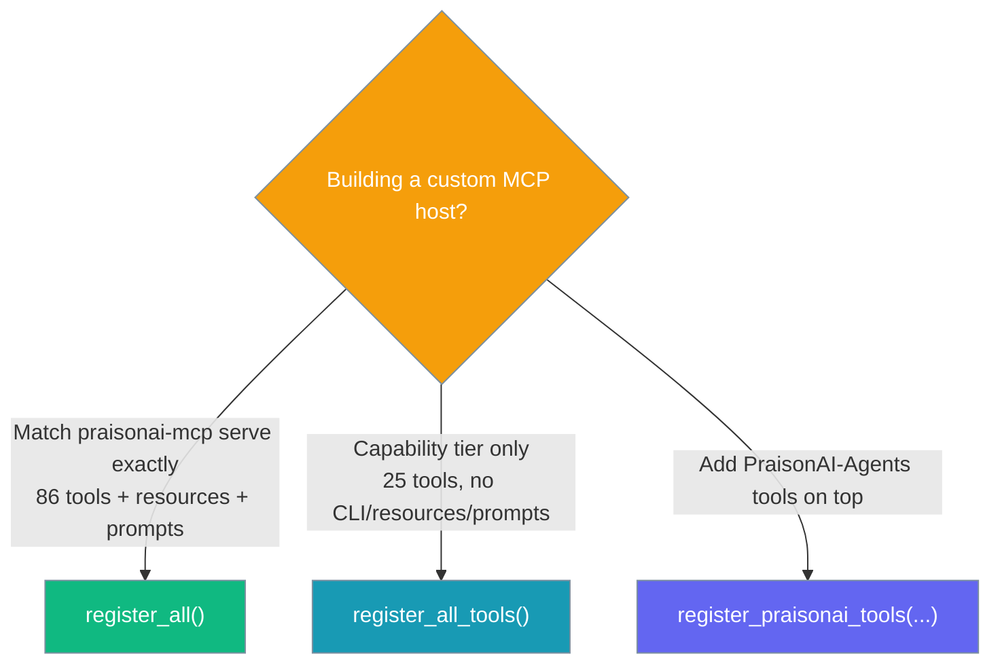

# MCP Registry Bridge Module

The Registry Bridge adapter connects the `praisonaiagents.tools` registry to the `praisonai.mcp_server` registry, enabling tools from PraisonAI Agents to be exposed via MCP without code duplication.

<Note>
Use **`register_all()`** to match what `praisonai-mcp serve`, `list-tools`, and `doctor` expose — the full built-in surface of **86 tools** plus 7 resources and 7 prompts. **`register_all_tools()`** is the smaller **capability-only** subset (**25 tools**, no CLI tools, resources, or prompts) — reach for it only when you deliberately want just the capability tier. See upstream [PR #3222](https://github.com/MervinPraison/PraisonAI/pull/3222).
</Note>

## Choosing a Registration Function



## Overview

**Key Features:**
- Lazy loading: Tools are only imported when first called
- Automatic hint inference from tool names
- Namespace prefixing to avoid collisions
- No eager imports or performance impact

## Code Usage

### Check Bridge Availability

```python
from praisonai.mcp_server.adapters.tools_bridge import is_bridge_available

if is_bridge_available():
    print("praisonaiagents.tools is available")
else:
    print("praisonaiagents not installed")
```

### Register Bridged Tools

```python
from praisonai.mcp_server.adapters.tools_bridge import register_praisonai_tools

# Register all tools from praisonaiagents
count = register_praisonai_tools()
print(f"Registered {count} tools")

# With custom namespace prefix
count = register_praisonai_tools(namespace_prefix="agents.")
```

### Unregister Bridged Tools

```python
from praisonai.mcp_server.adapters.tools_bridge import unregister_bridged_tools

# Remove all bridged tools
removed = unregister_bridged_tools()
print(f"Removed {removed} tools")
```

### Check Bridge Status

```python
from praisonai.mcp_server.adapters.tools_bridge import (
    is_bridge_enabled,
    get_bridged_tool_count,
    list_bridged_tools,
)

if is_bridge_enabled():
    print(f"Bridge active with {get_bridged_tool_count()} tools")
    for tool_name in list_bridged_tools():
        print(f"  - {tool_name}")
```

## Automatic Hint Inference

The bridge automatically infers tool annotation hints from tool names:

```python
from praisonai.mcp_server.adapters.tools_bridge import _infer_tool_hints

# Read-only patterns
hints = _infer_tool_hints("memory.show")
print(hints["read_only_hint"])  # True
print(hints["destructive_hint"])  # False

# Destructive patterns (default)
hints = _infer_tool_hints("file.delete")
print(hints["destructive_hint"])  # True

# Idempotent patterns
hints = _infer_tool_hints("config.set")
print(hints["idempotent_hint"])  # True

# Closed-world patterns
hints = _infer_tool_hints("session.create")
print(hints["open_world_hint"])  # False
```

### Inference Rules

| Pattern | Hint | Value |
|---------|------|-------|
| show, list, get, read, search, find, query, info, status | `read_only_hint` | `True` |
| set, update, configure | `idempotent_hint` | `True` |
| memory, session, config, local | `open_world_hint` | `False` |
| (default) | `destructive_hint` | `True` |

## Lazy Handler Creation

Tools are loaded lazily - the module is only imported when the tool is first called:

```python
from praisonai.mcp_server.adapters.tools_bridge import _create_lazy_handler

# Create a lazy handler
handler = _create_lazy_handler(
    module_path="praisonaiagents.tools.web",
    class_name="WebSearchTool",
    tool_name="web.search"
)

# Module is NOT imported yet
# ...

# First call imports the module
result = handler(query="test")  # Now the module is imported
```

## Category Extraction

Categories are extracted from tool names:

```python
from praisonai.mcp_server.adapters.tools_bridge import _extract_category

category = _extract_category("praisonai.memory.show")
print(category)  # "memory"

category = _extract_category("web.search")
print(category)  # "web"

category = _extract_category("tool")
print(category)  # None (single-part name)
```

## Integration with MCP Server

### Automatic Registration

```python
from praisonai.mcp_server.adapters import register_all, register_praisonai_tools

# Register all built-in tools
register_all()   # preferred: full 86-tool registration matching praisonai-mcp serve

# Optionally add bridged tools
if is_bridge_available():
    register_praisonai_tools()
```

### Server with Bridge

```python
from praisonai.mcp_server.server import MCPServer
from praisonai.mcp_server.adapters import register_all
from praisonai.mcp_server.adapters.tools_bridge import (
    is_bridge_available,
    register_praisonai_tools,
)

# Create server
server = MCPServer(name="my-server")

# Register built-in tools
register_all()   # 86 tools — capabilities + extended + CLI + resources + prompts

# Add bridged tools if available
if is_bridge_available():
    count = register_praisonai_tools()
    print(f"Added {count} tools from praisonaiagents")

# Start server
server.run()
```

## Collision Handling

### Skip on Collision (Default)

```python
# Tools with existing names are skipped
count = register_praisonai_tools(skip_on_collision=True)
```

### Error on Collision

```python
try:
    count = register_praisonai_tools(skip_on_collision=False)
except ValueError as e:
    print(f"Collision detected: {e}")
```

## Performance Characteristics

| Operation | Performance |
|-----------|-------------|
| `is_bridge_available()` | ~1ms (uses `find_spec`) |
| `register_praisonai_tools()` | O(n) where n = tool count |
| Tool first call | Module import time |
| Tool subsequent calls | Direct function call |

## Best Practices

1. **Check availability** before registering bridged tools
2. **Use namespace prefix** to avoid collisions with built-in tools
3. **Register once** at server startup, not per-request
4. **Handle missing praisonaiagents** gracefully

## Example: Conditional Bridge

```python
from praisonai.mcp_server.server import MCPServer
from praisonai.mcp_server.adapters import register_all

server = MCPServer(name="my-server")
register_all()   # 86 tools — capabilities + extended + CLI + resources + prompts

# Conditionally add agent tools
try:
    from praisonai.mcp_server.adapters.tools_bridge import (
        is_bridge_available,
        register_praisonai_tools,
    )
    
    if is_bridge_available():
        count = register_praisonai_tools(namespace_prefix="agents.")
        print(f"Bridge enabled: {count} agent tools available")
except ImportError:
    print("Bridge not available")

server.run()
```

## See Also

- [MCP Tool Annotations](/docs/mcp/mcp-tool-annotations) - Annotation hints
- [MCP Server](/docs/mcp/mcp-server) - Core MCP server
- [PraisonAI Agents Tools](/docs/tools/tools) - Agent tools documentation
