<Info>**Protocol Revision**: 2025-11-25</Info>

# Expose Tools as MCP Server

PraisonAI allows you to expose your Python functions as MCP (Model Context Protocol) tools that can be consumed by any MCP client, including Claude Desktop, Cursor, and other AI assistants.

```mermaid
graph LR
    subgraph Your Python Code
        F1[🔧 search_web]
        F2[🔧 calculate]
        F3[🔧 get_weather]
    end
    
    subgraph ToolsMCPServer
        REG[📋 Register Tools]
        SCHEMA[📄 Generate Schemas]
        RUN[🚀 Run Server]
    end
    
    subgraph MCP Clients
        CD[🖥️ Claude Desktop]
        CUR[📝 Cursor]
        OTHER[🤖 Other Clients]
    end
    
    F1 --> REG
    F2 --> REG
    F3 --> REG
    REG --> SCHEMA
    SCHEMA --> RUN
    RUN --> CD
    RUN --> CUR
    RUN --> OTHER
    
    classDef func fill:#2E8B57,stroke:#7C90A0,color:#fff
    classDef server fill:#189AB4,stroke:#7C90A0,color:#fff
    classDef client fill:#8B0000,stroke:#7C90A0,color:#fff
    
    class F1,F2,F3 func
    class REG,SCHEMA,RUN server
    class CD,CUR,OTHER client
```



## Quick Start

<Steps>
    <Step title="Install Dependencies">
        ```bash
        pip install "praisonaiagents[mcp]"
        ```
    </Step>
    <Step title="Create Your Tools">
        Define Python functions with type hints and docstrings:
        ```python
        def search_web(query: str, max_results: int = 5) -> dict:
            """Search the web for information.
            
            Args:
                query: The search query string
                max_results: Maximum number of results to return
            """
            return {"results": [f"Result for {query}"]}
        ```
    </Step>
    <Step title="Create and Run MCP Server">
        ```python
        from praisonaiagents import ToolsMCPServer
        
        server = ToolsMCPServer(name="my-tools")
        server.register_tool(search_web)
        server.run()  # Starts stdio server
        ```
    </Step>
</Steps>

## Basic Usage

### Simple MCP Server

```python
from praisonaiagents import ToolsMCPServer

# Define your tools as regular Python functions
def search_web(query: str, max_results: int = 5) -> dict:
    """Search the web for information."""
    return {
        "query": query,
        "results": [
            {"title": f"Result {i+1}", "url": f"https://example.com/{i}"}
            for i in range(max_results)
        ]
    }

def calculate(expression: str) -> dict:
    """Evaluate a mathematical expression."""
    try:
        result = eval(expression)  # Use safer parser in production
        return {"expression": expression, "result": result}
    except Exception as e:
        return {"error": str(e)}

def get_weather(city: str, units: str = "celsius") -> dict:
    """Get current weather for a city."""
    return {
        "city": city,
        "temperature": 22 if units == "celsius" else 72,
        "condition": "Sunny"
    }

# Create and run MCP server
server = ToolsMCPServer(name="my-tools")
server.register_tools([search_web, calculate, get_weather])
server.run()  # Starts stdio server (for Claude Desktop)
```

### Using the Convenience Function

```python
from praisonaiagents import launch_tools_mcp_server

def my_tool(query: str) -> str:
    """Process a query."""
    return f"Processed: {query}"

# Quick launch
launch_tools_mcp_server(
    tools=[my_tool],
    name="quick-server"
)
```

## Transport Options

### stdio Transport (Default)

Best for local integrations like Claude Desktop:

```python
server = ToolsMCPServer(name="my-tools")
server.register_tools([search_web, calculate])
server.run()  # or server.run_stdio()
```

### SSE Transport

For web-based clients and remote access:

```python
server = ToolsMCPServer(name="my-tools")
server.register_tools([search_web, calculate])
server.run_sse(host="0.0.0.0", port=8080)
```

Access at: `http://localhost:8080/sse`

## Tool Schema Generation

PraisonAI automatically generates MCP-compatible schemas from your Python functions:

```python
from praisonaiagents import function_to_mcp_schema

def search(query: str, max_results: int = 10, include_images: bool = False) -> dict:
    """Search the web for information.
    
    Args:
        query: The search query
        max_results: Maximum results to return
        include_images: Whether to include images
    """
    return {}

schema = function_to_mcp_schema(search)
print(schema)
```

Output:
```json
{
    "name": "search",
    "description": "Search the web for information.",
    "inputSchema": {
        "type": "object",
        "properties": {
            "query": {"type": "string"},
            "max_results": {"type": "integer"},
            "include_images": {"type": "boolean"}
        },
        "required": ["query"]
    }
}
```

### Supported Type Mappings

| Python Type | JSON Schema Type |
|-------------|------------------|
| `str` | `string` |
| `int` | `integer` |
| `float` | `number` |
| `bool` | `boolean` |
| `List[T]` | `array` with items |
| `Dict[str, Any]` | `object` |
| `Optional[T]` | Type T (not required) |

## Custom Tool Metadata

Override default name and description using special attributes:

```python
def my_internal_function(x: str) -> str:
    """Internal docstring."""
    return x

# Custom MCP metadata
my_internal_function.__mcp_name__ = "public_tool_name"
my_internal_function.__mcp_description__ = "Public description for MCP clients"

server.register_tool(my_internal_function)
```

## Async Tools

Async functions are fully supported:

```python
import asyncio

async def async_search(query: str) -> dict:
    """Async search function."""
    await asyncio.sleep(0.1)  # Simulate async operation
    return {"query": query, "results": ["Result 1", "Result 2"]}

server = ToolsMCPServer(name="async-tools")
server.register_tool(async_search)
server.run()
```

## Claude Desktop Integration

<Steps>
    <Step title="Create Your Server Script">
        Save as `my_mcp_server.py`:
        ```python
        from praisonaiagents import ToolsMCPServer
        
        def search(query: str) -> dict:
            """Search for information."""
            return {"results": [f"Result for {query}"]}
        
        def calculate(expr: str) -> dict:
            """Calculate expression."""
            return {"result": eval(expr)}
        
        if __name__ == "__main__":
            server = ToolsMCPServer(name="my-tools")
            server.register_tools([search, calculate])
            server.run()
        ```
    </Step>
    <Step title="Configure Claude Desktop">
        Add to Claude Desktop config (`~/Library/Application Support/Claude/claude_desktop_config.json` on macOS):
        ```json
        {
            "mcpServers": {
                "my-tools": {
                    "command": "python",
                    "args": ["/path/to/my_mcp_server.py"]
                }
            }
        }
        ```
    </Step>
    <Step title="Restart Claude Desktop">
        Restart Claude Desktop to load your new MCP server. Your tools will be available in conversations.
    </Step>
</Steps>

## Cursor Integration

<Steps>
    <Step title="Create Server Script">
        Same as Claude Desktop setup above.
    </Step>
    <Step title="Configure Cursor">
        Add to Cursor's MCP configuration:
        ```json
        {
            "mcpServers": {
                "praisonai-tools": {
                    "command": "python",
                    "args": ["/path/to/my_mcp_server.py"]
                }
            }
        }
        ```
    </Step>
</Steps>

## Exposing Built-in PraisonAI Tools

You can expose PraisonAI's built-in tools as an MCP server:

```python
from praisonaiagents import launch_tools_mcp_server

# Expose built-in tools by name
launch_tools_mcp_server(
    tool_names=["tavily_search", "duckduckgo_search"],
    name="search-tools-server"
)
```

## Complete Example

```python
"""Complete MCP Server Example

Run with: python mcp_tools_server.py
Or with SSE: python mcp_tools_server.py --sse --port 8080
"""

import argparse
from typing import List, Dict, Any

def search_web(query: str, max_results: int = 5) -> Dict[str, Any]:
    """Search the web for information.
    
    Args:
        query: The search query string
        max_results: Maximum number of results (default: 5)
    """
    return {
        "query": query,
        "results": [
            {"title": f"Result {i+1} for '{query}'", "url": f"https://example.com/{i+1}"}
            for i in range(max_results)
        ]
    }

def calculate(expression: str) -> Dict[str, Any]:
    """Evaluate a mathematical expression.
    
    Args:
        expression: Math expression to evaluate (e.g., "2 + 2 * 3")
    """
    try:
        allowed = set("0123456789+-*/.() ")
        if not all(c in allowed for c in expression):
            return {"error": "Invalid characters"}
        return {"expression": expression, "result": eval(expression)}
    except Exception as e:
        return {"error": str(e)}

def get_weather(city: str, units: str = "celsius") -> Dict[str, Any]:
    """Get current weather for a city.
    
    Args:
        city: Name of the city
        units: Temperature units - "celsius" or "fahrenheit"
    """
    return {
        "city": city,
        "temperature": 22 if units == "celsius" else 72,
        "units": units,
        "condition": "Sunny",
        "humidity": 45
    }

def list_files(directory: str = ".", pattern: str = "*") -> List[str]:
    """List files in a directory.
    
    Args:
        directory: Directory path (default: current)
        pattern: Glob pattern to filter files
    """
    import glob
    import os
    try:
        return [os.path.basename(f) for f in glob.glob(os.path.join(directory, pattern))]
    except Exception as e:
        return [f"Error: {e}"]

def main():
    parser = argparse.ArgumentParser(description="PraisonAI Tools MCP Server")
    parser.add_argument("--sse", action="store_true", help="Use SSE transport")
    parser.add_argument("--port", type=int, default=8080, help="Port for SSE")
    parser.add_argument("--host", type=str, default="0.0.0.0", help="Host for SSE")
    parser.add_argument("--debug", action="store_true", help="Enable debug logging")
    args = parser.parse_args()
    
    from praisonaiagents import ToolsMCPServer
    
    server = ToolsMCPServer(name="praisonai-tools", debug=args.debug)
    server.register_tools([search_web, calculate, get_weather, list_files])
    
    print(f"📦 Registered {len(server.tools)} tools: {', '.join(server.get_tool_names())}")
    
    if args.sse:
        server.run_sse(host=args.host, port=args.port)
    else:
        server.run_stdio()

if __name__ == "__main__":
    main()
```

## API Reference

### ToolsMCPServer

| Method | Description |
|--------|-------------|
| `__init__(name, tools, debug)` | Initialize server with optional tools |
| `register_tool(func)` | Register a single tool function |
| `register_tools(funcs)` | Register multiple tool functions |
| `get_tool_schemas()` | Get MCP schemas for all tools |
| `get_tool_names()` | Get list of registered tool names |
| `execute_tool(name, args)` | Execute a tool synchronously |
| `execute_tool_async(name, args)` | Execute a tool asynchronously |
| `run(transport)` | Run server with specified transport |
| `run_stdio()` | Run with stdio transport |
| `run_sse(host, port)` | Run with SSE transport |

### launch_tools_mcp_server

```python
launch_tools_mcp_server(
    tools=None,           # List of tool functions
    tool_names=None,      # List of built-in tool names
    name="praisonai-tools",
    transport="stdio",    # "stdio" or "sse"
    host="0.0.0.0",
    port=8080,
    debug=False
)
```

## Best Practices

<CardGroup cols={2}>
  <Card title="Type Hints" icon="code">
    Always use type hints for proper schema generation
  </Card>
  <Card title="Docstrings" icon="file-lines">
    Write clear docstrings - they become tool descriptions
  </Card>
  <Card title="Error Handling" icon="shield">
    Return error information in response dict, don't raise exceptions
  </Card>
  <Card title="Security" icon="lock">
    Validate inputs, especially for file/system operations
  </Card>
</CardGroup>

## Next Steps

<CardGroup cols={2}>
  <Card icon="plug" href="/mcp/mcp-tools">
    Connect to MCP servers as client
  </Card>
  <Card icon="server" href="/mcp/mcp-server">
    Create agent-based MCP servers
  </Card>
</CardGroup>
