# MCP Tools Integration

The MCP (Model Context Protocol) module enables seamless integration of MCP-compliant tools and servers with PraisonAI agents, supporting both stdio and SSE transport methods.

```mermaid
graph LR
    Agent[🤖 Agent] --> MCP[📡 MCP Module]
    
    subgraph Transports
        STDIO[📟 Stdio Transport]
        SSE[🌐 SSE Transport]
    end
    
    subgraph MCP Servers
        NPX[📦 NPX Tools]
        PY[🐍 Python Servers]
        HTTP[🌐 HTTP Endpoints]
    end
    
    MCP --> STDIO
    MCP --> SSE
    
    STDIO --> NPX
    STDIO --> PY
    SSE --> HTTP
    
    NPX --> Tools1[🔧 Memory Tools]
    PY --> Tools2[🛠️ Custom Tools]
    HTTP --> Tools3[⚙️ Remote Tools]
    
    classDef agent fill:#8B0000,stroke:#7C90A0,color:#fff
    classDef transport fill:#189AB4,stroke:#7C90A0,color:#fff
    classDef server fill:#2E8B57,stroke:#7C90A0,color:#fff
    classDef tools fill:#FF6B6B,stroke:#7C90A0,color:#fff
    
    class Agent agent
    class MCP,STDIO,SSE transport
    class NPX,PY,HTTP server
    class Tools1,Tools2,Tools3 tools
```



## Overview

MCP (Model Context Protocol) is a standard for connecting AI assistants to external tools and data sources. The MCP module in PraisonAI provides:

* **Stdio Transport**: Run MCP servers as subprocess commands
* **SSE Transport**: Connect to HTTP/SSE-based MCP servers
* **Automatic Tool Discovery**: Tools are automatically discovered and made available to agents
* **Flexible Integration**: Support for NPX packages, Python scripts, and remote servers

## Quick Start

<CodeGroup>
```python NPX MCP Server
from praisonaiagents import Agent, MCP

# Use the memory MCP server from NPX
agent = Agent(
    name="Memory Assistant",
    instructions="You can store and retrieve memories.",
    tools=MCP("npx @modelcontextprotocol/server-memory")
)

response = agent.start("Remember that my favourite colour is blue")
```

```python Python MCP Server
# Python MCP server
agent = Agent(
    name="Data Assistant",
    tools=MCP("/usr/bin/python3 /path/to/mcp_server.py")
)

# Or with separate command and args
agent = Agent(
    tools=MCP(
        command="/usr/bin/python3",
        args=["/path/to/mcp_server.py", "--config", "config.json"]
    )
)
```

```python SSE Endpoint
# Remote SSE endpoint
agent = Agent(
    name="Remote Assistant",
    tools=MCP("http://localhost:8080/sse")
)

# With custom headers
agent = Agent(
    tools=MCP("https://api.example.com/mcp/sse")
)
```
</CodeGroup>

## Transport Methods

### Stdio Transport

The stdio transport runs MCP servers as subprocesses:

<CodeGroup>
```python Command String
# Simple command string
tools = MCP("npx @modelcontextprotocol/server-github")

# Python script
tools = MCP("python3 mcp_weather_server.py")

# With environment variables
import os
os.environ["API_KEY"] = "your-api-key"
tools = MCP("node weather-server.js")
```

```python Command and Args
# Separate command and arguments
tools = MCP(
    command="/usr/bin/python3",
    args=["server.py", "--port", "8080", "--debug"]
)

# Node.js server with args
tools = MCP(
    command="node",
    args=["dist/server.js", "--config", "production.json"]
)
```

```python Advanced Options
# With timeout and debug
tools = MCP(
    "npx @modelcontextprotocol/server-filesystem",
    timeout=120,  # 2 minutes timeout
    debug=True    # Enable debug logging
)
```
</CodeGroup>

### SSE Transport

The SSE transport connects to HTTP endpoints using Server-Sent Events:

<CodeGroup>
```python Basic SSE
# Simple SSE endpoint
tools = MCP("http://localhost:8080/sse")

# HTTPS endpoint
tools = MCP("https://api.example.com/mcp/sse")
```

```python With Authentication
# SSE with headers (future support)
tools = MCP(
    "https://api.example.com/mcp/sse",
    headers={"Authorization": "Bearer token"}
)
```

```python With Options
# With timeout
tools = MCP(
    "http://localhost:3000/agents/sse",
    timeout=30,
    debug=True
)
```
</CodeGroup>

## Available MCP Servers

### Official NPX Servers

<CardGroup cols={2}>
  <Card icon="brain">
    ```bash
    npx @modelcontextprotocol/server-memory
    ```
    Store and retrieve conversation memories
  </Card>
  <Card icon="folder">
    ```bash
    npx @modelcontextprotocol/server-filesystem
    ```
    Read and write files with safety controls
  </Card>
  <Card icon="github">
    ```bash
    npx @modelcontextprotocol/server-github
    ```
    Interact with GitHub repositories
  </Card>
  <Card icon="database">
    ```bash
    npx @modelcontextprotocol/server-postgres
    ```
    Query and manage PostgreSQL databases
  </Card>
</CardGroup>

### Custom Python Servers

Create your own MCP server in Python:

```python
# mcp_calculator.py
import asyncio
from mcp import Server, Tool

server = Server("calculator")

@server.tool
async def add(a: float, b: float) -> float:
    """Add two numbers"""
    return a + b

@server.tool
async def multiply(a: float, b: float) -> float:
    """Multiply two numbers"""
    return a * b

if __name__ == "__main__":
    asyncio.run(server.run())
```

Use in agent:

```python
agent = Agent(
    tools=MCP("python3 mcp_calculator.py")
)
```

## Tool Discovery

MCP automatically discovers available tools:

```python
# Create MCP instance
mcp = MCP("npx @modelcontextprotocol/server-filesystem")

# Tools are automatically discovered and can be iterated
for tool in mcp:
    print(f"Tool: {tool.name}")
    print(f"Description: {tool.description}")
    print(f"Parameters: {tool.parameters}")

# Assign to agent
agent = Agent(name="File Manager", tools=mcp)
```

## Error Handling

MCP includes built-in error handling and retry logic for robust operation.

```python
try:
    agent = Agent(
        tools=MCP("npx @modelcontextprotocol/server-memory")
    )
    response = agent.start("Store this information")
except Exception as e:
    print(f"MCP Error: {e}")
    # Fallback logic
```

## Advanced Usage

### Multiple MCP Servers

```python
from praisonaiagents import Agent, MCP

# Combine multiple MCP servers
memory_tools = MCP("npx @modelcontextprotocol/server-memory")
file_tools = MCP("npx @modelcontextprotocol/server-filesystem")
custom_tools = MCP("python3 custom_mcp.py")

agent = Agent(
    name="Multi-Tool Assistant",
    instructions="You can manage files and memories.",
    tools=[*memory_tools, *file_tools, *custom_tools]
)
```

### Environment Configuration

```python
import os

# Set environment variables for MCP servers
os.environ["GITHUB_TOKEN"] = "your-github-token"
os.environ["DATABASE_URL"] = "postgresql://..."

# MCP servers can access these variables
github_tools = MCP("npx @modelcontextprotocol/server-github")
db_tools = MCP("python3 database_mcp.py")
```

### Debugging MCP Connections

```python
# Enable debug mode
mcp = MCP(
    "npx @modelcontextprotocol/server-memory",
    debug=True  # Prints detailed logs
)

# Check if tools are loaded
if not list(mcp):
    print("No tools discovered from MCP server")
```

## Creating SSE MCP Servers

Example SSE server implementation:

```python
# sse_mcp_server.py
from flask import Flask, Response
import json

app = Flask(__name__)

@app.route('/sse')
def sse():
    def generate():
        # Send tool definitions
        tools = [{
            "name": "get_weather",
            "description": "Get weather information",
            "parameters": {
                "type": "object",
                "properties": {
                    "location": {"type": "string"}
                },
                "required": ["location"]
            }
        }]
        
        yield f"data: {json.dumps({'type': 'tools', 'tools': tools})}\n\n"
    
    return Response(generate(), mimetype="text/event-stream")

if __name__ == '__main__':
    app.run(port=8080)
```

## Best Practices

<CardGroup cols={2}>
  <Card icon="microchip" title="Transport Choice">
    - Use stdio for local tools and development
    - Use SSE for remote/cloud deployments
    - Consider latency and reliability needs
  </Card>
  <Card icon="clock" title="Reliability">
    - Implement timeouts for long-running operations
    - Handle server disconnections gracefully
    - Provide fallback options
  </Card>
  <Card icon="shield-check" title="Security">
    - Validate input/output from MCP servers
    - Use environment variables for secrets
    - Implement proper authentication for SSE
  </Card>
  <Card icon="gauge-high" title="Performance">
    - Reuse MCP instances when possible
    - Monitor subprocess resource usage
    - Implement connection pooling for SSE
  </Card>
</CardGroup>

## Example: Multi-Tool Agent

<CodeGroup>
```python Complete Example
from praisonaiagents import Agent, Task, PraisonAIAgents, MCP
import os

# Set up environment
os.environ["GITHUB_TOKEN"] = "ghp_..."

# Create agent with multiple MCP tools
agent = Agent(
    name="DevOps Assistant",
    instructions="""You are a DevOps assistant that can:
    - Manage files and directories
    - Interact with GitHub repositories
    - Store and retrieve important information
    Use your tools wisely to help with development tasks.""",
    tools=[
        MCP("npx @modelcontextprotocol/server-filesystem"),
        MCP("npx @modelcontextprotocol/server-github"),
        MCP("npx @modelcontextprotocol/server-memory")
    ]
)

# Create tasks
tasks = [
    Task(
        description="Check the current directory structure",
        agent=agent,
        expected_output="Directory listing with key files identified"
    ),
    Task(
        description="Remember the project structure for future reference",
        agent=agent,
        expected_output="Confirmation that structure is memorised"
    )
]

# Run the system
agents = PraisonAIAgents(agents=[agent], tasks=tasks)
result = agents.start()
```
</CodeGroup>

## Next Steps

<CardGroup cols={2}>
  <Card icon="wrench" href="/tools/custom">
    Create custom tools for agents
  </Card>
  <Card icon="list" href="/mcp/mcp-server">
    Explore available MCP servers
  </Card>
</CardGroup>