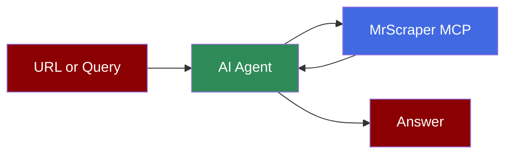

## Add Web Scraping to AI Agent



## Quick Start

<Steps>
    <Step title="Install Dependencies">
        Install PraisonAI with MCP support:
        ```bash
        pip install -U "praisonaiagents[mcp]" "mcp<2"
        ```
        PraisonAI's Streamable HTTP transport uses the `streamablehttp_client` API from `mcp` 1.x, so keep `mcp` below 2. MrScraper's `status` tool has a parameter named `from`, which needs the `praisonaiagents` release with the PraisonAI fix "fix(mcp): accept any JSON Schema property name and run remote tool calls on the session loop"; 1.7.11 and earlier stop with `ValueError: 'from' is not a valid parameter name`.
    </Step>
    <Step title="Set API Keys">
        Create a MrScraper API key at [app.mrscraper.com/api-tokens](https://app.mrscraper.com/api-tokens) and set it with your model's API key:
        ```bash
        export MRSCRAPER_API_KEY=your_mrscraper_api_key_here
        export OPENAI_API_KEY=your_openai_api_key_here
        ```
    </Step>
    <Step title="Create a file">
        Create a new file `mrscraper_agent.py` with the following code:
        ```python
        from praisonaiagents import Agent, MCP
        import os

        mrscraper_tools = MCP(
            "https://mcp.mrscraper.com/mcp",
            headers={"Authorization": f"Bearer {os.environ['MRSCRAPER_API_KEY']}"},
        )

        scraper_agent = Agent(
            instructions="""You research web pages with MrScraper.
            For a known URL, call fetch first and work from the raw page it returns.
            Use scrape only when the user asks for MrScraper-managed extraction,
            and serp when no URL is known.""",
            model="gpt-4o-mini",
            tools=mrscraper_tools,
        )

        scraper_agent.start("Fetch https://www.scrapethissite.com/pages/simple/ and summarize the page.")
        ```
    </Step>
    <Step title="Run the Agent">
        Execute your script:
        ```bash
        python mrscraper_agent.py
        ```
    </Step>
</Steps>

## Available Tools

| Tool | What it does |
| --- | --- |
| `fetch` | Fetches one page through MrScraper's unblocker and returns the status, headers, and raw body. Options include browser rendering, Super Mode, geo targeting, and waiting for a selector. |
| `scrape` | Managed extraction: the `general` or `listing` agent extracts fields from a prompt, and the `map` agent discovers URLs within a site. Saves a reusable scraper. |
| `serp` | Google search results for a query or Google search URL. |
| `rerun` | Reruns a saved AI or manual scraper on new URLs, one at a time or in bulk. |
| `results`, `result` | Lists stored results or returns one by ID. |
| `status` | Account usage, with optional request analytics for a domain. |

Tool calls run on your MrScraper account and use its plan tokens. `scrape` sends page content and your prompt to a backend language model. Only scrape sites you are authorized to access.

## Local MCP Server

Run the same tools locally with Node.js 20 or later. PraisonAI passes only a minimal environment to local servers, so pass the key in `env`:

```python
mrscraper_tools = MCP(
    "npx -y @mrscraper/mcp@latest",
    env={"MRSCRAPER_API_KEY": os.environ["MRSCRAPER_API_KEY"]},
)
```

## CLI Configuration

Declare the server in `praisonai.yaml` at your project root to use it from `praisonai run` and `praisonai code`. `${MRSCRAPER_API_KEY}` is read from the environment:

```yaml
mcp:
  servers:
    mrscraper:
      type: remote
      url: https://mcp.mrscraper.com/mcp
      headers:
        Authorization: Bearer ${MRSCRAPER_API_KEY}
```

Check that the tools load:

```bash
praisonai tools list
```

<Note>
  **Requirements**
  - Python 3.10 or higher
  - `praisonaiagents` with the fix named above, and `mcp` below 2
  - A MrScraper account and API key ([docs](https://docs.mrscraper.com/docs/getting-started/mcp-server))
  - An OpenAI API key (for the agent's LLM)
  - Node.js 20 or higher, only for the local server
</Note>
