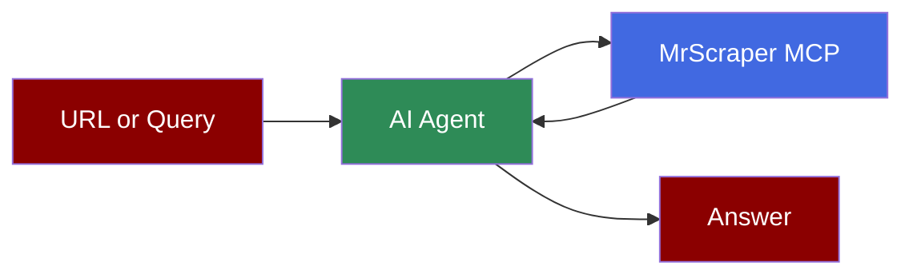

## Add Web Scraping to AI Agent


```mermaid
flowchart LR
    In[URL or Query] --> Agent[AI Agent]
    Agent --> Tool[MrScraper MCP]
    Tool --> Agent
    Agent --> Out[Answer]

    style In fill:#8B0000,color:#fff
    style Agent fill:#2E8B57,color:#fff
    style Tool fill:#4169E1,color:#fff
    style Out fill:#8B0000,color:#fff
```

## Quick Start

<Steps>
    <Step title="Install Dependencies">
        Install PraisonAI with MCP support:
        ```bash
        pip install -U "praisonaiagents[mcp]>=1.7.12"
        ```
        `praisonaiagents` 1.7.12 and later load MrScraper's tools over Streamable HTTP and install a compatible `mcp` 1.x.
    </Step>
    <Step title="Set API Keys">
        Create a MrScraper API key at [app.mrscraper.com/api-tokens](https://app.mrscraper.com/api-tokens) and set it with your model's API key:
        ```bash
        export MRSCRAPER_API_KEY=your_mrscraper_api_key_here
        export OPENAI_API_KEY=your_openai_api_key_here
        ```
    </Step>
    <Step title="Create a file">
        Create a new file `mrscraper_agent.py` with the following code:
        ```python
        from praisonaiagents import Agent, MCP
        import os

        mrscraper_tools = MCP(
            "https://mcp.mrscraper.com/mcp",
            headers={"Authorization": f"Bearer {os.environ['MRSCRAPER_API_KEY']}"},
        )

        scraper_agent = Agent(
            instructions="""You research web pages with MrScraper.
            For a known URL, call scraperAPI and work from the page it returns;
            set markdown=true for readable text. Call webSearch with raw=false
            when no URL is known, and status to check remaining tokens.""",
            model="gpt-4o-mini",
            tools=mrscraper_tools,
        )

        scraper_agent.start("Fetch https://www.scrapethissite.com/pages/simple/ and summarize the page.")
        ```
    </Step>
    <Step title="Run the Agent">
        Execute your script:
        ```bash
        python mrscraper_agent.py
        ```
    </Step>
</Steps>

## Available Tools

| Tool | What it does |
| --- | --- |
| `scraperAPI` | Retrieves a known page as HTML, Markdown, a screenshot, or a combination. Options include automatic browser fallback, real-device routing (`super`), geo targeting, proxies, and waiting for a selector. |
| `webSearch` | Searches the web from a query or search results URL. Set `raw=false` for parsed results. |
| `status` | Reports the account's subscription, token usage, and remaining tokens. |

Tool calls run on your MrScraper account and use its plan tokens. Only retrieve pages you are authorized to access.

## CLI Configuration

Declare the server in `praisonai.yaml` at your project root to use it from `praisonai run` and `praisonai code`. `${MRSCRAPER_API_KEY}` is read from the environment:

```yaml
mcp:
  servers:
    mrscraper:
      type: remote
      url: https://mcp.mrscraper.com/mcp
      headers:
        Authorization: Bearer ${MRSCRAPER_API_KEY}
```

Check that the tools load:

```bash
praisonai tools list
```

<Note>
  **Requirements**
  - Python 3.10 or higher
  - `praisonaiagents` 1.7.12 or later
  - A MrScraper account and API key ([docs](https://docs.mrscraper.com/docs/getting-started/mcp-server))
  - An OpenAI API key (for the agent's LLM)
</Note>
