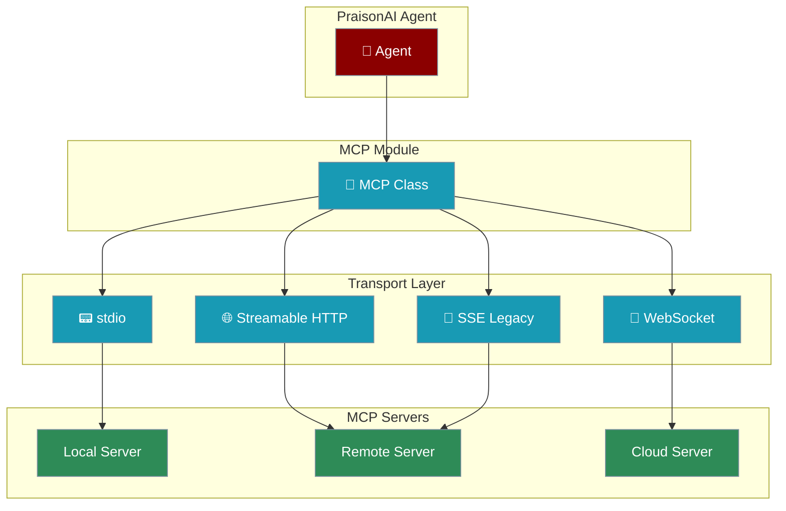
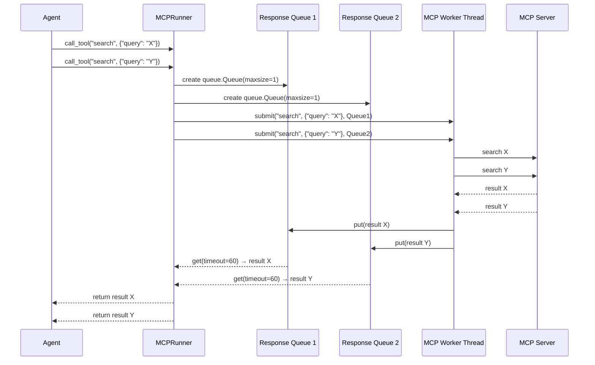

# MCP Transports

<Info>**Protocol Revision**: 2025-11-25</Info>

PraisonAI Agents supports all MCP transport mechanisms for connecting to MCP servers, providing flexibility for different deployment scenarios.


```mermaid
graph TB
    subgraph "PraisonAI Agent"
        A[🤖 Agent]
    end
    
    subgraph "MCP Module"
        MCP[📡 MCP Class]
    end
    
    subgraph "Transport Layer"
        STDIO[📟 stdio]
        HTTP[🌐 Streamable HTTP]
        WS[🔌 WebSocket]
        SSE[📡 SSE Legacy]
    end
    
    subgraph "MCP Servers"
        S1[Local Server]
        S2[Remote Server]
        S3[Cloud Server]
    end
    
    A --> MCP
    MCP --> STDIO
    MCP --> HTTP
    MCP --> WS
    MCP --> SSE
    
    STDIO --> S1
    HTTP --> S2
    WS --> S3
    SSE --> S2
    
    classDef agent fill:#8B0000,stroke:#7C90A0,color:#fff
    classDef transport fill:#189AB4,stroke:#7C90A0,color:#fff
    classDef server fill:#2E8B57,stroke:#7C90A0,color:#fff
    
    class A agent
    class MCP,STDIO,HTTP,WS,SSE transport
    class S1,S2,S3 server
```

## Transport Types

<CardGroup cols={2}>
  <Card title="stdio" icon="terminal">
    **Local subprocess communication**
    - Best for local development
    - NPX packages, Python scripts
    - Newline-delimited JSON-RPC
  </Card>
  <Card title="Streamable HTTP" icon="globe">
    **HTTP POST/GET with SSE streaming**
    - Production deployments
    - Official SDK `streamablehttp_client`
    - Auth via custom headers
  </Card>
  <Card title="WebSocket" icon="plug">
    **Bidirectional real-time**
    - Long-lived connections
    - Cloud-native (hibernatable)
    - Lower protocol overhead
  </Card>
  <Card title="SSE (Legacy)" icon="tower-broadcast">
    **Server-Sent Events**
    - Backward compatibility
    - Protocol version 2024-11-05
    - URLs ending in `/sse`
  </Card>
</CardGroup>

## Quick Start

<CodeGroup>
```python stdio Transport
from praisonaiagents import Agent, MCP

# Local NPX server
agent = Agent(
    name="Assistant",
    tools=MCP("npx @modelcontextprotocol/server-memory")
)

# Python script
agent = Agent(
    tools=MCP("python3 mcp_server.py")
)
```

```python Streamable HTTP
from praisonaiagents import Agent, MCP

# HTTP endpoint (auto-detected)
agent = Agent(
    tools=MCP("https://api.example.com/mcp")
)

# With auth headers and timeout
agent = Agent(
    tools=MCP(
        "https://api.example.com/mcp",
        headers={"Authorization": "Bearer YOUR_TOKEN"},
        timeout=60
    )
)
```

```python WebSocket
from praisonaiagents import Agent, MCP

# WebSocket endpoint (auto-detected via ws://)
agent = Agent(
    tools=MCP("ws://localhost:8080/mcp")
)

# Secure WebSocket
agent = Agent(
    tools=MCP(
        "wss://api.example.com/mcp",
        auth_token="your-token"
    )
)
```

```python SSE Legacy
from praisonaiagents import Agent, MCP

# Legacy SSE endpoint (auto-detected via /sse suffix)
agent = Agent(
    tools=MCP("http://localhost:8080/sse")
)
```
</CodeGroup>

## Transport Auto-Detection

The MCP class automatically selects the appropriate transport based on the URL:

| URL Pattern | Transport | Example |
|-------------|-----------|---------|
| `ws://` or `wss://` | WebSocket | `ws://localhost:8080/mcp` |
| `http(s)://...` ending in `/sse` | SSE (Legacy) | `http://localhost:8080/sse` |
| `http(s)://<host><path>` (path required) | Streamable HTTP | `https://api.example.com/mcp` |
| Command string | stdio | `npx @mcp/server-memory` |

<Note>
Streamable HTTP: the URL is used verbatim. Include whatever endpoint path your server exposes (commonly `/mcp`); a bare-host URL will POST to `/` and fail with `Session terminated`.
</Note>

---

## stdio Transport

The stdio transport runs MCP servers as subprocesses, communicating via standard input/output.

### Features
- ✅ JSON-RPC messages over stdin/stdout
- ✅ Newline-delimited messages
- ✅ UTF-8 encoding enforced
- ✅ Environment variable support

<Note>
**Server side (`praisonai-mcp serve --transport stdio`):** the host reads stdin on a dedicated thread (not `loop.connect_read_pipe`), so it works on Windows `ProactorEventLoop` + Python 3.13 and other environments where the async pipe API is unavailable. Malformed UTF-8 becomes a JSON-RPC `-32700` parse error, the input queue is bounded to 1000 lines with backpressure, and `stop()` unblocks an idle reader for clean shutdown. See [MCP STDIO Server Transport](/docs/features/mcp-stdio-server-transport).
</Note>

### Usage

```python
from praisonaiagents import Agent, MCP

# Simple command string
agent = Agent(
    tools=MCP("npx @modelcontextprotocol/server-filesystem")
)

# With separate command and args
agent = Agent(
    tools=MCP(
        command="python3",
        args=["server.py", "--config", "prod.json"]
    )
)

# With environment variables
agent = Agent(
    tools=MCP(
        command="npx",
        args=["-y", "@modelcontextprotocol/server-github"],
        env={"GITHUB_TOKEN": "ghp_xxx"}
    )
)

# With timeout and debug
agent = Agent(
    tools=MCP(
        "npx @modelcontextprotocol/server-memory",
        timeout=120,
        debug=True
    )
)
```

### Parallel Tool Calls

MCP stdio tool calls are safe to run in parallel — each call gets its own response channel, so results never cross.

```python
from praisonaiagents import Agent, MCP
from praisonaiagents.config.feature_configs import ToolConfig

agent = Agent(
    name="Researcher",
    instructions="Use the MCP tools in parallel when helpful.",
    tools=MCP("npx @modelcontextprotocol/server-memory", timeout=60),
    tool_config=ToolConfig(parallel=True),
)

agent.start("Look up X and Y at the same time")
```

The `timeout` parameter on `MCP()` controls the per-call wait time (default `60s`). On timeout, the tool result is the string `"Error: MCP tool call timed out after {N} seconds"` — the agent sees this as a tool error and can retry. The timeout also bounds the initial MCP handshake.


```mermaid
sequenceDiagram
    participant Agent
    participant MCPRunner
    participant Queue1 as Response Queue 1
    participant Queue2 as Response Queue 2
    participant MCPWorker as MCP Worker Thread
    participant MCPServer as MCP Server
    
    Agent->>MCPRunner: call_tool("search", {"query": "X"})
    Agent->>MCPRunner: call_tool("search", {"query": "Y"})
    
    MCPRunner->>Queue1: create queue.Queue(maxsize=1)
    MCPRunner->>Queue2: create queue.Queue(maxsize=1)
    
    MCPRunner->>MCPWorker: submit("search", {"query": "X"}, Queue1)
    MCPRunner->>MCPWorker: submit("search", {"query": "Y"}, Queue2)
    
    MCPWorker->>MCPServer: search X
    MCPWorker->>MCPServer: search Y
    
    MCPServer-->>MCPWorker: result X
    MCPServer-->>MCPWorker: result Y
    
    MCPWorker->>Queue1: put(result X)
    MCPWorker->>Queue2: put(result Y)
    
    Queue1-->>MCPRunner: get(timeout=60) → result X
    Queue2-->>MCPRunner: get(timeout=60) → result Y
    
    MCPRunner-->>Agent: return result X
    MCPRunner-->>Agent: return result Y
```

---

## Streamable HTTP Transport

<Info>This is the current standard transport (Protocol Revision 2025-11-25)</Info>

The Streamable HTTP transport uses HTTP POST for sending messages and supports SSE streaming for responses.

### Requirements

The Streamable HTTP transport is powered by the official MCP SDK's `streamablehttp_client` (httpx-based). It requires an up-to-date `mcp` package.

```bash
pip install -U 'mcp'
```

<Warning>
If the installed `mcp` package is too old, `HTTPStreamMCPClient` raises at construction time:

```
The installed 'mcp' package does not provide the Streamable HTTP client
(mcp.client.streamable_http.streamablehttp_client).
Upgrade it with: pip install -U 'mcp'
```

Fix it by upgrading: `pip install -U 'mcp'`.
</Warning>

### Features
- ✅ Single MCP endpoint for all communication
- ✅ Powered by the official `mcp.client.streamable_http.streamablehttp_client` (httpx, not aiohttp)
- ✅ Session lifecycle managed by the official SDK client
- ✅ Custom headers for authentication
- ✅ Clean context unwinding — a failed `initialize()` handshake unwinds already-entered contexts, so no httpx/anyio connection or half-open remote session is leaked

### Usage

The URL is used exactly as provided; there is no client-side rewriting. Pass the full endpoint your server exposes (commonly `.../mcp`).

```python
from praisonaiagents import Agent, MCP

# Basic HTTP endpoint
agent = Agent(
    tools=MCP("https://api.example.com/mcp")
)

# With auth headers and timeout
agent = Agent(
    tools=MCP(
        "https://api.example.com/mcp",
        headers={"Authorization": "Bearer YOUR_TOKEN"},
        timeout=60,
        debug=True
    )
)
```

### Supported Options

The HTTP-Stream transport reads only these two options:

| Option | Type | Default | Description |
|--------|------|---------|-------------|
| `headers` | `dict[str, str]` | `None` | Extra headers forwarded to `streamablehttp_client` (e.g. `{"Authorization": "Bearer ..."}`) |
| `timeout` | `int` | `60` | Passed to `streamablehttp_client` and used as the per-call bound |

<Note>
`session`, `resumability`, `cors`, and `responseMode` are still accepted as keyword arguments but are **no-ops** on this transport — session and resumability are fully managed by the official SDK client. Use `headers` and `timeout` only.
</Note>

### Troubleshooting

<AccordionGroup>
<Accordion title="ImportError: streamablehttp_client not found">
Your `mcp` package predates the Streamable HTTP client. Upgrade it:

```bash
pip install -U 'mcp'
```
</Accordion>

<Accordion title="session=True / resumability=True have no effect">
These options are no-ops on the HTTP-Stream transport. Session and resumability are managed internally by the official `streamablehttp_client`. Remove them — pass `headers` and `timeout` instead.
</Accordion>

<Accordion title="AttributeError on http_stream_client.transport">
The internal `transport` attribute is now `None`; session management is owned by the official SDK client. Do not access `http_stream_client.transport.session_id` or `.terminate_session()`.
</Accordion>

<Accordion title="McpError: Session terminated on initialize">
The Streamable HTTP transport posts to the URL exactly as you provided. It does **not** silently append `/mcp` to a bare-host URL any more (this convenience was removed in the fix for [PraisonAI #3032](https://github.com/MervinPraison/PraisonAI/issues/3032)). If your server exposes tools at `https://server.example.com/mcp`, pass that full URL — a bare `https://server.example.com` will POST to `/`, get HTTP 404, and the SDK will surface it as `McpError: Session terminated` during `session.initialize()`.

```python
# ❌ Old convenience — no longer works
MCP("https://server.example.com")

# ✅ Pass the full endpoint URL
MCP("https://server.example.com/mcp")
```
</Accordion>
</AccordionGroup>

---

## WebSocket Transport

<Note>Based on SEP-1288 (in review)</Note>

WebSocket transport provides bidirectional, long-lived connections ideal for cloud deployments.

### Features
- ✅ `ws://` and `wss://` URL detection
- ✅ JSON-RPC message framing
- ✅ Session ID handling
- ✅ Reconnection with exponential backoff
- ✅ Authentication token support
- ✅ Ping/pong keepalive

### Usage

```python
from praisonaiagents import Agent, MCP

# Basic WebSocket
agent = Agent(
    tools=MCP("ws://localhost:8080/mcp")
)

# Secure WebSocket with authentication
agent = Agent(
    tools=MCP(
        "wss://api.example.com/mcp",
        auth_token="Bearer your-secret-token",
        timeout=60
    )
)
```

### Advanced WebSocket Options

```python
from praisonaiagents.mcp.mcp_websocket import WebSocketMCPClient

# Direct client usage with all options
client = WebSocketMCPClient(
    server_url="wss://api.example.com/mcp",
    auth_token="your-token",
    timeout=60,
    options={
        "ping_interval": 30,
        "ping_timeout": 10,
        "max_retries": 5
    }
)

# Use with agent
agent = Agent(tools=list(client.tools))
```

### Reconnection

WebSocket transport automatically reconnects with exponential backoff:

```python
from praisonaiagents.mcp.mcp_websocket import calculate_backoff

# Backoff calculation: base_delay * 2^attempt, capped at max_delay
# Attempt 0: 1s, Attempt 1: 2s, Attempt 2: 4s, ... max 60s
```

---

## SSE Transport (Legacy)

<Warning>This transport is deprecated. Use Streamable HTTP for new implementations.</Warning>

The SSE transport is maintained for backward compatibility with servers using protocol version 2024-11-05.

### Usage

```python
from praisonaiagents import Agent, MCP

# URLs ending in /sse use legacy SSE transport
agent = Agent(
    tools=MCP("http://localhost:8080/sse")
)
```

---

## Security

### Origin Validation (DNS Rebinding Prevention)

```python
from praisonaiagents.mcp.mcp_security import SecurityConfig, is_valid_origin

# Configure allowed origins
config = SecurityConfig(
    allowed_origins=["localhost", "127.0.0.1", "example.com"],
    validate_origin=True
)

# Validate origin header
is_valid = is_valid_origin(
    origin="https://example.com",
    allowed_origins=config.allowed_origins
)
```

### Authentication

```python
from praisonaiagents.mcp.mcp_security import create_auth_header

# Bearer token
headers = create_auth_header("your-token", auth_type="bearer")
# {"Authorization": "Bearer your-token"}

# Basic auth
headers = create_auth_header("user:pass", auth_type="basic")
# {"Authorization": "Basic dXNlcjpwYXNz"}

# Custom header
headers = create_auth_header("api-key", auth_type="custom", header_name="X-API-Key")
# {"X-API-Key": "api-key"}
```

### Secure Session IDs

```python
from praisonaiagents.mcp.mcp_security import generate_secure_session_id

# Generate cryptographically secure session ID
session_id = generate_secure_session_id(length=32)
# Returns URL-safe base64 string with visible ASCII only
```

---

## Backward Compatibility

### Supporting Older Servers

The MCP class automatically handles backward compatibility:

```python
from praisonaiagents import MCP
from praisonaiagents.mcp.mcp_compat import detect_transport_support

# Auto-detection handles:
# 1. Try Streamable HTTP first (POST to endpoint)
# 2. On 400/404/405, fall back to legacy SSE
# 3. URLs ending in /sse use legacy transport directly

mcp = MCP("https://api.example.com/mcp")  # Auto-negotiates
```

### Protocol Versions Supported

| Version | Transport | Status |
|---------|-----------|--------|
| 2024-11-05 | HTTP+SSE | Legacy (supported) |
| 2025-03-26 | Streamable HTTP | Supported |
| 2025-06-18 | Streamable HTTP | Supported |
| 2025-11-25 | Streamable HTTP | Current |

---

## Custom Transports

You can implement custom transports by extending the `BaseTransport` class:

```python
from praisonaiagents.mcp.mcp_transport import BaseTransport, TransportRegistry

class MyCustomTransport(BaseTransport):
    async def connect(self):
        """Establish connection"""
        pass
    
    async def send(self, message: dict):
        """Send JSON-RPC message"""
        pass
    
    async def receive(self) -> dict:
        """Receive JSON-RPC message"""
        pass
    
    async def close(self):
        """Close connection"""
        pass
    
    @property
    def is_connected(self) -> bool:
        return self._connected

# Register custom transport
registry = TransportRegistry()
registry.register("my_transport", MyCustomTransport)
```

---

## Best Practices

<CardGroup cols={2}>
  <Card title="Transport Selection" icon="route">
    - **stdio**: Local development, NPX packages
    - **Streamable HTTP**: Production web services
    - **WebSocket**: Real-time, cloud-native apps
    - **SSE**: Legacy server compatibility
  </Card>
  <Card title="Streamable HTTP" icon="key">
    - Upgrade with `pip install -U 'mcp'`
    - Pass `headers` for authentication
    - Session lifecycle is handled by the SDK client
  </Card>
  <Card title="Timeouts" icon="rotate">
    - Set `timeout` for slow servers
    - The timeout bounds each tool call
    - It also bounds the initial handshake
  </Card>
  <Card title="Security" icon="shield">
    - Validate Origin headers
    - Use HTTPS/WSS in production
    - Implement proper authentication
    - Bind to localhost for local servers
  </Card>
</CardGroup>

## Next Steps

<CardGroup cols={2}>
  <Card title="MCP Tools" icon="wrench" href="/docs/mcp/mcp-tools">
    Learn about MCP tool integration
  </Card>
  <Card title="MCP Servers" icon="server" href="/docs/mcp/mcp-server">
    Explore available MCP servers
  </Card>
  <Card title="SSE Transport Details" icon="tower-broadcast" href="/docs/mcp/sse-transport">
    Deep dive into SSE transport
  </Card>
  <Card title="Custom MCP Servers" icon="code" href="/docs/mcp/custom">
    Build your own MCP servers
  </Card>
</CardGroup>
