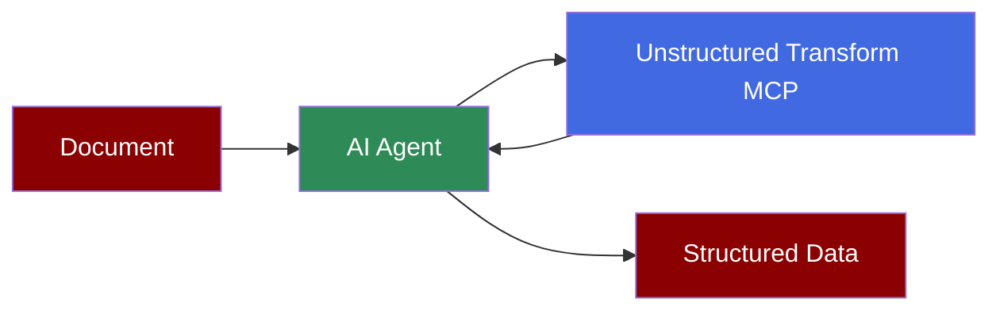

## Add Document Parsing to AI Agent



## Quick Start

<Steps>
    <Step title="Install Dependencies">
        Install PraisonAI with MCP support:
        ```bash
        pip install "praisonaiagents[mcp]"
        ```
        Connecting to a remote streamable-HTTP MCP server requires `praisonaiagents` 1.6.152 or later.
    </Step>
    <Step title="Set API Keys">
        Set your Unstructured API key (from [transform.unstructured.io](https://transform.unstructured.io)) and your model's API key as environment variables:
        ```bash
        export UNSTRUCTURED_API_KEY=your_unstructured_api_key_here
        export OPENAI_API_KEY=your_openai_api_key_here
        ```
    </Step>
    <Step title="Create a file">
        Create a new file `unstructured_transform.py` with the following code:
        ```python
        from praisonaiagents import Agent, MCP
        import os

        transform_agent = Agent(
            instructions="""You parse documents into structured, AI-ready data.
            Use the Unstructured Transform tools to turn PDFs, Office files, images,
            and other documents into clean Markdown, then answer questions about the content.""",
            model="gpt-4o-mini",
            tools=MCP(
                "https://mcp.transform.unstructured.io",
                headers={"Authorization": f"Bearer {os.environ['UNSTRUCTURED_API_KEY']}"},
            )
        )

        transform_agent.start(
            "Parse https://arxiv.org/pdf/1706.03762 to Markdown and list the section headings"
        )
        ```
    </Step>
    <Step title="Run the Agent">
        Execute your script:
        ```bash
        python unstructured_transform.py
        ```
        Transform is asynchronous: the agent starts a job with `transform_files`, polls `check_transform_status` until it is complete, then retrieves the output with `get_transform_results`. Large or scanned documents can take a few minutes.
    </Step>
</Steps>

<Note>
  **Requirements**
  - Python 3.10 or higher
  - `praisonaiagents` 1.6.152 or later (remote streamable-HTTP MCP support)
  - An Unstructured API key
  - An OpenAI API key (for the agent's LLM)
</Note>
