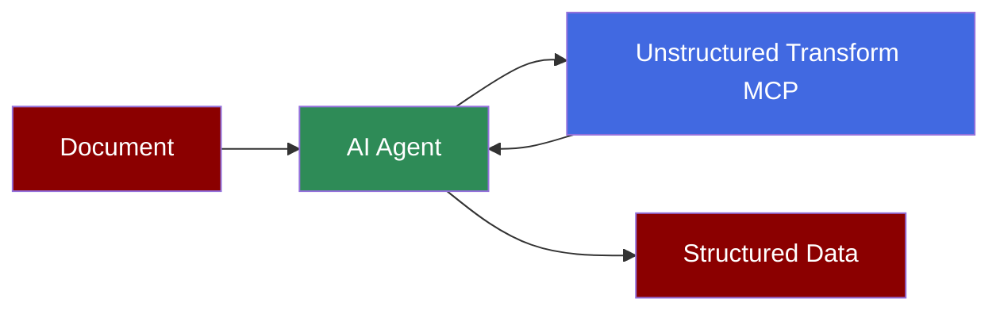

## Add Document Parsing to AI Agent


```mermaid
flowchart LR
    In[Document] --> Agent[AI Agent]
    Agent --> Tool[Unstructured Transform MCP]
    Tool --> Agent
    Agent --> Out[Structured Data]

    style In fill:#8B0000,color:#fff
    style Agent fill:#2E8B57,color:#fff
    style Tool fill:#4169E1,color:#fff
    style Out fill:#8B0000,color:#fff
```

## Quick Start

<Steps>
    <Step title="Install Dependencies">
        Install PraisonAI with MCP support:
        ```bash
        pip install "praisonaiagents[mcp]"
        ```
        This integration requires `praisonaiagents` 1.6.154 or later. Connecting to a remote streamable-HTTP MCP server needs 1.6.152, and the result-aware loop guard from 1.6.154 keeps a long-running transform from being halted as "no progress" while the agent polls for status.
    </Step>
    <Step title="Set API Keys">
        Set your Unstructured API key (from [transform.unstructured.io](https://transform.unstructured.io)) and your model's API key as environment variables:
        ```bash
        export UNSTRUCTURED_API_KEY=your_unstructured_api_key_here
        export OPENAI_API_KEY=your_openai_api_key_here
        ```
    </Step>
    <Step title="Create a file">
        Create a new file `unstructured_transform.py` with the following code:
        ```python
        from praisonaiagents import Agent, MCP
        from praisonaiagents.config.feature_configs import ExecutionConfig
        import os
        import time

        def wait_seconds(seconds: int) -> str:
            """Pause before the next transform status check. Use 30 seconds unless told otherwise."""
            seconds = max(1, min(int(seconds), 120))
            time.sleep(seconds)
            return f"Waited {seconds} seconds."

        transform_tools = MCP(
            "https://mcp.transform.unstructured.io",
            headers={"Authorization": f"Bearer {os.environ['UNSTRUCTURED_API_KEY']}"},
        )

        transform_agent = Agent(
            instructions="""You parse documents into structured, AI-ready data.
            Use the Unstructured Transform tools to turn PDFs, Office files, images,
            and other documents into clean Markdown, then answer questions about the content.
            Transforms are ASYNC and take 30 seconds to a few minutes. After start_transform_job
            returns a job_id, ALWAYS call wait_seconds(30) BEFORE each check_job_status call.
            Never call check_job_status twice in a row without waiting in between. Keep waiting
            and checking until the status is COMPLETED, then call get_job_results and answer
            from the parsed content.""",
            model="gpt-4o-mini",
            execution=ExecutionConfig(max_tool_calls_per_turn=100),
            tools=[*transform_tools, wait_seconds],
        )

        transform_agent.start(
            "Parse https://arxiv.org/pdf/1706.03762 to Markdown and list the section headings"
        )
        ```

        Two details make a multi-minute transform complete. The `wait_seconds` function, passed alongside the
        MCP tools, gives the agent a way to pace its polling: without it the agent checks the status every
        couple of seconds and then concludes the job is taking too long while it is still running. And
        `ExecutionConfig(max_tool_calls_per_turn=100)` raises the default cap of 10 tool calls per turn, which
        a polling loop passes well before a job finishes.
    </Step>
    <Step title="Run the Agent">
        Execute your script:
        ```bash
        python unstructured_transform.py
        ```
        Transform is asynchronous: the agent starts a job with `start_transform_job`, waits with `wait_seconds`, polls `check_job_status` until it is complete, then retrieves the output with `get_job_results`. Large or scanned documents can take a few minutes.
    </Step>
</Steps>

## Extract Structured Data

To pull named fields out of a document instead of converting the whole document, ask the agent for an extraction:

```python
transform_agent.start(
    """Extract each plant's name, light needs, watering instructions, and humidity level from
    https://docs.unstructured.io/img/pipelines/data-extractor/house-plant-care.png as JSON.
    Suggest a schema first and show it to me before running the extraction."""
)
```

Extraction runs on the element JSON that a parse produces rather than on the raw file, so the agent parses the document first, then extracts from the `output_ref` that `get_job_results` returns for it. It drafts a schema with `suggest_extraction_schema_for_file` when you have not supplied one, runs `start_extraction_job`, then polls with the same `check_job_status` and `get_job_results` tools. Two jobs run back to back, so an extraction takes longer than a parse alone.

Results come back as JSON matching the schema, wrapped with the source filename and the element JSON reference they were taken from. Extraction can only surface what the parse captured, so ask for a higher-fidelity parse if a first attempt comes back sparse. For prompt patterns, see [Structured data extraction](https://docs.unstructured.io/transform/sde).

<Note>
  **Requirements**
  - Python 3.10 or higher
  - `praisonaiagents` 1.6.154 or later (remote streamable-HTTP MCP support, plus the result-aware loop guard needed for async polling)
  - An Unstructured API key
  - An OpenAI API key (for the agent's LLM)
</Note>
