# Memory Features

PraisonAI agents support several memory features that make conversations smarter over time. Each feature is **opt-in** — disabled by default for zero overhead.

```mermaid
graph LR
    A["🧠 Agent"] --> B{"MemoryConfig"}
    B --> C["auto_save"]
    B --> D["history"]
    B --> E["auto_memory"]
    B --> F["learn"]
    style A fill:#8B0000,color:#fff
    style B fill:#189AB4,color:#fff
    style C fill:#189AB4,color:#fff
    style D fill:#189AB4,color:#fff
    style E fill:#189AB4,color:#fff
    style F fill:#189AB4,color:#fff
```



---

## Quick Comparison

| Feature | What it does | Config |
|---------|-------------|--------|
| **auto_save** | Saves full conversation to disk | `auto_save="chat1"` |
| **history** | Injects past sessions into context | `history=True` |
| **auto_memory** | Extracts facts/preferences automatically | `auto_memory=True` |
| **learn** | Captures patterns and insights | `learn=True` |

---

## Auto-Save Sessions

Automatically saves the full conversation history to disk after each `start()` / `run()` call.

<Tabs>
  <Tab title="Simple">
```python
from praisonaiagents import Agent, MemoryConfig

agent = Agent(
    name="assistant",
    instructions="Be helpful",
    memory=MemoryConfig(auto_save="my_chat")
)

agent.start("Hello!")
# Session saved to ~/.praisonai/memory/sessions/my_chat.json
```
  </Tab>
  <Tab title="Preset">
```python
from praisonaiagents import Agent

# Use the "session" preset (auto_save + history)
agent = Agent(
    name="assistant",
    instructions="Be helpful",
    memory="session"
)
```
  </Tab>
</Tabs>


---

## History Injection

Automatically loads past session history into context so the agent remembers previous conversations.

<Tabs>
  <Tab title="Basic">
```python
from praisonaiagents import Agent, MemoryConfig

agent = Agent(
    name="assistant",
    instructions="Be helpful",
    memory=MemoryConfig(history=True)
)

# First run
agent.start("My name is Alice")

# Later run — agent remembers!
agent.start("What's my name?")
# → "Your name is Alice"
```
  </Tab>
  <Tab title="With Limit">
```python
from praisonaiagents import Agent, MemoryConfig

agent = Agent(
    name="assistant",
    instructions="Be helpful",
    memory=MemoryConfig(
        history=True,
        history_limit=20,  # Load last 20 messages
        session_id="user_123"  # Explicit session ID
    )
)
```
  </Tab>
  <Tab title="Preset">
```python
from praisonaiagents import Agent

# "history" preset — history=True, limit=10
agent = Agent(name="assistant", memory="history")

# "chat" preset — history=True, limit=20
agent = Agent(name="assistant", memory="chat")
```
  </Tab>
</Tabs>

<Info>
  When `history=True`, a session ID is auto-generated from the agent name if you don't provide one.
  Use `session_id="..."` for explicit control over which session to resume.

```mermaid
sequenceDiagram
    participant S as 📂 Session Store
    participant A as 🧠 Agent
    participant U as 👤 User

    Note over A: chat() called
    A->>S: Load history (session_id)
    S->>A: Past messages
    Note over A: Inject into context
    U->>A: "What's my name?"
    A->>U: "Your name is Alice"
    A->>S: Save new messages
```

</Info>



---

## Auto-Memory Extraction

Automatically extracts memorable facts (names, preferences, roles) from conversations and stores them in long-term memory.

<Tabs>
  <Tab title="Enable">
```python
from praisonaiagents import Agent, MemoryConfig

agent = Agent(
    name="assistant",
    instructions="Be helpful",
    memory=MemoryConfig(auto_memory=True)
)

agent.start("My name is John and I prefer Python")
# Auto-extracted: name=John, preference=Python
```
  </Tab>
  <Tab title="How It Works">

  </Tab>
</Tabs>

<Tip>

```mermaid
sequenceDiagram
    participant U as 👤 User
    participant A as 🧠 Agent
    participant AM as 🔍 AutoMemory
    participant FM as 💾 FileMemory

    U->>A: "I'm John, I use Python"
    A->>U: "Nice to meet you!"
    A->>AM: process_interaction()
    AM->>AM: Extract facts
    AM->>FM: store name="John"
    AM->>FM: store preference="Python"
    Note over FM: Persisted to disk
```

  Auto-memory uses lightweight regex-based extraction — no LLM calls needed.
  It only processes messages that contain personal information keywords.
</Tip>

---

## Manual Memory Storage

You can also store memories manually using the `store_memory()` method.

```python
from praisonaiagents import Agent

agent = Agent(name="assistant", memory=True)

# Store facts manually
agent.store_memory("User prefers dark mode", "long_term")
agent.store_memory("Current task: build a dashboard", "short_term")

# Context is auto-injected into system prompt
response = agent.start("What should I work on?")
```

---

## Memory Presets

Use string shortcuts instead of `MemoryConfig` for common configurations.

| Preset | Equivalent Config |
|--------|-------------------|
| `"file"` | `MemoryConfig(backend="file")` |
| `"sqlite"` | `MemoryConfig(backend="sqlite")` |
| `"redis"` | `MemoryConfig(backend="redis")` |
| `"history"` | `MemoryConfig(history=True, history_limit=10)` |
| `"session"` | `MemoryConfig(history=True, history_limit=10)` |
| `"chat"` | `MemoryConfig(history=True, history_limit=20)` |
| `"learn"` | `MemoryConfig(learn=True)` |

```python
from praisonaiagents import Agent

# These are equivalent:
agent1 = Agent(name="a", memory="history")
agent2 = Agent(name="a", memory=MemoryConfig(history=True))
```

---

## Custom Memory Backend

Implement the `AgentMemoryProtocol` to create your own memory backend.

```python
from praisonaiagents import Agent

class MyRedisMemory:
    """Custom memory backend."""
    
    def get_context(self, query=None):
        # Return stored context for system prompt
        return "User prefers Python"
    
    def save_session(self, name, conversation_history=None, metadata=None):
        # Persist session to your backend
        pass

agent = Agent(
    name="assistant",
    memory=MyRedisMemory()  # Pass custom instance
)
```

<Info>
  Any object with `get_context()` and `save_session()` methods works as a memory backend.
  No inheritance required — PraisonAI uses duck typing via `AgentMemoryProtocol`.
</Info>

---

## Architecture


<CardGroup cols={2}>
  <Card title="Session Persistence" icon="clock-rotate-left" href="/memory/session-resume">
    Resume conversations across restarts
  </Card>
  <Card title="Storage Backends" icon="database" href="/memory/storage">
    File, SQLite, Redis, PostgreSQL, MongoDB
  </Card>
  <Card title="Advanced Memory" icon="brain" href="/memory/advanced">
    Long-term, short-term, entity memory
  </Card>
  <Card title="Graph Memory" icon="diagram-project" href="/memory/graph">
    Relationship-aware memory
  </Card>
</CardGroup>
