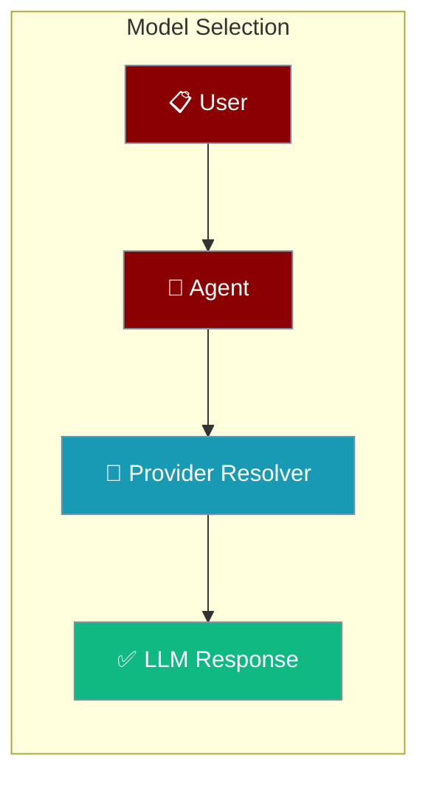
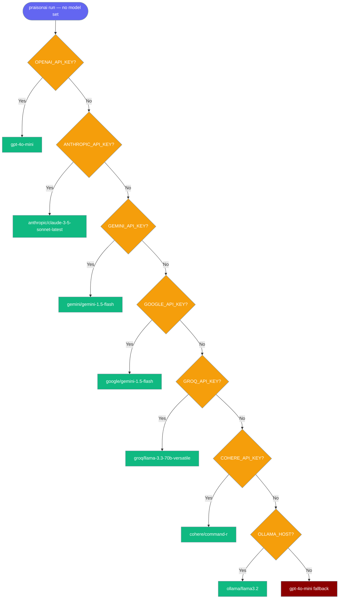
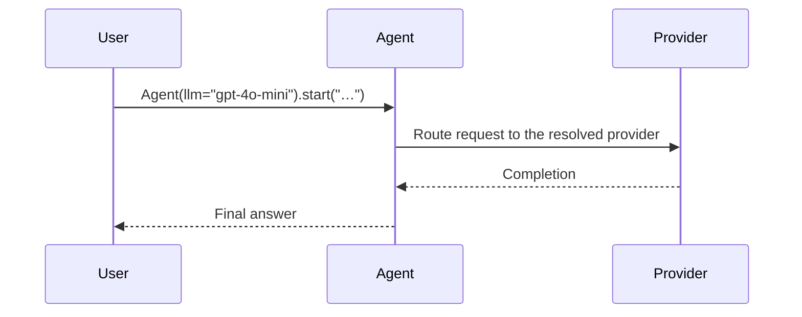

Point an Agent at any provider by setting its `llm` parameter — PraisonAI routes to OpenAI, Anthropic, Gemini, Groq, Cohere, or a local Ollama model.

```python
from praisonaiagents import Agent

agent = Agent(instructions="You are a helpful assistant", llm="gpt-4o-mini")
agent.start("Why is the sky blue?")
```



<Tip>
  Not sure which model to use? Run `praisonai models list` to browse all available models, or see the [Model Catalogue CLI](/docs/features/models-cli) for full details on browsing, describing, and validating models.
</Tip>

# Code

## Set model by 3 ways

### 1. OpenAI Compatible Endpoints

<Note>By Default it uses OPENAI_BASE_URL https://api.openai.com/v1 </Note>
Example Groq Implementation:

```bash
export OPENAI_API_KEY="${GROQ_API_KEY:?Set GROQ_API_KEY in your shell}"
export OPENAI_BASE_URL=https://api.groq.com/openai/v1
```

```python
from praisonaiagents import Agent

agent = Agent(
    instructions="You are a helpful assistant",
    llm="llama-3.1-8b-instant",
)

agent.start("Why sky is Blue?")
```

### 2. Litellm Compatible model names (eg: gemini/gemini-1.5-flash-8b)

```bash
pip install "praisonaiagents[llm]"
```

```python
from praisonaiagents import Agent

agent = Agent(
    instructions="You are a helpful assistant",
    llm="gemini/gemini-1.5-flash-8b",
    reflection=True,
    
)

agent.start("Why sky is Blue?")
```

### 3. Litellm Compatible Configuration

```bash
pip install "praisonaiagents[llm]"
```

```python 
from praisonaiagents import Agent

llm_config = {
    "model": "gemini/gemini-1.5-flash-latest",  # Model name without provider prefix
    
    # Core settings
    "temperature": 0.7,                # Controls randomness (like temperature)
    "timeout": 30,                 # Timeout in seconds
    "top_p": 0.9,                    # Nucleus sampling parameter
    "max_tokens": 1000,               # Max tokens in response
    
    # Advanced parameters
    "presence_penalty": 0.1,         # Penalize repetition of topics (-2.0 to 2.0)
    "frequency_penalty": 0.1,        # Penalize token repetition (-2.0 to 2.0)
    
    # API settings (optional)
    "api_key": None,                 # Your API key (or use environment variable)
    "base_url": None,                # Custom API endpoint if needed
    
    # Response formatting
    "response_format": {             # Force specific response format
        "type": "text"               # Options: "text", "json_object"
    },
    
    # Additional controls
    "seed": 42,                      # For reproducible responses
    "stop_phrases": ["##", "END"],   # Custom stop sequences
}

agent = Agent(
    instructions="You are a helpful Assistant."
    llm=llm_config
)
agent.start()
```

## Advanced Configuration (Litellm Support)

<Note>This uses Litellm</Note>
<Steps>
  <Step title="Install Package">
    Install required packages:
    ```bash
    pip install "praisonaiagents[llm]"
    ```
  </Step>

  <Step title="Setup Environment">
    Configure environment:
    ```bash
    export GOOGLE_API_KEY="${GOOGLE_API_KEY:?Set GOOGLE_API_KEY in your shell}"
    ```
    
    <Note>
    Get your API key from [Google AI Studio](https://makersuite.google.com/app/apikey)
    </Note>
  </Step>

  <Step title="Create Agent">
    Create `app.py`:

<CodeGroup>

```python Basic
# if json_object is supported by the model
from praisonaiagents import Agent

agent = Agent(
    instructions="You are a helpful assistant",
    llm="gemini/gemini-1.5-flash-8b",
    reflection=True,
    
)

agent.start("Why sky is Blue?")
```

```python Advanced 
# if json_object is not supported by the model
from praisonaiagents import Agent

# Detailed LLM configuration
llm_config = {
    "model": "gemini/gemini-1.5-flash-latest",  # Model name without provider prefix
    
    # Core settings
    "temperature": 0.7,                # Controls randomness (like temperature)
    "timeout": 30,                 # Timeout in seconds
    "top_p": 0.9,                    # Nucleus sampling parameter
    "max_tokens": 1000,               # Max tokens in response
    
    # Advanced parameters
    "presence_penalty": 0.1,         # Penalize repetition of topics (-2.0 to 2.0)
    "frequency_penalty": 0.1,        # Penalize token repetition (-2.0 to 2.0)
    
    # API settings (optional)
    "api_key": None,                 # Your API key (or use environment variable)
    "base_url": None,                # Custom API endpoint if needed
    
    # Response formatting
    "response_format": {             # Force specific response format
        "type": "text"               # Options: "text", "json_object"
    },
    
    # Additional controls
    "seed": 42,                      # For reproducible responses
    "stop_phrases": ["##", "END"],   # Custom stop sequences
}

agent = Agent(
    instructions="You are a helpful Assistant specialized in scientific explanations. "
                "Provide clear, accurate, and engaging responses.",
    llm=llm_config,                  # Pass the detailed configuration
                        # Enable detailed output
                       # Format responses in markdown
    reflection=True,              # Enable self-reflection
    max_iterations=3,                  # Maximum reflection iterations
    min_iterations=1                   # Minimum reflection iterations
)

# Test the agent
response = agent.start("Why is the sky blue? Please explain in simple terms.")

```
</CodeGroup>
</Step>
</Steps>

<AccordionGroup>
  <Accordion title="Ollama Integration" defaultOpen>
    ```bash
    export OPENAI_BASE_URL=http://localhost:11434/v1
    ```
  </Accordion>
  <Accordion title="Groq Integration" defaultOpen>
    ```bash
    export OPENAI_API_KEY="${GROQ_API_KEY:?Set GROQ_API_KEY in your shell}"
    export OPENAI_BASE_URL=https://api.groq.com/openai/v1
    ```
  </Accordion>
  <Accordion title="Google Gemini" defaultOpen> 
    ```bash
    export OPENAI_API_KEY="${GEMINI_API_KEY:?Set GEMINI_API_KEY in your shell}"
    export OPENAI_BASE_URL=https://generativelanguage.googleapis.com/v1beta/openai/
    ```
  </Accordion>
  <Accordion title="Jan AI Integration" defaultOpen>
    ```bash
    export OPENAI_BASE_URL=http://localhost:1337/v1
    ```
  </Accordion>
  <Accordion title="LM Studio Integration" defaultOpen>
    ```bash
    export OPENAI_BASE_URL=http://localhost:1234/v1
    ```
  </Accordion>
  <Accordion title="OpenRouter Integration" defaultOpen>
    ```bash
    export OPENAI_API_KEY="${OPENROUTER_API_KEY:?Set OPENROUTER_API_KEY in your shell}"
    export OPENAI_BASE_URL=https://openrouter.ai/api/v1
    ```
  </Accordion>

</AccordionGroup>

## Provider Auto-Detection (no-config first run)

When you run `praisonai run` without setting `--model` or a `model:` key in `config.yaml`, PraisonAI inspects which supported provider credential is present in your environment and picks a provider-appropriate default — so a user whose only key is `ANTHROPIC_API_KEY` no longer gets an OpenAI auth error on first run.

| Credential env var | Resolved default model | Base URL |
|---|---|---|
| `OPENAI_API_KEY` | `gpt-4o-mini` | `https://api.openai.com/v1` |
| `ANTHROPIC_API_KEY` | `anthropic/claude-3-5-sonnet-latest` | `https://api.anthropic.com/v1` |
| `GEMINI_API_KEY` | `gemini/gemini-1.5-flash` | `https://generativelanguage.googleapis.com/v1beta` |
| `GOOGLE_API_KEY` | `google/gemini-1.5-flash` | `https://generativelanguage.googleapis.com/v1beta` |
| `GROQ_API_KEY` | `groq/llama-3.3-70b-versatile` | `https://api.groq.com/openai/v1` |
| `COHERE_API_KEY` | `cohere/command-r` | `https://api.cohere.ai/v1` |
| `OLLAMA_HOST` | `ollama/llama3.2` | `http://localhost:11434/v1` |
| (none of the above) | `gpt-4o-mini` | `https://api.openai.com/v1` |

Precedence: the first credential in the table that is set wins. If multiple provider keys are set, the one listed first takes effect.

<Note>
The same resolver drives implicit defaults for `praisonai run`, `praisonai chat`, `praisonai init` scaffolding, `praisonai setup`, and the bare-`praisonai` TUI launch — not just `run`.
</Note>



<Tip>
An explicit `--model <name>` flag or a `model:` key in `config.yaml` always overrides auto-detection.
</Tip>

## Supported Models for No Code

| PraisonAI Chat | PraisonAI Code | PraisonAI (Multi-Agents) |
| --- | --- | --- |
| [Litellm](https://litellm.vercel.app/docs/providers) | [Litellm](https://litellm.vercel.app/docs/providers) | Below Models |

- [OpenAI](models/openai.md)
- [Groq](models/groq.md)
- [Google Gemini](models/google.md)
- [Anthropic Claude](models/anthropic.md)
- [Cohere](models/cohere.md)
- [Mistral](models/mistral.md)
- [Ollama](models/ollama.md)
- [Other Models](models/other.md)


## Example agents.yaml

This uses Multi-Agents with Multi-LLMs.

```yaml
framework: crewai
topic: research about the causes of lung disease
agents:  # Canonical: use 'agents' instead of 'roles'
  research_analyst:
    instructions:  # Canonical: use 'instructions' instead of 'backstory' Experienced in analyzing scientific data related to respiratory health.
    goal: Analyze data on lung diseases
    role: Research Analyst
    llm:  
      model: "groq/llama3-70b-8192"
    function_calling_llm: 
      model: "google/gemini-1.5-flash-001"
    tasks:
      data_analysis:
        description: Gather and analyze data on the causes and risk factors of lung
          diseases.
        expected_output: Report detailing key findings on lung disease causes.
    tools:
    - 'InternetSearchTool'
  medical_writer:
    instructions:  # Canonical: use 'instructions' instead of 'backstory' Skilled in translating complex medical information into accessible
      content.
    goal: Compile comprehensive content on lung disease causes
    role: Medical Writer
    llm:  
      model: "anthropic/claude-3-haiku-20240307"
    function_calling_llm: 
      model: "openai/gpt-4o"
    tasks:
      content_creation:
        description: Create detailed content summarizing the research findings on
          lung disease causes.
        expected_output: Document outlining various causes and risk factors of lung
          diseases.
    tools:
    - ''
  editor:
    instructions:  # Canonical: use 'instructions' instead of 'backstory' Proficient in editing medical content for accuracy and clarity.
    goal: Review and refine content on lung disease causes
    role: Editor
    llm:  
      model: "cohere/command-r"
    tasks:
      content_review:
        description: Edit and refine the compiled content on lung disease causes for
          accuracy and coherence.
        expected_output: Finalized document on lung disease causes ready for dissemination.
    tools:
    - ''
dependencies: []
```

## How It Works

The Agent passes your `llm` value to the provider resolver, which routes the request to the matching model and returns the response.



## Best Practices

<AccordionGroup>
<Accordion title="Let auto-detection pick the default">
Skip `llm=` on first runs. PraisonAI resolves a sensible default from whichever provider key is set — see [Provider Auto-Detection](#provider-auto-detection-no-config-first-run).
</Accordion>

<Accordion title="Use LiteLLM prefixes for non-OpenAI providers">
Pass `llm="gemini/gemini-1.5-flash-8b"` or `llm="anthropic/claude-3-5-sonnet-latest"` to target a specific provider model.
</Accordion>

<Accordion title="Keep API keys in the environment">
Set provider keys in your shell or `.env`. Use `api_key=None` in `llm_config` so the SDK reads the environment variable.
</Accordion>

<Accordion title="Match model to task">
Use a small fast model (`gpt-4o-mini`, `gemini-1.5-flash`) for routing and a larger model only where quality matters.
</Accordion>
</AccordionGroup>

## Related

<CardGroup cols={2}>
  <Card title="Quick Start" icon="bolt" href="/docs/quickstart">
    Run your first agent in a few lines.
  </Card>
  <Card title="Tools" icon="wrench" href="/docs/tools">
    Give models real actions with tools.
  </Card>
</CardGroup>