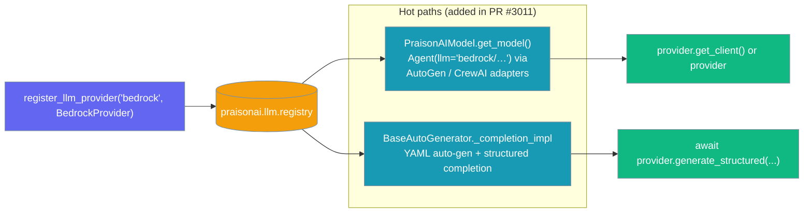

# Custom Provider Registry

The Custom Provider Registry allows you to register custom LLM providers that extend PraisonAI's capabilities beyond the built-in providers (OpenAI, Anthropic, Google via LiteLLM).

<Note>
**Updated in PR #1624**: Built-in providers (`openai`, `anthropic`, `google`) plus aliases (`oai`, `claude`, `gemini`, `google_genai`) are now auto-registered and backed by LiteLLM. You add custom providers when you need a non-LiteLLM backend or a custom routing/caching/mocking layer.

**Verified end-to-end in [PR #2171](https://github.com/MervinPraison/PraisonAI/pull/2171) and [PR #3011](https://github.com/MervinPraison/PraisonAI/pull/3011):**
- PR #2171 wired built-in aliases (`oai`, `claude`, `gemini`, `google_genai`) through the loader map so alias-based `create_llm_provider(...)` calls resolve.
- PR #3011 wired the wrapper's two hot LLM paths (framework-adapter resolver + structured-completion generator) to consult the registry first, so a registered non-built-in provider is now the one that actually serves `Agent(llm="…/…")` calls — not just standalone `create_llm_provider(...)`.
</Note>

## Built-in providers

Built-in providers are automatically registered when a registry is created:

| Provider name | Aliases | Backend |
|---|---|---|
| `openai` | `oai` | LiteLLM (`litellm.completion` / `litellm.acompletion`) |
| `anthropic` | `claude` | LiteLLM |
| `google` | `gemini`, `google_genai` | LiteLLM |

```python
from praisonai.llm import create_llm_provider

# Both work out of the box
provider1 = create_llm_provider("openai/gpt-4o")
provider2 = create_llm_provider("oai/gpt-4o")
```

## What Problem Does It Solve?

- Integrate proprietary or internal LLM APIs
- Add support for new providers before LiteLLM supports them
- Create mock providers for testing
- Build custom routing or caching layers

## Quick Start

<Steps>

<Step title="Define provider">
```python
class MyCustomProvider:
    provider_id = "my-custom"

    def __init__(self, model_id, config=None):
        self.model_id = model_id
        self.config = config or {}

    def generate(self, prompt):
        return f"Response from {self.model_id}"

    async def generate_async(self, prompt):
        return f"Async response from {self.model_id}"
```
</Step>

<Step title="Register and use">
```python
from praisonai.llm import register_llm_provider, create_llm_provider

register_llm_provider("my-custom", MyCustomProvider)

provider = create_llm_provider("my-custom/my-model")
provider.generate("Hello")            # sync
await provider.generate_async("Hello")  # async
```
</Step>

</Steps>

## Thread Safety

<Note>
**Enhanced in PR #1597:** `LLMProviderRegistry` is now thread-safe with singleton access and `RLock` protection for all operations.
</Note>

All registry methods (`register`, `unregister`, `resolve`, alias lookup, and listing) are **safe to call concurrently** from threads. Built-in providers are registered automatically on first instantiation.

**Singleton access pattern (preferred for app code):**

```python
from praisonai.llm.registry import LLMProviderRegistry

registry = LLMProviderRegistry.get_instance()  # double-checked-locked singleton
```

The existing helpers `register_llm_provider` / `create_llm_provider` continue to work unchanged (backwards compatible).

## How Provider Resolution Works

The registry resolves providers in this order:

### 1. Explicit Provider Format: `provider/model`

```python
# Explicitly specify provider
provider = create_llm_provider("cloudflare/workers-ai-model")
# Resolves to: provider_id="cloudflare", model_id="workers-ai-model"
```

### 2. Model Prefix Inference

When no provider is specified, the model name prefix determines the provider:

| Model Prefix | Inferred Provider |
|--------------|-------------------|
| `gpt-*`, `o1*`, `o3*` | `openai` |
| `claude-*` | `anthropic` |
| `gemini-*` | `google` |
| Other | `openai` (default) |

```python
# Built-in provider examples:
create_llm_provider("openai/gpt-4o")
create_llm_provider("oai/gpt-4o")  # Using alias

# Custom provider (after registration):
register_llm_provider("cloudflare", CloudflareProvider)
create_llm_provider("cloudflare/workers-ai-model")
```

### 3. Custom Provider with Explicit Name

```python
# After registering "cloudflare"
create_llm_provider("cloudflare/workers-ai")
# Resolves to your registered CloudflareProvider
```

## Where registered providers take effect

Registering a provider makes it reachable from every entry point that resolves models through the wrapper — not just direct `create_llm_provider(...)` calls.



Two wrapper hot paths now consult the registry before falling back to the built-in ladder.

| Hot path | What it calls on your provider | Opt-in |
|---|---|---|
| **`PraisonAIModel.get_model()`** — every `Agent(llm="myprov/…")` call routed through a framework adapter (AutoGen, CrewAI, etc.) | `provider.get_client()` if defined, otherwise the provider instance itself is returned as the "client" | Passive — any registered provider works |
| **`BaseAutoGenerator._completion_impl`** — YAML auto-generation and any generator inheriting from `BaseAutoGenerator` | `await provider.generate_structured(response_model, messages, **kwargs)` | Explicit — providers without `generate_structured` fall through to the built-in LiteLLM ladder |

<Note>
Registering a provider under a built-in prefix (`openai/`, `groq/`, `cohere/`, `ollama/`, `anthropic/`, `google/`, `openrouter/`) does **not** hijack the built-in path. Both hot paths gate against a shared `_BUILTIN_MODEL_PREFIXES` set so the built-in ladder always wins for those prefixes. Use a unique namespace (e.g. `mycompany-openai/`) if you need custom routing under an OpenAI-like protocol.
</Note>

<Warning>
The wrapper drops empty `api_key`/`base_url` entries from the config it forwards to your provider so the provider's own environment/credential chain still applies. If you rely on `AWS_REGION` / `AWS_PROFILE` (Bedrock), `CLOUDFLARE_ACCOUNT_ID` (Workers AI), or similar env-driven auth, you do not need to thread anything through the registry — resolve credentials inside your provider's `__init__`.
</Warning>

<Warning>
A registered provider that raises during construction now surfaces its real error — it is **not** silently replaced by the OpenAI-key `ValueError` from the built-in ladder. Before PR #3011 a broken Bedrock provider looked like a missing `OPENAI_API_KEY`; the error message now points at the actual provider that failed to construct.
</Warning>

### End-to-end Bedrock example

```python
# 1. Define a Bedrock-shaped provider.
from praisonai.llm import register_llm_provider

class BedrockProvider:
    provider_id = "bedrock"

    def __init__(self, model_id, config=None):
        self.model_id = model_id
        self.config = config or {}
        import boto3
        self._client = boto3.client(
            "bedrock-runtime",
            region_name=self.config.get("region_name", "us-east-1"),
        )

    # Framework-adapter hot path (PraisonAIModel.get_model)
    def get_client(self):
        return self._client

    # AutoGenerator hot path (BaseAutoGenerator._completion_impl)
    async def generate_structured(self, response_model, messages, **kwargs):
        # Call Bedrock, parse into response_model, return the pydantic model instance.
        ...

register_llm_provider("bedrock", BedrockProvider)

# 2. Now every wrapper entry point resolves through the provider — no OPENAI_API_KEY needed.
from praisonaiagents import Agent

agent = Agent(
    name="Claude on Bedrock",
    instructions="Answer using Claude on AWS Bedrock.",
    llm="bedrock/anthropic.claude-3-sonnet-20240229-v1:0",   # <- was previously an OpenAI-key ValueError
)

result = agent.start("Summarise the latest PR in one sentence.")
```

<Tip>
Skip `generate_structured` if you only need chat completion — `PraisonAIModel.get_client()` is enough for framework adapters. Add `generate_structured` when you also need YAML auto-generation (`praisonai --auto ...`) or another generator that produces pydantic models.
</Tip>

## Provider Aliases

Built-in providers support aliases for shorter, more convenient model specifications:

| Canonical | Aliases |
|-----------|---------|
| `openai` | `oai` |
| `anthropic` | `claude` |
| `google` | `gemini`, `google_genai` |

### Using Aliases

```python
from praisonaiagents import Agent

# These are equivalent ways to use Claude
agent1 = Agent(llm="anthropic/claude-3-5-sonnet")
agent2 = Agent(llm="claude/claude-3-5-sonnet")  # Alias

# These are equivalent ways to use OpenAI
agent3 = Agent(llm="openai/gpt-4o")
agent4 = Agent(llm="oai/gpt-4o")  # Alias

# These are equivalent ways to use Google
agent5 = Agent(llm="google/gemini-1.5-pro")
agent6 = Agent(llm="gemini/gemini-1.5-pro")  # Alias
```

### Registering Custom Providers with Aliases

When registering your own custom providers, you can specify aliases:

```python
from praisonai.llm import register_llm_provider

class CloudflareProvider:
    provider_id = "cloudflare"
    
    def __init__(self, model_id, config=None):
        self.model_id = model_id
        self.config = config or {}
        
    def generate(self, prompt):
        # Implementation
        pass

# Register with aliases
register_llm_provider(
    "cloudflare", 
    CloudflareProvider, 
    aliases=["cf", "workers"]
)

# Now all these work:
provider1 = create_llm_provider("cloudflare/workers-ai")
provider2 = create_llm_provider("cf/workers-ai")
provider3 = create_llm_provider("workers/workers-ai")
```

## Registering Custom Providers Safely

### Unique Name Rules

Provider names must be unique. Attempting to register a duplicate name raises an error:

```python
register_llm_provider("my-provider", MyProvider)
register_llm_provider("my-provider", AnotherProvider)  # Raises ValueError!
```

**Error message:**
```
ValueError: Provider 'my-provider' is already registered. Use override=True to replace it.
```

### Alias Rules

Aliases provide alternative names for a provider:

```python
register_llm_provider("cloudflare", CloudflareProvider, aliases=["cf", "workers-ai"])

# All of these now work:
create_llm_provider("cloudflare/model")
create_llm_provider("cf/model")
create_llm_provider("workers-ai/model")
```

**Alias collision detection:**

```python
register_llm_provider("provider-a", ProviderA, aliases=["shared"])
register_llm_provider("provider-b", ProviderB, aliases=["shared"])  # Raises ValueError!
```

**Error message:**
```
ValueError: Alias 'shared' is already registered (points to 'provider-a'). Use override=True to replace it.
```

### Override Flag

Use `override=True` only when you intentionally want to replace an existing registration:

```python
# Replace existing provider
register_llm_provider("my-provider", NewProvider, override=True)
```

<Warning>
**Avoid using `override=True` carelessly** - it can break other code that depends on the original provider.
</Warning>

## Avoiding Collisions

### Recommended Naming Pattern

Use a namespace prefix to avoid collisions:

```python
# Good: namespaced provider names
register_llm_provider("mycompany-internal-llm", InternalProvider)
register_llm_provider("myproject-mock", MockProvider)

# Avoid: generic names that might conflict
register_llm_provider("custom", CustomProvider)  # Too generic
register_llm_provider("llm", LLMProvider)  # Too generic
```

### Reserved Names

These provider names are now **registered providers** (not just inference defaults):

- `openai` - Auto-registered LiteLLM provider
- `anthropic` - Auto-registered LiteLLM provider  
- `google` - Auto-registered LiteLLM provider
- Their aliases: `oai`, `claude`, `gemini`, `google_genai`

<Note>
Re-registering them without `override=True` will raise `ValueError: Provider 'X' is already registered`. Use `override=True` only if you're intentionally replacing the built-in provider.
</Note>

## Multi-Agent Guidance

### Global Registry (Default)

The default global registry is shared across all code:

```python
from praisonai.llm import register_llm_provider

# This affects all code using the default registry
register_llm_provider("shared-provider", SharedProvider)
```

### Isolated Registry (Per Agent/Run)

For multi-agent scenarios where you need isolation:

```python
from praisonai.llm import LLMProviderRegistry, create_llm_provider

# Create isolated registries
agent1_registry = LLMProviderRegistry()
agent2_registry = LLMProviderRegistry()

# Register different providers to each
agent1_registry.register("custom", Agent1Provider)
agent2_registry.register("custom", Agent2Provider)

# Use with create_llm_provider
provider1 = create_llm_provider("custom/model", registry=agent1_registry)
provider2 = create_llm_provider("custom/model", registry=agent2_registry)

# provider1 and provider2 are different instances from different classes
```

**Benefits of isolated registries:**
- No global state mutation
- Safe for concurrent/parallel agent runs
- Each agent can have its own provider configuration
- Testing isolation

## API Reference

### register_llm_provider

```python
register_llm_provider(
    name: str,
    provider: ProviderClass | ProviderFactory,
    *,
    override: bool = False,
    aliases: list[str] | None = None
) -> None
```

### create_llm_provider

```python
create_llm_provider(
    input_value: str | dict | ProviderInstance,
    *,
    registry: LLMProviderRegistry | None = None,
    config: dict | None = None
) -> ProviderInstance
```

### LLMProviderRegistry

```python
class LLMProviderRegistry:
    def register(name, provider, *, override=False, aliases=None) -> None
    def unregister(name) -> bool
    def has(name) -> bool
    def list() -> list[str]
    def list_all() -> list[str]  # Includes aliases
    def resolve(name, model_id, config=None) -> ProviderInstance
    def get(name) -> ProviderClass | None
```

### Utility Functions

```python
from praisonai.llm import (
    get_default_llm_registry,  # Get global registry
    has_llm_provider,          # Check if provider exists
    list_llm_providers,        # List registered providers
    unregister_llm_provider,   # Remove a provider
    parse_model_string,        # Parse "provider/model" strings
)
```

## Breaking Changes

<Warning>
**Advanced Users Only**: The following breaking changes affect low-level API usage. Most users should use `register_provider()` and `resolve_provider()` for new code.
</Warning>

### Removed APIs

- `LLMProviderRegistry.get_instance()` → Use `get_default_llm_registry()`
- `LLMProviderRegistry._instance` and `_instance_lock` class attributes removed
- `praisonai.profiler.default_profiler` module attribute removed

### Changed Semantics

The `LLMProviderRegistry.register()` and `LLMProviderRegistry.resolve()` methods now have `PluginRegistry` semantics:

```python
# OLD (pre-PR #1675): 3-arg resolve
registry.resolve(name, model_id, config)

# NEW: Use register_provider/resolve_provider instead
registry.register_provider(name, provider, aliases=aliases)
provider_instance = registry.resolve_provider(name, model_id, config)
```

### Preserved Aliases

These methods continue to work for backward compatibility:
- `has()`, `list()`, `list_all()`
- Module-level `register_llm_provider(...)`, `create_llm_provider(...)`

## Minimal Example

```python
from praisonai.llm import register_llm_provider, create_llm_provider

class EchoProvider:
    """Simple provider that echoes input."""
    provider_id = "echo"
    
    def __init__(self, model_id, config=None):
        self.model_id = model_id
        self.config = config or {}
    
    def generate(self, prompt):
        return f"[{self.model_id}] Echo: {prompt}"

# Register
register_llm_provider("echo", EchoProvider)

# Use
provider = create_llm_provider("echo/v1")
print(provider.generate("Hello!"))
# Output: [v1] Echo: Hello!
```

## Troubleshooting

### Common Errors

**"Provider 'X' is already registered"**

```python
# Problem: Duplicate registration
register_llm_provider("my-provider", ProviderA)
register_llm_provider("my-provider", ProviderB)  # Error!

# Solution 1: Use a different name
register_llm_provider("my-provider-v2", ProviderB)

# Solution 2: Override intentionally
register_llm_provider("my-provider", ProviderB, override=True)
```

**"Unknown provider: 'X'"**

```python
# Problem: Provider not registered
provider = create_llm_provider("unregistered/model")  # Error!

# Solution: Register first
register_llm_provider("unregistered", MyProvider)
provider = create_llm_provider("unregistered/model")
```

**"Alias 'X' conflicts with existing provider"**

```python
# Problem: Alias matches an existing provider name
register_llm_provider("provider-a", ProviderA)
register_llm_provider("provider-b", ProviderB, aliases=["provider-a"])  # Error!

# Solution: Use a unique alias
register_llm_provider("provider-b", ProviderB, aliases=["alias-b"])
```

### Performance Notes

- **Lazy imports**: The registry module only imports `typing` - no heavy dependencies
- **Import time**: ~800μs for `praisonai.llm.registry`
- **O(1) operations**: `has()`, `resolve()`, and `register()` are all O(1)
- **No LiteLLM coupling**: The registry is completely independent of LiteLLM

## Migration note

**Before PR #3011**, `register_llm_provider("bedrock", ...)` succeeded but `Agent(llm="bedrock/…")` raised `ValueError: OPENAI_API_KEY environment variable is required for the default OpenAI service.` — because the framework-adapter resolver never consulted the registry. If you worked around this by shipping `OPENAI_API_KEY=not-needed` or a shim adapter, you can now delete the workaround: the registered provider is used directly.

## See Also

- [Models Overview](/docs/models) - Built-in provider configuration
- [LLM Gateways](/docs/features/llm-gateways) - Pre-registered gateway providers
- [Advanced Multi-Provider Patterns](/docs/features/multi-provider-advanced) - Routing across providers
- [LiteLLM Models](https://docs.litellm.ai/docs/providers) - Providers supported by LiteLLM
