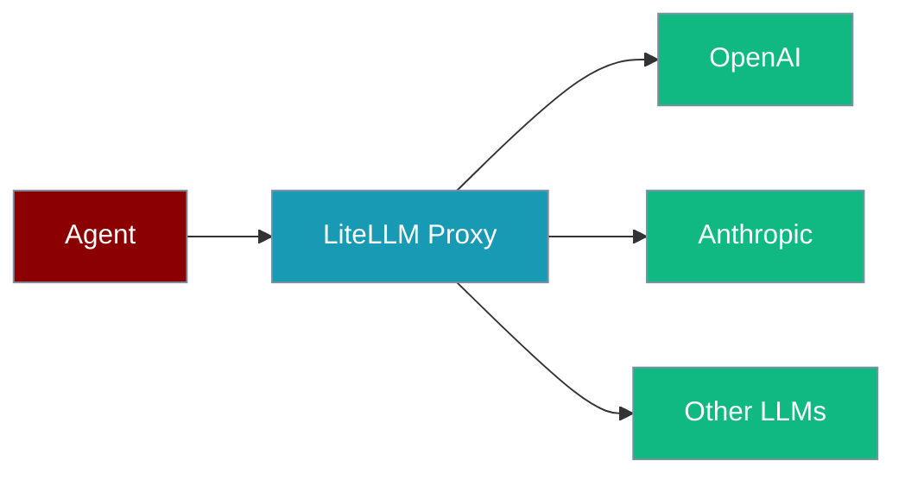

Route agent LLM calls through a self-hosted LiteLLM Proxy for caching, fallback, and load balancing.



## Quick Start

<Steps>

<Step title="Set environment variables">

```bash
export LITELLM_PROXY_BASE_URL=http://localhost:4000
export LITELLM_PROXY_API_KEY=your-proxy-key
```

</Step>

<Step title="Run agent through proxy">

```python
from praisonaiagents import Agent

agent = Agent(
    name="Proxy Agent",
    instructions="You are a helpful assistant",
    llm="litellm-proxy/gpt-4",
)
agent.start("Summarise LiteLLM Proxy benefits")
```

Aliases: `litellm-proxy`, `llm-proxy`, `litellm-gateway`. Model IDs are passed through unchanged.

</Step>

</Steps>

---

## Deployment Options

| Deployment | `LITELLM_PROXY_BASE_URL` |
|------------|--------------------------|
| Local dev | `http://localhost:4000` |
| Docker / k8s | Your service URL |
| LiteLLM cloud | Provider-supplied endpoint |

---

## Best Practices

<AccordionGroup>

<Accordion title="Use environment variables for keys">
Set `LITELLM_PROXY_API_KEY` in your environment instead of hardcoding keys in code.
</Accordion>

<Accordion title="LiteLLM Proxy for production">
Self-hosted caching, observability, and fallback routing suit production workloads over direct provider access.
</Accordion>

<Accordion title="Model ID pass-through">
LiteLLM Proxy passes model IDs unchanged — use the model name your proxy is configured to serve.
</Accordion>

</AccordionGroup>

---

## Related

<CardGroup cols={2}>
  <Card title="LLM Gateways" icon="router" href="/docs/features/llm-gateways">
    Multi-gateway patterns, custom headers, and programmatic setup
  </Card>
  <Card title="OpenRouter" icon="router" href="/docs/models/openrouter">
    Hosted access to 100+ models via OpenRouter
  </Card>
</CardGroup>

<Note>
For programmatic configuration, custom headers, and multi-gateway patterns, see [LLM Gateways](/docs/features/llm-gateways).
</Note>
