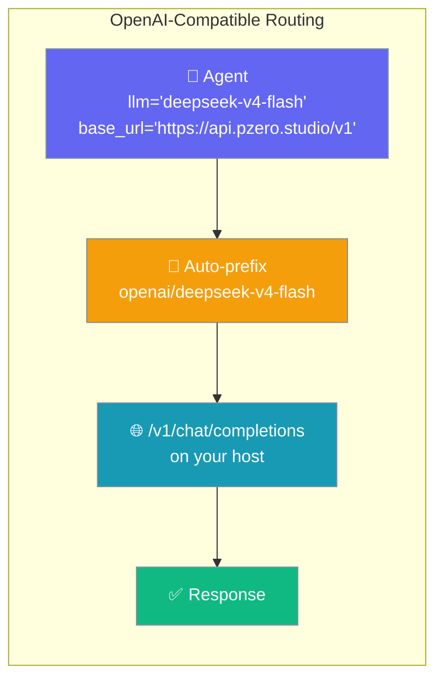
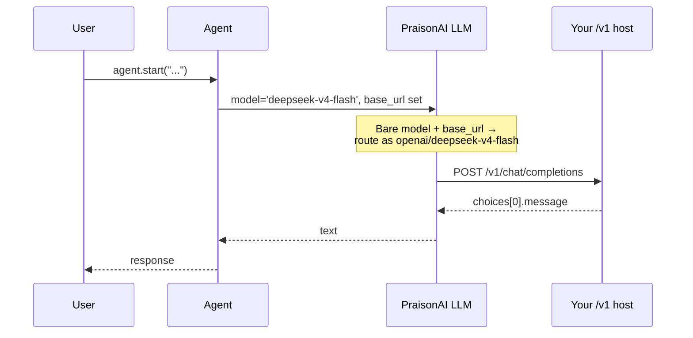
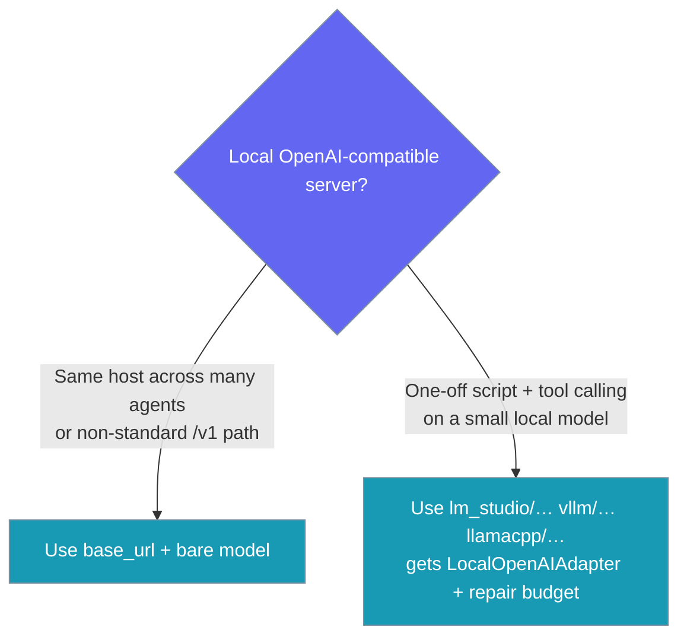
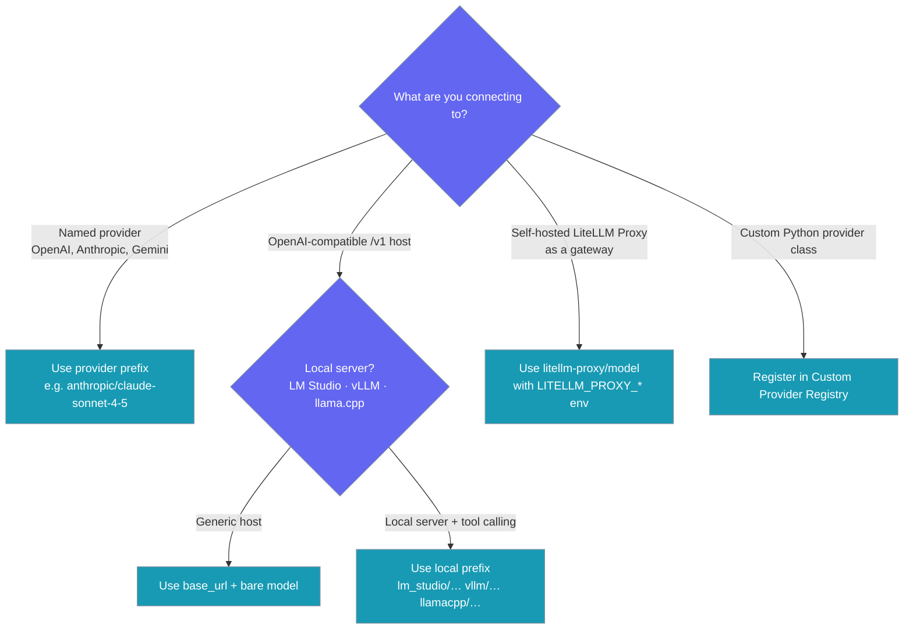
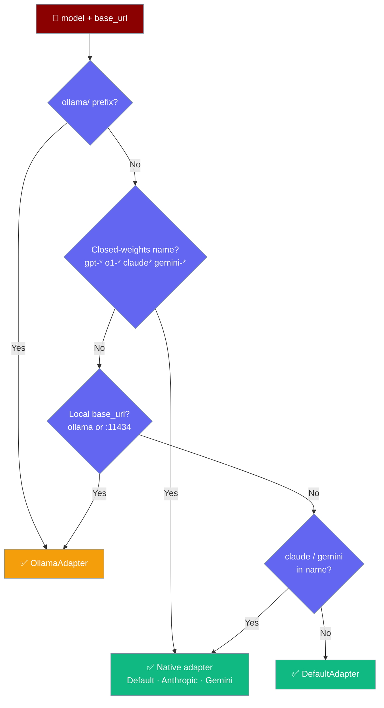

Point PraisonAI at any OpenAI-compatible `/v1` host by setting `base_url` and `api_key` on the `Agent` — bare catalog model ids are fine, no `provider/` prefix required.

<Tip>
Running the server **locally**? If you don't want to hard-code the base URL or model name, use `llm="local"` — it discovers a running local server (Ollama, llama.cpp, LM Studio, vLLM, …) and configures itself. See the [Local Model Resolver](/features/local-model-resolver).
</Tip>



## Quick Start

<Steps>
<Step title="Simplest form">
Pass `base_url` and `api_key` at the top level with a bare model id.

```python
from praisonaiagents import Agent

agent = Agent(
    name="assistant",
    instructions="You are a helpful assistant",
    llm="deepseek-v4-flash",
    base_url="https://api.pzero.studio/v1",
    api_key="your-key-or-empty-if-public",
)
agent.start("Explain what an OpenAI-compatible endpoint is in one paragraph.")
```
</Step>

<Step title="Environment-variable variant">
Set the host once with environment variables, then keep the code clean.

```bash
export OPENAI_API_BASE=https://api.pzero.studio/v1
export OPENAI_API_KEY=your-key
```

```python
from praisonaiagents import Agent

agent = Agent(
    name="assistant",
    instructions="You are a helpful assistant",
    llm="deepseek-v4-flash",
)
agent.start("Hi")
```
</Step>

<Step title="Dict form (equivalent)">
The dict form does the same thing when you prefer to bundle connection settings inside `llm`.

```python
from praisonaiagents import Agent

agent = Agent(
    name="assistant",
    instructions="You are a helpful assistant",
    llm={
        "model": "deepseek-v4-flash",
        "api_base": "https://api.pzero.studio/v1",
        "api_key": "",
    },
)
agent.start("Hello")
```
</Step>
</Steps>

---

## How It Works

PraisonAI routes a bare model id plus a `base_url` through the OpenAI-compatible client.



| Situation | What happens |
|---|---|
| Bare model + `base_url` set | Routed as `openai/<model>` to `<base_url>` |
| Prefixed model (e.g. `anthropic/…`, `ollama/…`, `openai/…`) | Passed through unchanged |
| Bare model with no `base_url` and no `OPENAI_API_BASE` | Uses OpenAI default (`api.openai.com/v1`) |

---

## Configuration Options

Set these top-level `Agent` parameters for any OpenAI-compatible host.

| Option | Type | Default | Description |
|--------|------|---------|-------------|
| `llm` | `str` \| `dict` | required | Catalog model id (e.g. `"deepseek-v4-flash"`) or a full dict `{model, api_base, api_key}` |
| `base_url` | `str` | `None` | OpenAI-compatible `/v1` root, e.g. `https://api.pzero.studio/v1` |
| `api_key` | `str` | `None` | API key for the host (may be empty for public catalogs) |

<Card title="Agent SDK Reference" icon="code" href="/api/praisonaiagents/agent/agent">
  Full parameter surface for the Agent class.
</Card>

---

## Common Patterns

Every host uses the same 5-line pattern — only `base_url` and the catalog id change.

<Tabs>
<Tab title="P0 / pzero.studio">
```python
from praisonaiagents import Agent

agent = Agent(
    name="assistant",
    llm="deepseek-v4-flash",
    base_url="https://api.pzero.studio/v1",
    api_key="",
)
agent.start("Hello")
```
</Tab>

<Tab title="DeepInfra">
```python
from praisonaiagents import Agent

agent = Agent(
    name="assistant",
    llm="meta-llama/Meta-Llama-3-8B-Instruct",
    base_url="https://api.deepinfra.com/v1/openai",
    api_key="your-deepinfra-key",
)
agent.start("Hello")
```
</Tab>

<Tab title="Fireworks">
```python
from praisonaiagents import Agent

agent = Agent(
    name="assistant",
    llm="accounts/fireworks/models/llama-v3-8b-instruct",
    base_url="https://api.fireworks.ai/inference/v1",
    api_key="your-fireworks-key",
)
agent.start("Hello")
```
</Tab>

<Tab title="Together AI">
```python
from praisonaiagents import Agent

agent = Agent(
    name="assistant",
    llm="meta-llama/Llama-3-8b-chat-hf",
    base_url="https://api.together.xyz/v1",
    api_key="your-together-key",
)
agent.start("Hello")
```
</Tab>

<Tab title="vLLM">
You can also use the `vllm/…` / `hosted_vllm/…` prefix directly — see [Local prefix route](/models/openai-compatible#local-prefix-route-tool-call-repair) for the adapter with tool-call repair.

```python
from praisonaiagents import Agent

agent = Agent(
    name="assistant",
    llm="meta-llama/Meta-Llama-3-8B-Instruct",
    base_url="http://localhost:8000/v1",
    api_key="not-needed",
)
agent.start("Hello")
```
</Tab>

<Tab title="LM Studio">
You can also use the `lm_studio/…` prefix directly — see [Local prefix route](/models/openai-compatible#local-prefix-route-tool-call-repair) for the adapter with tool-call repair.

```python
from praisonaiagents import Agent

agent = Agent(
    name="assistant",
    llm="local-model",
    base_url="http://localhost:1234/v1",
    api_key="not-needed",
)
agent.start("Hello")
```
</Tab>

<Tab title="Company gateway">
```python
from praisonaiagents import Agent

agent = Agent(
    name="assistant",
    llm="your-catalog-id",
    base_url="https://gateway.company.internal/v1",
    api_key="your-key",
)
agent.start("Hello")
```
</Tab>
</Tabs>

---

## Local prefix route (tool-call repair)

For a locally-served OpenAI-compatible server — LM Studio, vLLM, llama.cpp's `llama-server` — use a dedicated prefix instead of `base_url + bare model`. PraisonAI recognises these prefixes and selects a `LocalOpenAIAdapter` that keeps the standard OpenAI message shape and adds a tool-call repair budget of 2 — a safety net for the malformed JSON tool calls small local models occasionally emit.

```python
from praisonaiagents import Agent

def get_weather(city: str) -> str:
    return f"{city}: 21°C"

agent = Agent(llm="lm_studio/qwen2.5-7b-instruct", tools=[get_weather])
agent.start("What is the weather in Paris?")
```

Every local prefix works the same way — swap the prefix, keep your tools:

```python
from praisonaiagents import Agent

def get_weather(city: str) -> str:
    return f"{city}: 21°C"

# LM Studio
agent = Agent(llm="lm_studio/qwen2.5-7b-instruct", tools=[get_weather])

# vLLM (self-hosted)
agent = Agent(llm="vllm/meta-llama/Llama-3.1-8B-Instruct", tools=[get_weather])

# OpenAI-compatible vLLM (LiteLLM's hosted_vllm/ spelling)
agent = Agent(llm="hosted_vllm/Qwen2.5-7B", tools=[get_weather])

# llama.cpp
agent = Agent(llm="llamacpp/qwen2.5", tools=[get_weather])
```

| Prefix | Server | Adapter | `max_tool_repairs` |
|---|---|---|---|
| `lm_studio/…`, `lmstudio/…` | LM Studio | `LocalOpenAIAdapter` | 2 |
| `vllm/…`, `hosted_vllm/…` | vLLM | `LocalOpenAIAdapter` | 2 |
| `llamacpp/…`, `llama_cpp/…` | llama.cpp `llama-server` | `LocalOpenAIAdapter` | 2 |
| `ollama_chat/…` | Ollama (tool-calling) | `OllamaAdapter` | 2 |
| `ollama/…` | Ollama | `OllamaAdapter` | 2 |
| `huggingface/…` | **Hosted Inference API** (not local) | `DefaultAdapter` | 0 |

<Note>
`huggingface/…` is the hosted Inference API, **not** a local server — it keeps the `DefaultAdapter` with `max_tool_repairs=0` and is not part of the local prefix route.
</Note>

Explicit `max_tool_repairs` on the `Agent` always wins:

```python
from praisonaiagents import Agent

agent = Agent(llm="lm_studio/qwen", max_tool_repairs=5)  # ends up as 5
```

Streaming with tools keeps working on LM Studio, vLLM, and llama.cpp — the `LocalOpenAIAdapter` deliberately does not inherit Ollama's stream-disabling behaviour, because these servers stream tool calls correctly.



---

## Choosing Which Style to Use

Pick the routing style that matches what you connect to.



---

## Which Adapter Am I Getting?

A `base_url` says *where* the server is, not *what* it serves — so a local URL only implies Ollama for a model a local runtime could plausibly host.



---

## Best Practices

<AccordionGroup>
<Accordion title="Use base_url at the top level for one-off hosts">
The top-level `base_url` is cleaner than the dict form for single-agent scripts. Reach for the dict form only when you want connection settings bundled inside `llm`.
</Accordion>

<Accordion title="Use env vars when the host is fixed">
Set `OPENAI_API_BASE` and `OPENAI_API_KEY` when the host stays the same across runs. This keeps code portable across environments.
</Accordion>

<Accordion title="Keep embeddings on their own provider">
Most OpenAI-compatible chat hosts don't serve embeddings. Configure embeddings separately — see the [Embeddings](/capabilities/embeddings) docs.
</Accordion>

<Accordion title="Don't add openai/ yourself">
PraisonAI adds the `openai/` prefix internally when `base_url` is set. Adding it manually is harmless but unnecessary.
</Accordion>

<Accordion title="Mixing base_url with hosted model names is safe">
Closed-weights models — `gpt-*`, `o1-*`, `o3-*`, `chatgpt-*`, `claude*`, `gemini-*` — keep their native adapter regardless of `base_url`. Setting a local `base_url` (even `http://localhost:11434/v1`) no longer reassigns them to Ollama.

The exception is open-weights families — `llama`, `gemma`, `mistral`, `qwen`, `deepseek`, `phi` — which a local server can actually host. Behind a local `base_url` these are treated as Ollama, unlocking the tool-call repair budget. See [Mixing local and hosted models](/features/local-models#mixing-local-and-hosted-models) for the full rules.
</Accordion>
</AccordionGroup>

---

## Related

<CardGroup cols={2}>
<Card title="OpenAI" icon="robot" href="/models/openai">
  First-party OpenAI models.
</Card>
<Card title="LiteLLM Proxy" icon="server" href="/models/litellm-proxy">
  Route through a self-hosted LiteLLM proxy gateway.
</Card>
<Card title="Ollama" icon="microchip" href="/models/ollama">
  Local Ollama models.
</Card>
<Card title="Custom Provider" icon="wrench" href="/models/custom-provider">
  Register a fully custom Python provider.
</Card>
</CardGroup>
