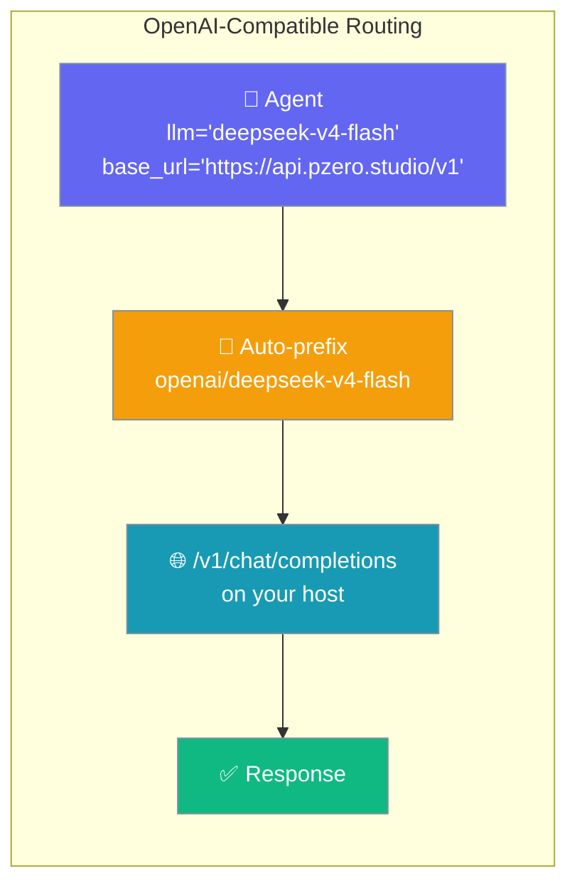
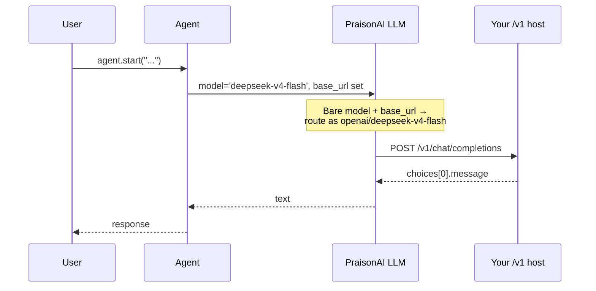
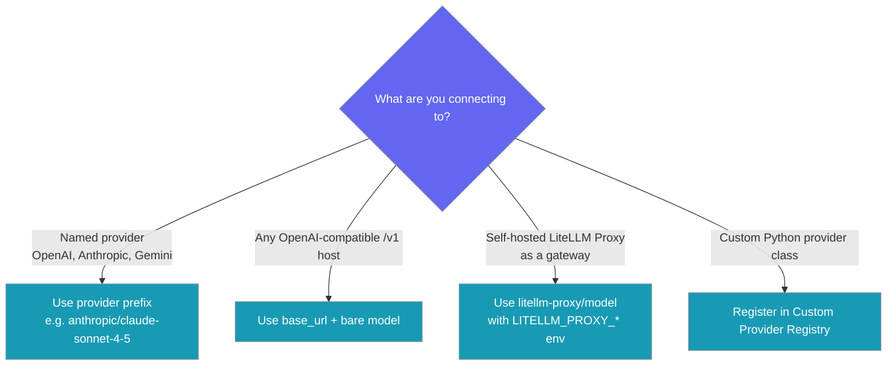

Point PraisonAI at any OpenAI-compatible `/v1` host by setting `base_url` and `api_key` on the `Agent` — bare catalog model ids are fine, no `provider/` prefix required.



## Quick Start

<Steps>
<Step title="Simplest form">
Pass `base_url` and `api_key` at the top level with a bare model id.

```python
from praisonaiagents import Agent

agent = Agent(
    name="assistant",
    instructions="You are a helpful assistant",
    llm="deepseek-v4-flash",
    base_url="https://api.pzero.studio/v1",
    api_key="your-key-or-empty-if-public",
)
agent.start("Explain what an OpenAI-compatible endpoint is in one paragraph.")
```
</Step>

<Step title="Environment-variable variant">
Set the host once with environment variables, then keep the code clean.

```bash
export OPENAI_API_BASE=https://api.pzero.studio/v1
export OPENAI_API_KEY=your-key
```

```python
from praisonaiagents import Agent

agent = Agent(
    name="assistant",
    instructions="You are a helpful assistant",
    llm="deepseek-v4-flash",
)
agent.start("Hi")
```
</Step>

<Step title="Dict form (equivalent)">
The dict form does the same thing when you prefer to bundle connection settings inside `llm`.

```python
from praisonaiagents import Agent

agent = Agent(
    name="assistant",
    instructions="You are a helpful assistant",
    llm={
        "model": "deepseek-v4-flash",
        "api_base": "https://api.pzero.studio/v1",
        "api_key": "",
    },
)
agent.start("Hello")
```
</Step>
</Steps>

---

## How It Works

PraisonAI routes a bare model id plus a `base_url` through the OpenAI-compatible client.



| Situation | What happens |
|---|---|
| Bare model + `base_url` set | Routed as `openai/<model>` to `<base_url>` |
| Prefixed model (e.g. `anthropic/…`, `ollama/…`, `openai/…`) | Passed through unchanged |
| Bare model with no `base_url` and no `OPENAI_API_BASE` | Uses OpenAI default (`api.openai.com/v1`) |

---

## Configuration Options

Set these top-level `Agent` parameters for any OpenAI-compatible host.

| Option | Type | Default | Description |
|--------|------|---------|-------------|
| `llm` | `str` \| `dict` | required | Catalog model id (e.g. `"deepseek-v4-flash"`) or a full dict `{model, api_base, api_key}` |
| `base_url` | `str` | `None` | OpenAI-compatible `/v1` root, e.g. `https://api.pzero.studio/v1` |
| `api_key` | `str` | `None` | API key for the host (may be empty for public catalogs) |

<Card title="Agent SDK Reference" icon="code" href="/api/praisonaiagents/agent/agent">
  Full parameter surface for the Agent class.
</Card>

---

## Common Patterns

Every host uses the same 5-line pattern — only `base_url` and the catalog id change.

<Tabs>
<Tab title="P0 / pzero.studio">
```python
from praisonaiagents import Agent

agent = Agent(
    name="assistant",
    llm="deepseek-v4-flash",
    base_url="https://api.pzero.studio/v1",
    api_key="",
)
agent.start("Hello")
```
</Tab>

<Tab title="DeepInfra">
```python
from praisonaiagents import Agent

agent = Agent(
    name="assistant",
    llm="meta-llama/Meta-Llama-3-8B-Instruct",
    base_url="https://api.deepinfra.com/v1/openai",
    api_key="your-deepinfra-key",
)
agent.start("Hello")
```
</Tab>

<Tab title="Fireworks">
```python
from praisonaiagents import Agent

agent = Agent(
    name="assistant",
    llm="accounts/fireworks/models/llama-v3-8b-instruct",
    base_url="https://api.fireworks.ai/inference/v1",
    api_key="your-fireworks-key",
)
agent.start("Hello")
```
</Tab>

<Tab title="Together AI">
```python
from praisonaiagents import Agent

agent = Agent(
    name="assistant",
    llm="meta-llama/Llama-3-8b-chat-hf",
    base_url="https://api.together.xyz/v1",
    api_key="your-together-key",
)
agent.start("Hello")
```
</Tab>

<Tab title="vLLM">
```python
from praisonaiagents import Agent

agent = Agent(
    name="assistant",
    llm="meta-llama/Meta-Llama-3-8B-Instruct",
    base_url="http://localhost:8000/v1",
    api_key="not-needed",
)
agent.start("Hello")
```
</Tab>

<Tab title="LM Studio">
```python
from praisonaiagents import Agent

agent = Agent(
    name="assistant",
    llm="local-model",
    base_url="http://localhost:1234/v1",
    api_key="not-needed",
)
agent.start("Hello")
```
</Tab>

<Tab title="Company gateway">
```python
from praisonaiagents import Agent

agent = Agent(
    name="assistant",
    llm="your-catalog-id",
    base_url="https://gateway.company.internal/v1",
    api_key="your-key",
)
agent.start("Hello")
```
</Tab>
</Tabs>

---

## Choosing Which Style to Use

Pick the routing style that matches what you connect to.



---

## Best Practices

<AccordionGroup>
<Accordion title="Use base_url at the top level for one-off hosts">
The top-level `base_url` is cleaner than the dict form for single-agent scripts. Reach for the dict form only when you want connection settings bundled inside `llm`.
</Accordion>

<Accordion title="Use env vars when the host is fixed">
Set `OPENAI_API_BASE` and `OPENAI_API_KEY` when the host stays the same across runs. This keeps code portable across environments.
</Accordion>

<Accordion title="Keep embeddings on their own provider">
Most OpenAI-compatible chat hosts don't serve embeddings. Configure embeddings separately — see the [Embeddings](/capabilities/embeddings) docs.
</Accordion>

<Accordion title="Don't add openai/ yourself">
PraisonAI adds the `openai/` prefix internally when `base_url` is set. Adding it manually is harmless but unnecessary.
</Accordion>

<Accordion title="Don't mix base_url with Anthropic, Gemini, or Ollama models">
Those keep their native adapters. Use `base_url` only for OpenAI-compatible Chat Completions hosts.
</Accordion>
</AccordionGroup>

---

## Related

<CardGroup cols={2}>
<Card title="OpenAI" icon="robot" href="/models/openai">
  First-party OpenAI models.
</Card>
<Card title="LiteLLM Proxy" icon="server" href="/models/litellm-proxy">
  Route through a self-hosted LiteLLM proxy gateway.
</Card>
<Card title="Ollama" icon="microchip" href="/models/ollama">
  Local Ollama models.
</Card>
<Card title="Custom Provider" icon="wrench" href="/models/custom-provider">
  Register a fully custom Python provider.
</Card>
</CardGroup>
