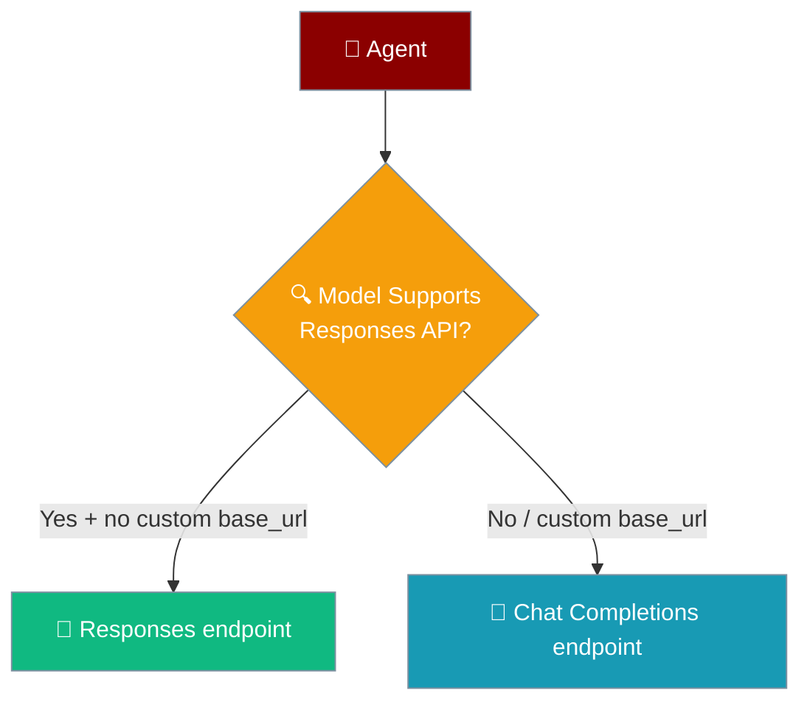
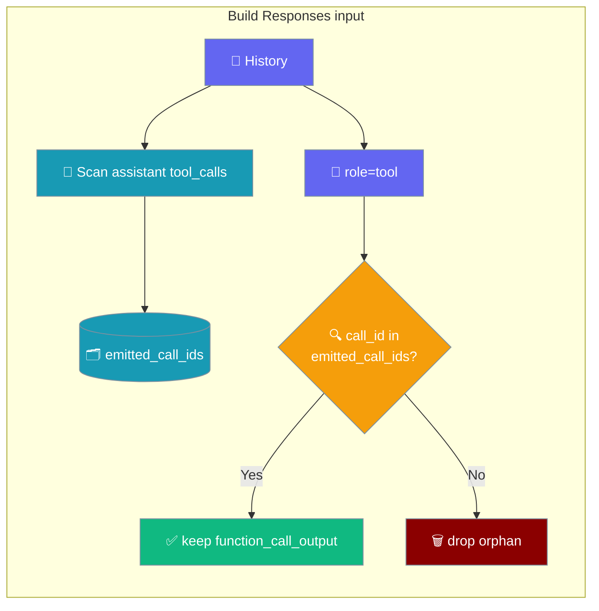
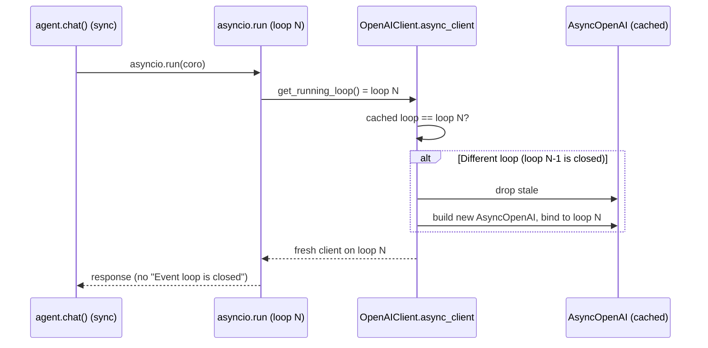

## Models

- **Recommended**: `gpt-4o` (latest, best quality)
- **Fast/Cheap**: `gpt-4o-mini` (fast, cost-effective)
- **Reasoning**: `o1`, `o1-mini` (advanced reasoning)
- **Latest**: `gpt-4.1`, `gpt-4.5-preview` (newest releases)

## Python

```python
# export OPENAI_API_KEY=your-api-key
from praisonaiagents import Agent

agent = Agent(
    instructions="You are a helpful assistant",
    llm="gpt-4o"
)
agent.start("What is artificial intelligence?")
```

### With Tools

```python
# export OPENAI_API_KEY=your-api-key
from praisonaiagents import Agent

def get_weather(city: str) -> str:
    """Get weather for a city."""
    return f"Weather in {city}: 72°F, Sunny"

agent = Agent(
    instructions="You are a weather assistant",
    llm="gpt-4o-mini",
    tools=[get_weather]
)
agent.start("What's the weather in Tokyo?")
```

### Multi-Agent

```python
# export OPENAI_API_KEY=your-api-key
from praisonaiagents import Agent, Task, AgentTeam

researcher = Agent(
    instructions="You research topics thoroughly",
    llm="gpt-4o"
)
writer = Agent(
    instructions="You write clear summaries",
    llm="gpt-4o-mini"
)

task1 = Task(description="Research AI trends", agent=researcher)
task2 = Task(description="Summarize findings", agent=writer)

agents = AgentTeam(agents=[researcher, writer], tasks=[task1, task2])
agents.start()
```

## Transparent Responses API routing

For OpenAI models that support the Responses API (`gpt-4o`, `gpt-4.1`, `gpt-4.5`, `gpt-5`, `o1`, `o3`, `o4`, `chatgpt-4o`, and their `azure/` / `openai/` prefixes), PraisonAI uses the Responses endpoint automatically on the native client path — no code change, no flag. Chat Completions is only used when a custom `base_url` is set or the installed `openai` SDK does not expose `responses`.

```python
from praisonaiagents import Agent

agent = Agent(
    name="Assistant",
    instructions="You are a helpful assistant.",
    llm="gpt-4o-mini",   # routes through the Responses API automatically
)
agent.start("Summarise today's news.")
```



On the Responses branch, sync callers (`agent.chat` / `agent.start`) use the same transparent routing — the client rebinds its async transport across `asyncio.run` loops, so a sync turn and the next sync turn stay on the Responses endpoint rather than silently swapping to Chat Completions.

### Supplying history with tool calls

If you pass conversation history that includes an assistant turn with `tool_calls`, the `content` field may be any of:

- a plain string: `"Checking"`
- a list of text parts: `[{"type": "text", "text": "Checking"}]` (the Chat Completions multimodal shape)
- empty — `""`, `None`, `[]`, or whitespace — in which case only the tool call is emitted

Multimodal list `content` was [fixed in PraisonAI PR #5695](https://github.com/MervinPraison/PraisonAI/pull/5695) (merged 2026-10-08). On earlier versions the same history raised `AttributeError` and silently fell back to Chat Completions.

### Fallback is quieter now

Two spurious `Responses API failed, falling back to Chat Completions: …` WARNING lines were fixed in [PraisonAI PR #5682](https://github.com/MervinPraison/PraisonAI/pull/5682) (merged 2026-10-08):

- **Orphan tool outputs no longer 400.** If your history contains a `role="tool"` message whose `tool_call_id` has no matching assistant `function_call` in the same payload — e.g. history trimming dropped the assistant turn, or a user turn follows a tool round from an earlier session — the client now **drops** that `function_call_output` before sending. Before #5682 the Responses API rejected the payload with `No tool call found for function call output with call_id …` and the client logged a fallback WARNING for every such turn.
- **Sync callers no longer see "Event loop is closed".** The cached `AsyncOpenAI` instance is rebuilt whenever the running loop differs from the one it was bound to (the common case for sync `agent.chat()` / `agent.start()` which bridge into the async path via a fresh `asyncio.run` per call). Before #5682 the stale httpx transport raised `Event loop is closed` on reuse and the client logged a fallback WARNING for every turn.

```python
# export OPENAI_API_KEY=...
from praisonaiagents import Agent

def add(a: int, b: int) -> int:
    return a + b

agent = Agent(
    name="ToolProbe",
    role="Assistant",
    goal="Use tools",
    llm="gpt-4o-mini",
    tools=[add],
)
agent.chat("What is 19 + 23? Use the add tool.")
agent.chat("Say done.")   # second turn — no fallback WARNING on stderr
```

<Note>
The fallback **mechanism** is unchanged — on a real Responses failure the client still falls back to Chat Completions, so answers are not lost. #5682 only stops the two spurious triggers above from firing.
</Note>

Orphan `function_call_output` items are dropped while the Responses input is built — the client scans assistant `tool_calls` first, then keeps only the tool outputs whose `call_id` matches one it emitted.



The cached `AsyncOpenAI` is rebound whenever the running loop changes, so each sync turn gets a client bound to its own `asyncio.run` loop.



## CLI

```bash
export OPENAI_API_KEY=your-api-key

# Basic prompt
python -m praisonai "What is AI?" --llm gpt-4o

# With temperature
python -m praisonai "Write a poem" --llm gpt-4o --temperature 0.9

# With tools
python -m praisonai "Search for AI news" --llm gpt-4o --tools web_search

# Run agents.yaml
python -m praisonai
```

## YAML

```yaml
framework: praisonai
topic: Research AI trends
agents:
  researcher:
    role: Research Analyst
    goal: Find latest AI developments
    instructions: You are an expert researcher who finds accurate information
    llm:
      model: gpt-4o
    tasks:
      research_task:
        description: Research the latest trends in artificial intelligence
        expected_output: A comprehensive report on AI trends

  writer:
    role: Content Writer
    goal: Create clear summaries
    instructions: You write engaging and clear content
    llm:
      model: gpt-4o-mini
    tasks:
      write_task:
        description: Write a summary of the research findings
        expected_output: A well-written summary article
```