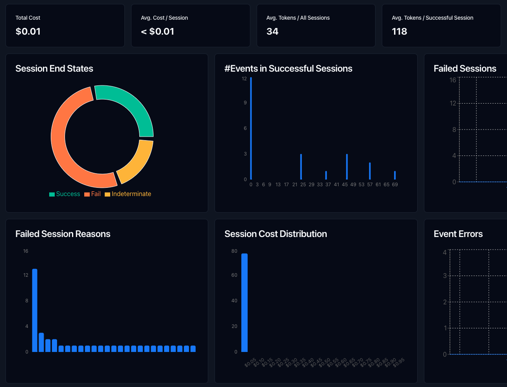

# AgentOps PraisonAI Monitoring

<Note>
AgentOps is treated as a soft optional dependency. If the package isn't installed, PraisonAI skips telemetry without raising; if `end_session()` fails at runtime, the failure is logged as a warning and the agent run still returns its result.
</Note>

```bash
pip install "praisonai[agentops]"
```

```bash
export AGENTOPS_API_KEY=xxxxxxxx
```

## Dashboard

