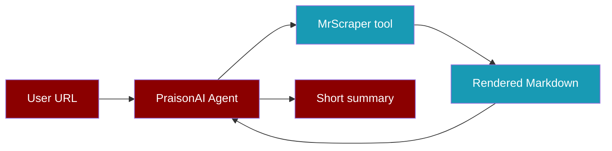
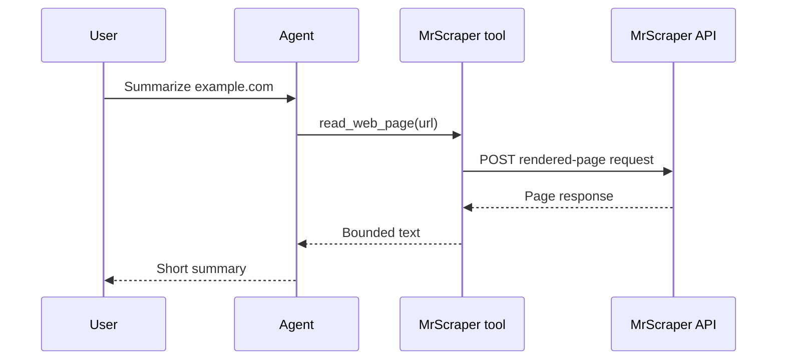

Give an Agent a bounded rendered-page tool so it can summarize a public page.

```python
from praisonaiagents import Agent
from praisonai_mrscraper import MrScraperClient, make_mrscraper_tools

with MrScraperClient() as scraper:
    read_web_page = make_mrscraper_tools(scraper)[0]
    agent = Agent(
        instructions="Summarize the page in five bullet points. Cite the source URL.",
        tools=[read_web_page],
    )
    agent.start("Summarize https://example.com")
```



## Set up

<Steps>
  <Step title="Install the packages">
    The example integration is maintained in the PraisonAI repository. Install it from a checkout of the [PraisonAI integration example](https://github.com/MervinPraison/PraisonAI/tree/main/examples/tools/external/mrscraper):

    ```bash
    git clone https://github.com/MervinPraison/PraisonAI.git
    cd PraisonAI
    pip install praisonaiagents
    pip install -e examples/tools/external/mrscraper
    ```

    Run the second command from the root of that checkout. It installs the example's `httpx` dependency.
  </Step>
  <Step title="Set your tokens">
    Create a MrScraper token in the [dashboard](https://app.mrscraper.com/) and set it as `MRSCRAPER_API_TOKEN`. Set `OPENAI_API_KEY` for the default PraisonAI model, or configure another supported model and provider key.

    ```bash
    export MRSCRAPER_API_TOKEN="your-mrscraper-token"
    export OPENAI_API_KEY="your-llm-provider-key"
    ```
  </Step>
  <Step title="Run the Agent">
    Save the first example as `summarize.py`, then run `python summarize.py`.
  </Step>
</Steps>

## What the tool does

`read_web_page` asks MrScraper for rendered Markdown, caps the text at 12,000 characters, and passes that text to the Agent. The other callable tools returned by `make_mrscraper_tools` are `extract_page`, `crawl_urls`, and `search_google`. Give an Agent only the tools needed for its task.



## More examples

### Extract fields from one page

```python
from praisonai_mrscraper import MrScraperClient

with MrScraperClient() as scraper:
    response = scraper.extract_page_by_prompt(
        "https://example.com",
        "Extract the page title and main heading",
        output_schema={"title": "string", "heading": "string"},
    )
    print(response)  # Inspect the actual response before reading an ID or result.
```

### Crawl URLs and search Google

```python
from praisonai_mrscraper import MrScraperClient

with MrScraperClient() as scraper:
    print(scraper.crawl_website_urls("https://example.com", max_depth=2))
    print(scraper.search_google_serp("site:example.com example"))
```

### Reuse a scraper and inspect a completed result

Use IDs returned by your own account. Creation and rerun responses can have different envelopes; inspect the response before choosing an ID. The Results endpoints return stored results when available.

```python
from praisonai_mrscraper import MrScraperClient

scraper_id = "replace-with-your-scraper-id"
result_id = "replace-with-a-result-id-from-your-results"
with MrScraperClient() as scraper:
    print(scraper.run_existing_scraper(scraper_id, "https://example.com"))
    print(scraper.get_latest_results(scraper_id))
    print(scraper.get_result_detail(result_id))
```

<Note>
  The example client returns MrScraper responses without imposing a response schema. Avoid passing screenshot or cookie payloads to an Agent. The bounded tools remove screenshot and cookie fields, including nested fields, before sharing a response with a model.
</Note>

## Troubleshooting

<AccordionGroup>
  <Accordion title="HTTP 401 or 403">
    Check `MRSCRAPER_API_TOKEN` and the correct MrScraper account. Platform calls use `x-api-token`; SERP uses Bearer authorization plus the credential header; rendered-page requests also carry the token in a query parameter. The client redacts token-bearing URLs from errors.
  </Accordion>
  <Accordion title="Wrong host or method">
    The n8n-compatible calls span three hosts. Use the client methods rather than rebuilding URLs. The current MrScraper v3 API docs use some different routes and field names; see the compatibility notes in the reference.
  </Accordion>
  <Accordion title="No completed result yet">
    A create or rerun response does not guarantee that a stored result is ready. Inspect its returned identifiers and your account's Results list. The example does not assume a polling interval or status name.
  </Accordion>
  <Accordion title="Unexpected response shape">
    Print a redacted response in your own application and inspect it before selecting fields. The n8n node does not define a stable response schema for every operation.
  </Accordion>
</AccordionGroup>

See the [MrScraper operation reference](/docs/integrations/mrscraper-api) for all 15 operations, parameters, authentication, and a token-based smoke test. For the latest platform behavior, see the [official MrScraper API documentation](https://docs.mrscraper.com/docs/api/overview).
