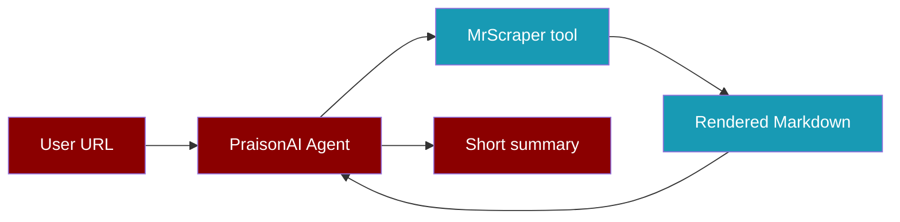
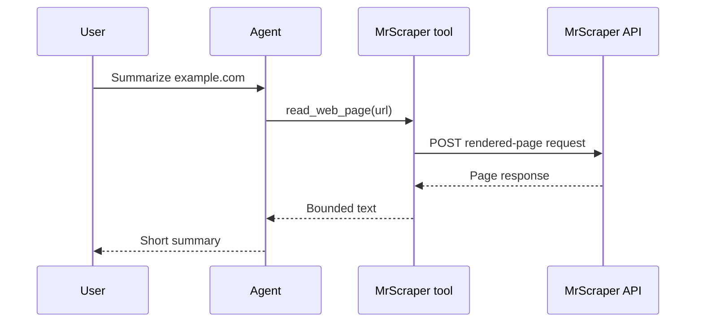

Give an Agent a bounded rendered-page tool so it can summarize a public page.

```python
from praisonaiagents import Agent
from praisonai_mrscraper import MrScraperClient, make_mrscraper_tools

with MrScraperClient() as scraper:
    read_web_page = make_mrscraper_tools(scraper)[0]
    agent = Agent(
        instructions="Summarize the page in five bullet points. Cite the source URL.",
        tools=[read_web_page],
    )
    agent.start("Summarize https://example.com")
```



## Set up

<Steps>
  <Step title="Install the packages">
    The example integration is maintained in the PraisonAI repository. Install it from a checkout of the [PraisonAI integration example](https://github.com/MervinPraison/PraisonAI/tree/main/examples/tools/external/mrscraper):

    ```bash
    git clone https://github.com/MervinPraison/PraisonAI.git
    cd PraisonAI
    pip install praisonaiagents
    pip install -e examples/tools/external/mrscraper
    ```

    Run the second command from the root of that checkout. It installs the example's `httpx` dependency.
  </Step>
  <Step title="Set your tokens">
    Create a MrScraper token in the [dashboard](https://app.mrscraper.com/) and set it as `MRSCRAPER_API_TOKEN`. Set `OPENAI_API_KEY` for the default PraisonAI model, or configure another supported model and provider key.

    ```bash
    export MRSCRAPER_API_TOKEN="your-mrscraper-token"
    export OPENAI_API_KEY="your-llm-provider-key"
    ```
  </Step>
  <Step title="Run the Agent">
    Save the first example as `summarize.py`, then run `python summarize.py`.
  </Step>
</Steps>

## What the tool does

`read_web_page` asks MrScraper for rendered Markdown, caps the text at 12,000 characters, and passes that text to the Agent. By default, `make_mrscraper_tools` returns four simple callables: `read_web_page(url)`, `extract_page(url, prompt)`, `crawl_urls(url)`, and `search_google(query)`. Their client uses the MrScraper Python SDK's request fields while keeping synchronous calls for PraisonAI Agent tools.

For advanced settings and account or result management, pass `include_all=True`. That adds 11 callable operations with the full client parameter sets. Select only the functions the Agent needs:

```python
from praisonaiagents import Agent
from praisonai_mrscraper import MrScraperClient, make_mrscraper_tools

with MrScraperClient() as scraper:
    available = {tool.__name__: tool for tool in make_mrscraper_tools(
        scraper, include_all=True, max_chars=12000
    )}
    agent = Agent(
        instructions="Search and summarize public pages",
        tools=[available["fetch_google_serp"], available["fetch_html"]],
    )
    agent.start("Find and summarize example.com")
```

The complete tools include scraper creation, AI and manual reruns, batch reruns, results, subscription information, and request status analytics. They remove token, cookie, screenshot, proxy, and response header fields before sharing output with a model. Call `MrScraperClient` directly when your application needs the full unfiltered response.



## More examples

### Extract fields from one page

```python
from praisonai_mrscraper import MrScraperClient

with MrScraperClient() as scraper:
    response = scraper.create_scraper(
        "https://example.com",
        "Extract the page title and main heading",
        schema_prompt={"title": "string", "heading": "string"},
    )
    print(response["status_code"], response["data"])
```

### Crawl URLs and search Google

```python
from praisonai_mrscraper import MrScraperClient

with MrScraperClient() as scraper:
    print(scraper.create_scraper("https://example.com", agent="map", max_depth=2)["data"])
    print(scraper.fetch_google_serp("site:example.com example", raw=False)["data"])
```

### Reuse a scraper and inspect a completed result

Use IDs returned by your own account. Creation and rerun responses can have different envelopes; inspect the response before choosing an ID. The Results endpoints return stored results when available.

```python
from praisonai_mrscraper import MrScraperClient

scraper_id = "replace-with-your-scraper-id"
result_id = "replace-with-a-result-id-from-your-results"
with MrScraperClient() as scraper:
    print(scraper.rerun_scraper(scraper_id, "https://example.com")["data"])
    print(scraper.get_all_results(scraper_id=scraper_id)["data"])
    print(scraper.get_result_by_id(result_id)["data"])
```

<Note>
  The example client returns `{"status_code": ..., "data": ..., "headers": ...}`, matching the SDK response envelope. The value inside `data` varies by operation. The bounded Agent tools remove sensitive fields and cap output before sharing it with a model.
</Note>

## Troubleshooting

<AccordionGroup>
  <Accordion title="HTTP 401 or 403">
    Check `MRSCRAPER_API_TOKEN` and the correct MrScraper account. Platform calls use `x-api-token`; SERP and rendered-page calls use Bearer authorization plus `x-api-token`. Rendered-page requests also include the token in the JSON body. The client omits token-bearing URLs and response bodies from error messages.
  </Accordion>
  <Accordion title="Wrong host or method">
    Calls span three hosts. Use the client methods rather than rebuilding URLs. The older n8n node uses some different fields, such as `graph` and a token query parameter; this example follows the supplied Python SDK request contract.
  </Accordion>
  <Accordion title="No completed result yet">
    A create or rerun response does not guarantee that a stored result is ready. Inspect its returned identifiers and your account's Results list. The example does not assume a polling interval or status name.
  </Accordion>
  <Accordion title="Unexpected response shape">
    Inspect `response["status_code"]` and `response["data"]` before selecting result fields. The structure inside `data` can vary by operation.
  </Accordion>
</AccordionGroup>

See the [MrScraper operation reference](/docs/integrations/mrscraper-api) for the full client and tool parameters, authentication, and a token-based smoke test. For the latest platform behavior, see the [official MrScraper API documentation](https://docs.mrscraper.com/docs/api/overview).
