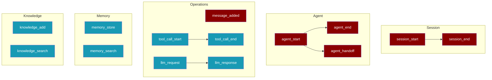
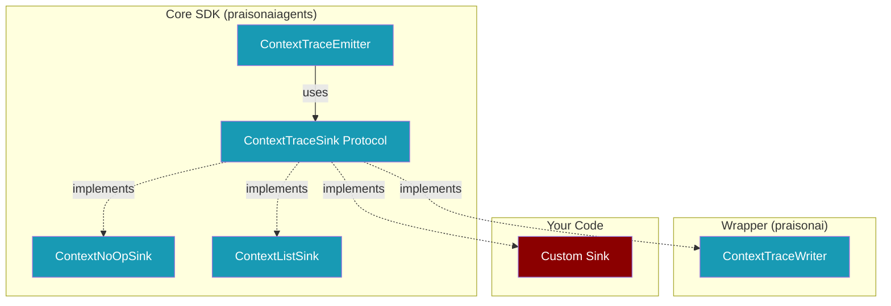

Send agent events to any destination - HTTP endpoints, databases, cloud services, or your own systems.


<Tip>
PraisonAI uses a **protocol-driven** design. Implement 3 methods and your sink works with any agent.
</Tip>

## Quick Start

<Steps>
  <Step title="Create Your Sink">
    Implement 3 methods: `emit()`, `flush()`, `close()`
    
    ```python
    class MySink:
        def emit(self, event):
            print(f"Event: {event.event_type.value}")
        
        def flush(self):
            pass
        
        def close(self):
            pass
    ```
  </Step>
  
  <Step title="Connect to Agent">
    Use `trace_context()` to capture all agent events
    
    ```python
    from praisonaiagents import Agent, ContextTraceEmitter, trace_context
    
    sink = MySink()
    emitter = ContextTraceEmitter(sink=sink, session_id="my-session", enabled=True)
    
    with trace_context(emitter):
        agent = Agent(instructions="You are helpful")
        agent.chat("Hello!")  # Events go to MySink
    ```
  </Step>
</Steps>

## How It Works


## The Protocol

<Info>
Your sink must implement 3 methods. That's it!
</Info>

<Tabs>
  <Tab title="Protocol">
    ```python
    class ContextTraceSinkProtocol:
        def emit(self, event): ...   # Receive event
        def flush(self): ...         # Flush buffer
        def close(self): ...         # Release resources
    ```
    <Note>
    `ContextTraceSink` is a backward-compatible alias for `ContextTraceSinkProtocol`.
    </Note>
  </Tab>
  <Tab title="Methods">
    | Method | Purpose |
    |--------|--------|
    | `emit(event)` | Receive a trace event |
    | `flush()` | Flush buffered events |
    | `close()` | Release resources |
  </Tab>
</Tabs>

## Example Sinks

<AccordionGroup>
  <Accordion title="HTTP Sink" icon="globe">

    Send events to a remote HTTP endpoint with batching.
    
    ```python
    class HTTPSink:
        def __init__(self, url, batch_size=10):
            self.url = url
            self.buffer = []
            self.batch_size = batch_size
        
        def emit(self, event):
            self.buffer.append(event.to_dict())
            if len(self.buffer) >= self.batch_size:
                self.flush()
        
        def flush(self):
            if self.buffer:
                import requests
                requests.post(self.url, json=self.buffer)
                self.buffer.clear()
        
        def close(self):
            self.flush()
    ```
  </Accordion>
  
  <Accordion title="Database Sink" icon="database">

    Store events in SQLite database for later analysis.
    
    ```python
    class SQLiteSink:
        def __init__(self, db_path="traces.db"):
            import sqlite3
            self.conn = sqlite3.connect(db_path)
            self.conn.execute("""
                CREATE TABLE IF NOT EXISTS events (
                    id INTEGER PRIMARY KEY,
                    session_id TEXT,
                    event_type TEXT,
                    agent_name TEXT,
                    timestamp REAL,
                    data TEXT
                )
            """)
        
        def emit(self, event):
            import json
            self.conn.execute(
                "INSERT INTO events VALUES (NULL, ?, ?, ?, ?, ?)",
                (event.session_id, event.event_type.value, 
                 event.agent_name, event.timestamp, json.dumps(event.data))
            )
        
        def flush(self):
            self.conn.commit()
        
        def close(self):
            self.flush()
            self.conn.close()
    ```
  </Accordion>
  
  <Accordion title="Console Sink" icon="terminal">

    Print events to console for debugging.
    
    ```python
    class ConsoleSink:
        def emit(self, event):
            print(f"[{event.event_type.value}] {event.agent_name or 'session'}")
        
        def flush(self):
            pass
        
        def close(self):
            pass
    ```
  </Accordion>
</AccordionGroup>

## Event Types



| Event | Description |
|-------|-------------|
| `session_start` | Session begins |
| `session_end` | Session ends |
| `agent_start` | Agent starts |
| `agent_end` | Agent finishes |
| `agent_handoff` | Agent hands off |
| `message_added` | Message added |
| `tool_call_start` | Tool starts |
| `tool_call_end` | Tool finishes |
| `llm_request` | LLM request sent |
| `llm_response` | LLM response received |
| `memory_store` | Memory stored |
| `memory_search` | Memory searched |
| `knowledge_add` | Knowledge added |
| `knowledge_search` | Knowledge searched |

## Event Data

```python
event.event_type      # ContextEventType enum
event.timestamp       # Unix timestamp
event.session_id      # Session identifier
event.agent_name      # Agent name (if applicable)
event.sequence_num    # Event sequence number
event.data            # Event-specific data dict
event.to_dict()       # Convert to dictionary
event.to_json()       # Convert to JSON string
```

## Architecture



## Best Practices

<CardGroup cols={2}>
  <Card title="Buffer Events" icon="layer-group">
    Batch events before sending to reduce network calls
  </Card>
  <Card title="Handle Errors" icon="shield">
    Sink errors are caught silently - tracing never crashes agents
  </Card>
  <Card title="Use trace_context" icon="brackets-curly">
    Automatic cleanup even if exceptions occur
  </Card>
  <Card title="Thread Safety" icon="lock">
    Use locks if your sink is accessed from multiple threads
  </Card>
</CardGroup>

## Zero Overhead

When tracing is disabled, there's **zero performance impact**:

```python
# Disabled by default - zero overhead
emitter = ContextTraceEmitter(sink=sink, enabled=False)

# Or use NoOpSink
from praisonaiagents import ContextNoOpSink
emitter = ContextTraceEmitter(sink=ContextNoOpSink())
```

## API Reference

### ContextTraceEmitter

```python
from praisonaiagents import ContextTraceEmitter

emitter = ContextTraceEmitter(
    sink=my_sink,           # Your sink implementation
    session_id="my-session", # Session identifier
    enabled=True,           # Enable/disable tracing
    redact=True,            # Redact sensitive data
)
```

### trace_context

```python
from praisonaiagents import trace_context

with trace_context(emitter) as ctx:
    # All agent events go to your sink
    agent.chat("Hello")
# Automatically resets when done
```

### Built-in Sinks

| Sink | Purpose |
|------|---------|
| `ContextNoOpSink` | Does nothing (zero overhead) |
| `ContextListSink` | Collects events in memory (testing) |
| `ContextTraceWriter` | Writes to JSONL files (in praisonai) |

## CLI Commands

Use the CLI to manage traces:

<CodeGroup>
```bash List Traces
praisonai replay list
```

```bash Replay Session
praisonai replay context <session_id>
```

```bash Show Events
praisonai replay show <session_id>
```

```bash Cleanup Old Traces
praisonai replay cleanup --max-age 7
```
</CodeGroup>

## Related

<CardGroup cols={2}>
  <Card title="Context Replay" icon="rotate-left" href="/features/replay">
    Debug agent execution step-by-step
  </Card>
  <Card title="Observability" icon="chart-line" href="/observability/overview">
    20+ provider integrations
  </Card>
</CardGroup>
