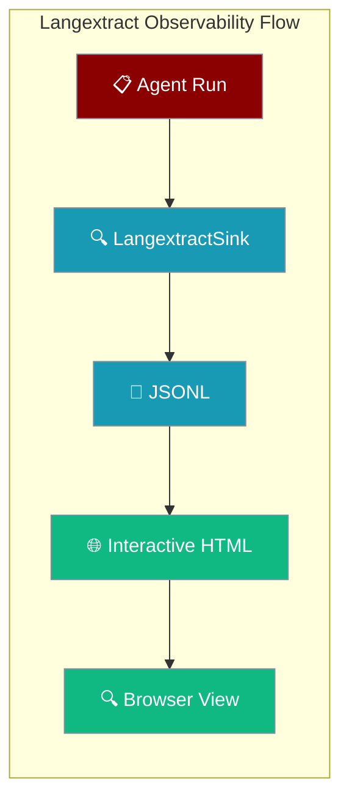
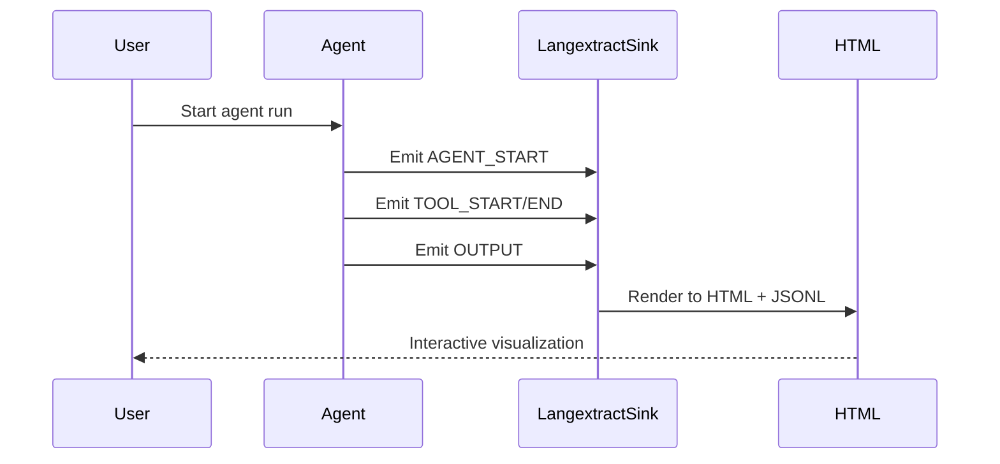

Langextract transforms PraisonAI agent runs into self-contained interactive HTML visualizations, grounding extractions in the original input text for deeper analysis.



## Quick Start

<Steps>
<Step title="Install langextract">
Install PraisonAI with langextract support:

```bash
pip install 'praisonai[langextract]'
```
</Step>

<Step title="Programmatic Usage">
Set up langextract observability for any agent run:

```python
from praisonaiagents import Agent
from praisonaiagents.trace.protocol import TraceEmitter, set_default_emitter
from praisonai.observability import LangextractSink, LangextractSinkConfig

# Configure langextract sink
sink = LangextractSink(LangextractSinkConfig(
    output_path="trace.html",
    auto_open=True
))

# Set up trace emitter
emitter = TraceEmitter(sink=sink, enabled=True)
set_default_emitter(emitter)

# Run your agent
agent = Agent(
    name="Writer",
    instructions="Write a haiku about code."
)
result = agent.start("Write a haiku about code.")

# Close sink to render the trace
sink.close()  # Creates trace.jsonl and trace.html
```
</Step>

<Step title="CLI Usage">
Use langextract with any PraisonAI workflow:

```bash
# Render a YAML workflow with langextract
praisonai langextract render workflow.yaml -o trace.html

# View an existing JSONL trace
praisonai langextract view trace.jsonl -o trace.html

# Instrument any praisonai run
praisonai --observe langextract agents.yaml
```
</Step>
</Steps>

---

## How It Works



| Event Type | Extraction Class | Grounded | Description |
|------------|------------------|----------|-------------|
| `AGENT_START` | `agent_run` | First 200 chars of input | Agent run initiation |
| `TOOL_START` | `tool_call` | No (ungrounded) | Tool execution start |
| `TOOL_END` | `tool_result` | No | Tool execution result |
| `OUTPUT` | `final_output` | First 1000 chars of output | Agent final output |
| `ERROR` | `error` | No | Error events |

---

## Configuration Options

The `LangextractSinkConfig` class provides comprehensive configuration:

| Option | Type | Default | Description |
|--------|------|---------|-------------|
| `output_path` | `str` | `"praisonai-trace.html"` | HTML file written on close() |
| `jsonl_path` | `Optional[str]` | `None` | Annotated-documents JSONL path (derived from output_path if None) |
| `document_id` | `str` | `"praisonai-run"` | Document ID in the JSONL |
| `auto_open` | `bool` | `False` | Open the HTML in a browser after render |
| `include_llm_content` | `bool` | `True` | Include response text in attributes |
| `include_tool_args` | `bool` | `True` | Include tool args in attributes |
| `enabled` | `bool` | `True` | Master switch |

---

## CLI Reference

### render command
Render a YAML workflow with langextract observability:

```bash
praisonai langextract render workflow.yaml [OPTIONS]
```

**Options:**
- `-o, --output FILE`: Output HTML file path (default: `workflow.html`)
- `--no-open`: Don't open HTML in browser automatically
- `--api-url URL`: API URL if using remote API

### view command
Render an existing annotated-documents JSONL to HTML:

```bash
praisonai langextract view trace.jsonl [OPTIONS]
```

**Options:**
- `-o, --output FILE`: Output HTML file path (default: `trace.html`)
- `--no-open`: Don't open HTML in browser automatically

### --observe flag
Instrument any PraisonAI command with langextract:

```bash
praisonai --observe langextract <command>
```

---

## Common Patterns

<Tabs>
<Tab title="Single Agent with Custom Config">
```python
from praisonaiagents import Agent
from praisonaiagents.trace.protocol import TraceEmitter, set_default_emitter
from praisonai.observability import LangextractSink, LangextractSinkConfig

sink = LangextractSink(LangextractSinkConfig(
    output_path="analysis.html",
    document_id="data-analysis",
    include_tool_args=False,  # Exclude tool args for cleaner view
    auto_open=False  # Don't auto-open in CI
))

set_default_emitter(TraceEmitter(sink=sink, enabled=True))

agent = Agent(name="Analyst", instructions="Analyze the data.")
result = agent.start("Analyze quarterly sales data")
sink.close()
```
</Tab>

<Tab title="CLI Workflow">
```bash
# Create workflow YAML
echo 'agents:
  - name: "Researcher"
    instructions: "Research the topic"
    task: "Research climate change impacts"' > research.yaml

# Render with langextract
praisonai langextract render research.yaml -o research-trace.html
```
</Tab>

<Tab title="Post-hoc Analysis">
```bash
# If you have an existing JSONL trace
praisonai langextract view old-trace.jsonl -o updated-view.html

# Useful for re-rendering with different langextract versions
```
</Tab>
</Tabs>

---

## Troubleshooting

<AccordionGroup>
<Accordion title='"Trace was not rendered" / empty HTML'>
Ensure you call `sink.close()` to trigger the rendering process. The CLI commands handle this automatically, but programmatic usage requires explicit closure.

```python
# ✅ Correct
sink = LangextractSink(config)
set_default_emitter(TraceEmitter(sink=sink))
agent.start("task")
sink.close()  # Required!
```
</Accordion>

<Accordion title="ImportError: langextract not found">
Install langextract with the PraisonAI extra:

```bash
pip install 'praisonai[langextract]'
```

This installs both PraisonAI and the required langextract dependency.
</Accordion>

<Accordion title="Empty trace output">
Verify that your agent actually emits trace events. Single agents require proper trace emitter setup as shown in the examples above.
</Accordion>

<Accordion title="Browser doesn't open automatically">
Check the `auto_open` configuration:

```python
config = LangextractSinkConfig(auto_open=True)
```

For CLI commands, remove the `--no-open` flag.
</Accordion>
</AccordionGroup>

---

## Best Practices

<AccordionGroup>
<Accordion title="Use auto_open=False in CI/CD">
Disable automatic browser opening in automated environments:

```python
sink = LangextractSink(LangextractSinkConfig(
    output_path="ci-trace.html",
    auto_open=False
))
```
</Accordion>

<Accordion title="Scope the emitter properly">
Restore the previous emitter after your run to avoid affecting other code:

```python
from praisonaiagents.trace.protocol import get_default_emitter

# Save current emitter
previous_emitter = get_default_emitter()

# Set up langextract
sink = LangextractSink(config)
set_default_emitter(TraceEmitter(sink=sink))

try:
    # Your agent work
    agent.start("task")
finally:
    sink.close()
    # Restore previous emitter
    set_default_emitter(previous_emitter)
```
</Accordion>

<Accordion title="Use descriptive document IDs">
Set meaningful document IDs for easier trace identification:

```python
config = LangextractSinkConfig(
    document_id=f"analysis-{datetime.now().isoformat()}"
)
```
</Accordion>

<Accordion title="Handle rendering failures gracefully">
Langextract rendering failures don't break agent execution - check logs for details:

```python
import logging
logging.basicConfig(level=logging.DEBUG)
# Rendering errors will appear in logs without stopping your agent
```
</Accordion>
</AccordionGroup>

---

## Related

<CardGroup cols={2}>
<Card title="Observability Overview" icon="chart-line" href="/observability/overview">
  Compare all observability providers
</Card>
<Card title="Langfuse Integration" icon="chart-mixed" href="/observability/langfuse">
  Hosted observability alternative
</Card>
</CardGroup>