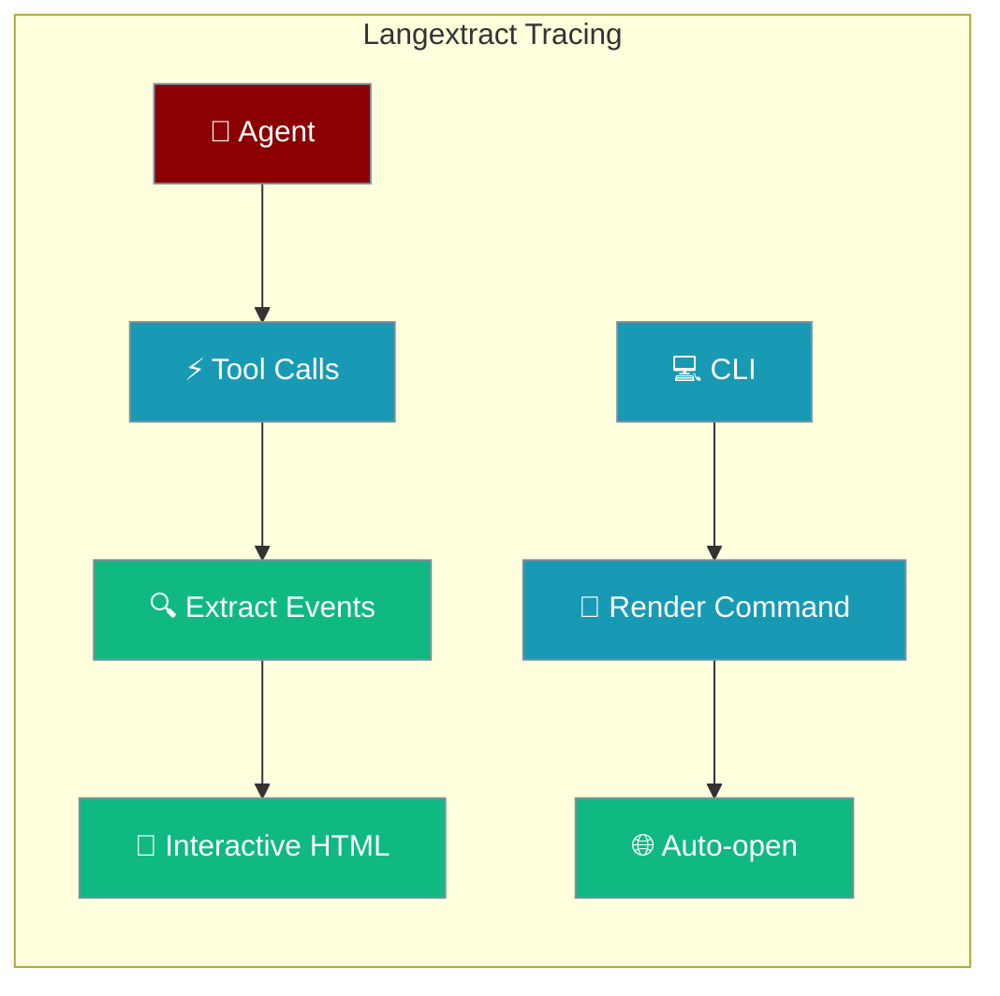

Langextract provides interactive text analysis and visualization capabilities, creating self-contained HTML documents that highlight extractions, tool calls, and agent outputs grounded in the original input text.



## Quick Start

<Steps>
<Step title="Install and Setup">
```bash
# Install langextract
pip install langextract

# Or install with praisonai
pip install "praisonai[langextract]"
```
</Step>

<Step title="Enable Observability">
```python
from praisonaiagents import Agent

# Create agent with langextract observability
agent = Agent(
    name="Assistant",
    instructions="You are a helpful assistant that analyzes text.",
    model="gpt-4o-mini",
)

# Run agent with input text
response = agent.start("Analyze this document about renewable energy...")
```
</Step>

<Step title="Generate HTML Visualization">
```bash
# Using CLI with observability flag
praisonai agent run \
    --name "text-analyzer" \
    --instructions "Analyze the given text for key concepts" \
    --observe langextract \
    --prompt "Solar power is a renewable energy source that converts sunlight into electricity."

# This will generate an interactive HTML file with highlighted extractions
```
</Step>
</Steps>

## CLI Usage

### Basic Rendering

```bash
# Run agent with langextract observability
praisonai agent run \
    --observe langextract \
    --name "research-agent" \
    --prompt "Research renewable energy trends"
```

### Render Command

```bash
# Render existing YAML config with langextract visualization
praisonai langextract render simple.yaml -o analysis.html --no-open

# Auto-open in browser
praisonai langextract render simple.yaml -o analysis.html

# View existing HTML file
praisonai langextract view analysis.html
```

### Environment Variables

```bash
# Configure output path
export PRAISONAI_LANGEXTRACT_OUTPUT="./trace.html"

# Auto-open in browser
export PRAISONAI_LANGEXTRACT_AUTO_OPEN="true"

# Run with environment config
praisonai agent run --observe langextract --prompt "Analyze this text..."
```

## Python API

### Basic Usage

```python
from praisonaiagents import Agent
from praisonai.observability import LangextractSink, LangextractSinkConfig
from praisonaiagents.trace.protocol import TraceEmitter, set_default_emitter
from praisonaiagents.trace.context_events import ContextTraceEmitter, set_context_emitter

# Configure langextract observability
config = LangextractSinkConfig(
    output_path="agent_trace.html",
    auto_open=True,
    include_llm_content=True
)

sink = LangextractSink(config=config)

# Set up both action and context emitters for comprehensive tracing
action_emitter = TraceEmitter(sink=sink, enabled=True)
context_emitter = ContextTraceEmitter(sink=sink.context_sink(), enabled=True)

set_default_emitter(action_emitter)
set_context_emitter(context_emitter)

# Create and run agent
agent = Agent(
    name="text-analyzer",
    instructions="Analyze text for key concepts and entities",
    model="gpt-4o-mini"
)

response = agent.start("The quick brown fox jumps over the lazy dog.")

# Close sink to generate HTML
sink.close()
```

### Advanced Configuration

```python
from praisonai.observability import LangextractSinkConfig

config = LangextractSinkConfig(
    output_path="detailed_analysis.html",
    jsonl_path="trace_data.jsonl",  # Also save raw trace data
    document_id="agent-analysis-v1",
    auto_open=False,
    include_llm_content=True,
    include_tool_args=True,
    enabled=True
)

sink = LangextractSink(config=config)
```

### Using Langextract Tools

Agents can also use langextract functionality directly as tools:

```python
from praisonaiagents import Agent
from praisonaiagents.tools import langextract_extract, langextract_render_file

# Agent with langextract tools
agent = Agent(
    name="document-analyzer",
    instructions="Use langextract tools to analyze and visualize text",
    tools=[langextract_extract, langextract_render_file]
)

# Agent can call tools directly
response = agent.start("""
Analyze the text 'Machine learning is transforming healthcare' and create 
an interactive visualization highlighting the key concepts 'machine learning' 
and 'healthcare'.
""")
```

## Configuration Options

| Option | Default | Description |
|--------|---------|-------------|
| `output_path` | `"praisonai-trace.html"` | Path to save HTML visualization |
| `jsonl_path` | `None` | Optional path to save raw trace data |
| `document_id` | `"praisonai-run"` | Identifier for the document |
| `auto_open` | `False` | Open HTML in browser automatically |
| `include_llm_content` | `True` | Include LLM response text in visualization |
| `include_tool_args` | `True` | Include tool arguments in extractions |
| `enabled` | `True` | Enable/disable langextract tracing |

## Output Format

Langextract generates two types of output:

### Interactive HTML
- Self-contained HTML file with embedded CSS and JavaScript
- Highlighted text extractions with hover details
- Tool call visualizations with arguments and results
- Agent conversation flow with timestamps
- Responsive design for desktop and mobile viewing

### Raw Trace Data (Optional)
- JSONL file with structured trace events
- Can be processed programmatically
- Useful for debugging and analysis
- Compatible with other observability tools

## Visualization Features

<CardGroup cols={2}>
<Card title="Text Grounding" icon="anchor">
Extractions are anchored to specific character positions in the original text
</Card>

<Card title="Tool Call Tracking" icon="wrench">
Visual representation of all tool calls with arguments and results
</Card>

<Card title="Agent Flow" icon="sitemap">
Complete agent conversation flow with message threading
</Card>

<Card title="Interactive Elements" icon="hand-pointer">
Click and hover interactions for detailed inspection
</Card>
</CardGroup>

## Integration Patterns

### With Multi-Agent Systems

```python
from praisonaiagents import Agent, AgentTeam

# Team with shared langextract observability
researcher = Agent(name="researcher", instructions="Research topics")
writer = Agent(name="writer", instructions="Write summaries")

team = AgentTeam(agents=[researcher, writer])

# Langextract will capture the entire multi-agent flow
response = team.start("Research and summarize renewable energy trends")
```

### With Custom Tools

```python
from praisonaiagents import Agent, tool

@tool
def analyze_sentiment(text: str) -> str:
    """Analyze sentiment of text."""
    # Tool implementation
    return "positive"

agent = Agent(
    name="sentiment-analyzer",
    tools=[analyze_sentiment],
    instructions="Analyze text sentiment"
)

# Tool calls will appear in langextract visualization
response = agent.start("This is a great day!")
```

## Troubleshooting

<AccordionGroup>
<Accordion title="HTML file not generated">
Make sure to call `sink.close()` after agent execution to trigger HTML rendering.

```python
sink = LangextractSink(config=config)
# ... run agent ...
sink.close()  # This generates the HTML file
```
</Accordion>

<Accordion title="Empty trace visualization">
Ensure both action and context emitters are set up for comprehensive event capture:

```python
# Set up both emitters
set_default_emitter(TraceEmitter(sink=sink, enabled=True))
set_context_emitter(ContextTraceEmitter(sink=sink.context_sink(), enabled=True))
```
</Accordion>

<Accordion title="Installation issues">
Install langextract separately if needed:

```bash
pip install langextract
# or
pip install "praisonai[langextract]"
```
</Accordion>
</AccordionGroup>

## Examples

### Text Analysis Agent

```python
from praisonaiagents import Agent
from praisonai.observability import LangextractSink, LangextractSinkConfig

config = LangextractSinkConfig(output_path="text_analysis.html", auto_open=True)
sink = LangextractSink(config=config)

# Set up observability
from praisonaiagents.trace.protocol import TraceEmitter, set_default_emitter
from praisonaiagents.trace.context_events import ContextTraceEmitter, set_context_emitter

set_default_emitter(TraceEmitter(sink=sink, enabled=True))
set_context_emitter(ContextTraceEmitter(sink=sink.context_sink(), enabled=True))

agent = Agent(
    name="text-analyzer",
    instructions="Extract key entities and concepts from text",
    model="gpt-4o-mini"
)

text = """
Artificial intelligence is revolutionizing healthcare through machine learning 
algorithms that can diagnose diseases, predict patient outcomes, and personalize 
treatment plans. Deep learning models analyze medical imaging data with 
unprecedented accuracy.
"""

response = agent.start(f"Analyze this text for key concepts: {text}")
sink.close()  # Generates interactive HTML visualization
```

### Research Documentation Agent

```python
agent = Agent(
    name="research-documenter",
    instructions="Research topics and create structured documentation",
    tools=[langextract_extract]  # Can use langextract as a tool
)

response = agent.start("""
Research quantum computing and create an interactive visualization of the key 
concepts in your findings.
""")
```

## Best Practices

<CardGroup cols={2}>
<Card title="Meaningful Document IDs" icon="tag">
Use descriptive document IDs for easy identification: `"user-query-2024-01-15"`
</Card>

<Card title="Cleanup Resources" icon="broom">
Always call `sink.close()` to ensure HTML generation and resource cleanup
</Card>

<Card title="Environment Configuration" icon="gear">
Use environment variables for consistent configuration across environments
</Card>

<Card title="Tool Integration" icon="puzzle-piece">
Combine langextract tools with observability for comprehensive analysis workflows
</Card>
</CardGroup>

---

Langextract provides a unique approach to agent observability by grounding all events in the original text, making it easier to understand how agents process and analyze information.