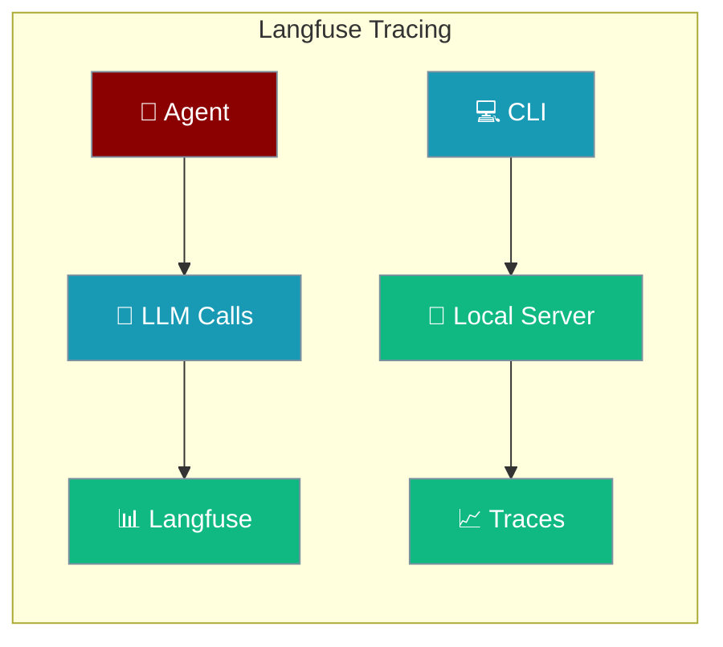
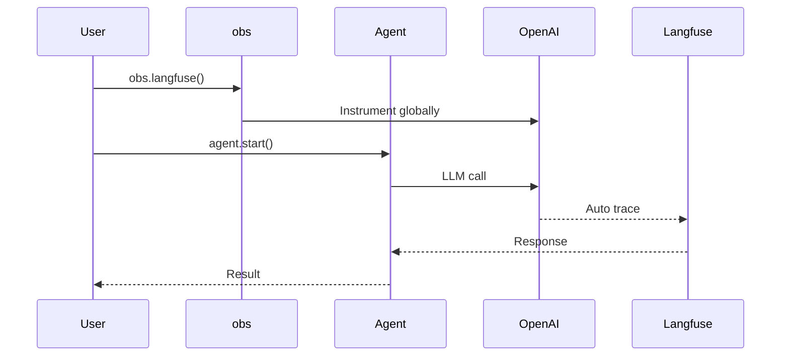

Langfuse provides observability and evaluation tools for LLM applications with automatic tracing of all agent conversations.



## Quick Start

<Steps>
<Step title="Install and Enable">
```python
# Install required packages
# pip install praisonaiagents langfuse

import os
os.environ["LANGFUSE_PUBLIC_KEY"] = "pk-lf-xxx"
os.environ["LANGFUSE_SECRET_KEY"] = "sk-lf-xxx"

from praisonaiagents.obs import obs
from praisonaiagents import Agent

# Initialize Langfuse tracing
provider = obs.langfuse()

agent = Agent(
    name="Assistant",
    instructions="You are a helpful assistant.",
    model="gpt-4o-mini",
)

result = agent.start("What is the capital of France?")
print(result)

# Always flush before exit
provider.flush()
```
</Step>

<Step title="Auto-Detection">
```python
from praisonaiagents.obs import obs
from praisonaiagents import Agent

# Auto-detects Langfuse from environment variables
provider = obs.auto()

agent = Agent(
    name="Assistant",
    instructions="You are a helpful assistant.",
    model="gpt-4o-mini",
)

result = agent.start("Hello!")
```
</Step>
</Steps>

---

## How It Works



| Component | Purpose |
|-----------|---------|
| `obs.langfuse()` | Instruments OpenAI client globally for automatic tracing |
| Agent | Makes LLM calls that are automatically traced |
| Langfuse SDK | Captures traces via `langfuse.openai` drop-in |

---

## Environment Variables

| Variable | Required | Description |
|----------|----------|-------------|
| `LANGFUSE_PUBLIC_KEY` | ✅ | Your Langfuse public key (`pk-lf-...`) |
| `LANGFUSE_SECRET_KEY` | ✅ | Your Langfuse secret key (`sk-lf-...`) |
| `LANGFUSE_BASE_URL` | For self-hosted | Base URL e.g. `http://localhost:3000` |
| `LANGFUSE_HOST` | For compatibility | Same as `LANGFUSE_BASE_URL` |

```bash
# Cloud Langfuse
export LANGFUSE_PUBLIC_KEY=pk-lf-xxx
export LANGFUSE_SECRET_KEY=sk-lf-xxx

# Self-hosted Langfuse
export LANGFUSE_BASE_URL=http://localhost:3000
export LANGFUSE_HOST=http://localhost:3000
```

---

## CLI Commands

<Tabs>
<Tab title="Local Server">
```bash
# Start local Langfuse server
praisonai langfuse start

# Custom port and credentials
praisonai langfuse start --port 8080 --email admin@example.com

# Check status
praisonai langfuse status

# Stop server
praisonai langfuse stop
```
</Tab>

<Tab title="Configuration">
```bash
# Configure credentials interactively
praisonai langfuse config

# Set specific credentials
praisonai langfuse config \
  --public-key pk-lf-xxx \
  --secret-key sk-lf-xxx

# Connect to remote instance
praisonai langfuse connect \
  --public-key pk-lf-xxx \
  --secret-key sk-lf-xxx \
  --host https://my-langfuse.com
```
</Tab>

<Tab title="View Traces">
```bash
# List recent traces
praisonai langfuse traces

# Show specific trace details
praisonai langfuse show <trace-id>

# List sessions
praisonai langfuse sessions

# Test connection
praisonai langfuse test
```
</Tab>
</Tabs>

---

## Common Patterns

### Multi-Agent Tracing

All agents in a session share the same Langfuse context automatically:

```python
from praisonaiagents.obs import obs
from praisonaiagents import Agent, Task, PraisonAIAgents

provider = obs.langfuse()

researcher = Agent(
    name="Researcher", 
    role="Research specialist",
    model="gpt-4o-mini"
)

writer = Agent(
    name="Writer", 
    role="Content writer",
    model="gpt-4o-mini"
)

agents = PraisonAIAgents(
    agents=[researcher, writer],
    tasks=[
        Task(description="Research AI trends"),
        Task(description="Write a summary")
    ],
)

agents.start()
provider.flush()
```

### Connection Verification

```python
from praisonaiagents.obs import obs

provider = obs.langfuse()
ok, message = provider.check_connection()
print(f"Connected: {ok} — {message}")
```

### Configuration File Usage

Credentials from `~/.praisonai/langfuse.env` are auto-loaded:

```python
from praisonaiagents.obs import obs

# Automatically loads from config file if env vars not set
provider = obs.auto()

if provider:
    print(f"Provider active: {type(provider).__name__}")
```

---

## Best Practices

<AccordionGroup>
<Accordion title="Always Flush Before Exit">
Call `provider.flush()` to ensure all traces are sent:

```python
provider = obs.langfuse()
# ... run agents ...
provider.flush()  # Critical for trace delivery
```
</Accordion>

<Accordion title="Use Auto-Detection">
Prefer `obs.auto()` for environment-based configuration:

```python
provider = obs.auto()  # Detects Langfuse automatically
```
</Accordion>

<Accordion title="Langfuse v4 Compatibility">
PraisonAI uses Langfuse v4 SDK with `langfuse.openai` drop-in for automatic instrumentation. No manual trace creation needed.
</Accordion>

<Accordion title="Local Development Setup">
Use CLI for local development:
1. `praisonai langfuse start`
2. `praisonai langfuse config`
3. Test with `praisonai langfuse test`
</Accordion>
</AccordionGroup>

---

## Related

<CardGroup cols={2}>
<Card title="Observability Overview" icon="chart-line" href="/docs/observability/overview">
  Compare observability providers
</Card>
<Card title="Agent Configuration" icon="user" href="/docs/concepts/agents">
  Configure agent settings
</Card>
</CardGroup>