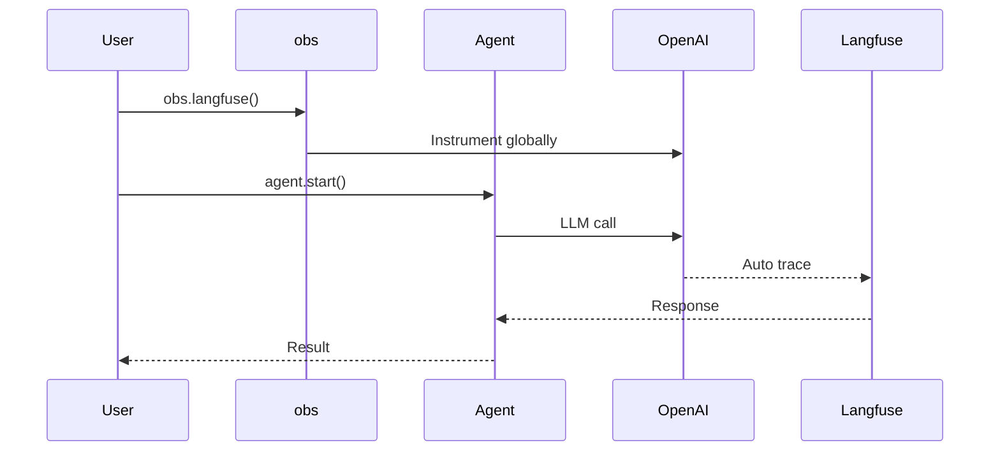
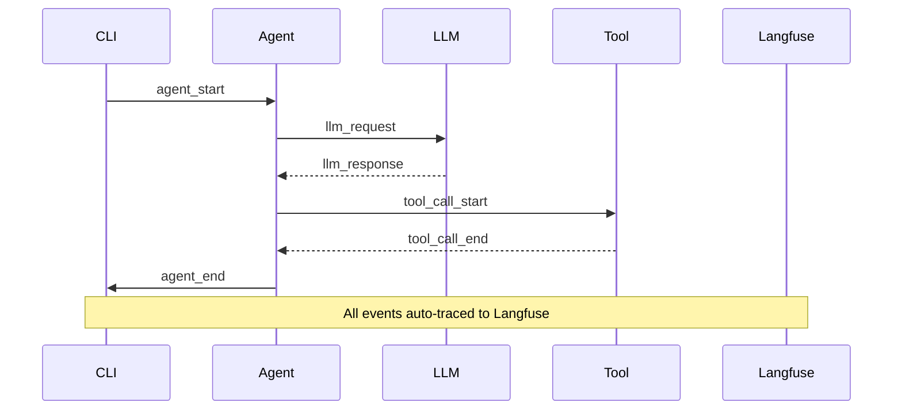

Langfuse provides observability and evaluation tools for LLM applications with automatic tracing of all agent conversations.

```mermaid
graph LR
    subgraph "Two Paths to Enable Langfuse"
        A[📝 Path A: obs.langfuse()] --> B[📡 OpenAI Drop-in]
        C[💻 Path B: --observe langfuse] --> D[🔄 Context Bridge]
        B --> E[📊 Langfuse]
        D --> E
    end
    
    classDef pathA fill:#8B0000,stroke:#7C90A0,color:#fff
    classDef pathB fill:#189AB4,stroke:#7C90A0,color:#fff
    classDef output fill:#10B981,stroke:#7C90A0,color:#fff
    
    class A,B pathA
    class C,D pathB
    class E output
```

## Path Comparison

| | Path A — `obs.langfuse()` | Path B — `praisonai --observe langfuse` |
|---|---|---|
| **Usage** | Python script | CLI flag (also `PRAISONAI_OBSERVE=langfuse`) |
| **Mechanism** | Instruments OpenAI client globally via `langfuse.openai` drop-in | `LangfuseSink` + `ContextTraceEmitter` bridge |
| **Span Coverage** | Per-LLM-call generations (input/output, tokens, model) | Full lifecycle: `agent_start`, `agent_end`, `tool_call_*`, `llm_*` |
| **Manual flush needed?** | Yes — `provider.flush()` | No — `atexit` registers it |
| **Best for** | Programmatic agents, any Python flow | YAML / CLI workflows, multi-agent pipelines |

## Quick Start

<Steps>
<Step title="Install and Enable">
```python
# Install required packages
# pip install praisonaiagents langfuse

import os
os.environ["LANGFUSE_PUBLIC_KEY"] = "pk-lf-xxx"
os.environ["LANGFUSE_SECRET_KEY"] = "sk-lf-xxx"

from praisonaiagents.obs import obs
from praisonaiagents import Agent

# Initialize Langfuse tracing
provider = obs.langfuse()

agent = Agent(
    name="Assistant",
    instructions="You are a helpful assistant.",
    model="gpt-4o-mini",
)

result = agent.start("What is the capital of France?")
print(result)

# Always flush before exit
provider.flush()
```
</Step>

<Step title="Auto-Detection">
```python
from praisonaiagents.obs import obs
from praisonaiagents import Agent

# Auto-detects Langfuse from environment variables
provider = obs.auto()

agent = Agent(
    name="Assistant",
    instructions="You are a helpful assistant.",
    model="gpt-4o-mini",
)

result = agent.start("Hello!")
```
</Step>
</Steps>

---

## How Path A Works — `obs.langfuse()`



| Component | Purpose |
|-----------|---------|
| `obs.langfuse()` | Instruments OpenAI client globally for automatic tracing |
| Agent | Makes LLM calls that are automatically traced |
| Langfuse SDK | Captures traces via `langfuse.openai` drop-in |

---

## Environment Variables

| Variable | Required | Description |
|----------|----------|-------------|
| `LANGFUSE_PUBLIC_KEY` | ✅ | Your Langfuse public key (`pk-lf-...`) |
| `LANGFUSE_SECRET_KEY` | ✅ | Your Langfuse secret key (`sk-lf-...`) |
| `LANGFUSE_BASE_URL` | For self-hosted | Base URL e.g. `http://localhost:3000` |
| `LANGFUSE_HOST` | For compatibility | Same as `LANGFUSE_BASE_URL` |

```bash
# Cloud Langfuse
export LANGFUSE_PUBLIC_KEY=pk-lf-xxx
export LANGFUSE_SECRET_KEY=sk-lf-xxx

# Self-hosted Langfuse
export LANGFUSE_BASE_URL=http://localhost:3000
export LANGFUSE_HOST=http://localhost:3000
```

---

## CLI Observability — `--observe langfuse`

Enable full agent lifecycle tracing with a single CLI flag:

```bash
# Basic usage
praisonai --observe langfuse run agents.yaml

# With environment variable
PRAISONAI_OBSERVE=langfuse praisonai run agents.yaml

# Multi-agent workflows
praisonai --observe langfuse agents "Research AI trends" "Write a summary"
```

### What Gets Traced



The CLI `--observe langfuse` captures:
- **Agent lifecycle**: `agent_start` / `agent_end` spans
- **LLM interactions**: `llm_request` / `llm_response` with readable content
- **Tool usage**: `tool_call_start` / `tool_call_end` with args and results
- **Automatic flush**: No manual `provider.flush()` required

<Note>
As of PR #1461, `atexit` auto-closes the sink — no manual flush required for CLI runs. See [Custom Tracing](/docs/observability/custom-tracing) for the underlying `ContextTraceSinkProtocol`.
</Note>

---

## Programmatic — `LangfuseSink` + Context Bridge

For full control over Langfuse tracing in Python code:

```python
from praisonaiagents import Agent
from praisonaiagents.trace.protocol import TraceEmitter, set_default_emitter
from praisonaiagents.trace.context_events import ContextTraceEmitter, set_context_emitter
from praisonai.observability import LangfuseSink, LangfuseSinkConfig
import atexit

sink = LangfuseSink(LangfuseSinkConfig())  # reads env vars

# Action-level events (RouterAgent / PlanningAgent)
set_default_emitter(TraceEmitter(sink=sink, enabled=True))

# Context-level events (Agent.start lifecycle, tool calls, LLM I/O) — required for full coverage
set_context_emitter(ContextTraceEmitter(sink=sink.context_sink(), enabled=True))

atexit.register(sink.close)

agent = Agent(name="Writer", instructions="Write a haiku about code.")
agent.start("Write a haiku about code.")
```

<Note>
The `set_context_emitter(... sink=sink.context_sink() ...)` call is **required** for typical single-agent flows. Without it, only `RouterAgent` token-usage and `PlanningAgent.plan_created` events appear in Langfuse — `Agent.start()` lifecycle is silent.
</Note>

### LangfuseSinkConfig Options

| Option | Type | Default | Description |
|--------|------|---------|-------------|
| `public_key` | `str` | `""` (then `LANGFUSE_PUBLIC_KEY`) | Langfuse public key (`pk-lf-...`) |
| `secret_key` | `str` | `""` (then `LANGFUSE_SECRET_KEY`) | Langfuse secret key (`sk-lf-...`) |
| `host` | `str` | `""` (then `LANGFUSE_HOST` → `LANGFUSE_BASE_URL` → `https://cloud.langfuse.com`) | Langfuse server URL |
| `flush_at` | `int` | `20` | Number of events that triggers a flush |
| `flush_interval` | `float` | `10.0` | Seconds between background flushes |
| `enabled` | `bool` | `True` | Master switch |

---

## CLI Server Commands

<Tabs>
<Tab title="Local Server">
```bash
# Start local Langfuse server
praisonai langfuse start

# Custom port and credentials
praisonai langfuse start --port 8080 --email admin@example.com

# Check status
praisonai langfuse status

# Stop server
praisonai langfuse stop
```
</Tab>

<Tab title="Configuration">
```bash
# Configure credentials interactively
praisonai langfuse config

# Set specific credentials
praisonai langfuse config \
  --public-key pk-lf-xxx \
  --secret-key sk-lf-xxx

# Connect to remote instance
praisonai langfuse connect \
  --public-key pk-lf-xxx \
  --secret-key sk-lf-xxx \
  --host https://my-langfuse.com
```
</Tab>

<Tab title="View Traces">
```bash
# List recent traces
praisonai langfuse traces

# Show specific trace details
praisonai langfuse show <trace-id>

# List sessions
praisonai langfuse sessions

# Test connection
praisonai langfuse test
```
</Tab>
</Tabs>

---

## Common Patterns

### Multi-Agent Tracing

All agents in a session share the same Langfuse context automatically:

```python
from praisonaiagents.obs import obs
from praisonaiagents import Agent, Task, PraisonAIAgents

provider = obs.langfuse()

researcher = Agent(
    name="Researcher", 
    role="Research specialist",
    model="gpt-4o-mini"
)

writer = Agent(
    name="Writer", 
    role="Content writer",
    model="gpt-4o-mini"
)

agents = PraisonAIAgents(
    agents=[researcher, writer],
    tasks=[
        Task(description="Research AI trends"),
        Task(description="Write a summary")
    ],
)

agents.start()
provider.flush()
```

### Connection Verification

```python
from praisonaiagents.obs import obs

provider = obs.langfuse()
ok, message = provider.check_connection()
print(f"Connected: {ok} — {message}")
```

### Configuration File Usage

Credentials from `~/.praisonai/langfuse.env` are auto-loaded:

```python
from praisonaiagents.obs import obs

# Automatically loads from config file if env vars not set
provider = obs.auto()

if provider:
    print(f"Provider active: {type(provider).__name__}")
```

---

## Best Practices

<AccordionGroup>
<Accordion title="Always Flush Before Exit (Path A)">
Call `provider.flush()` to ensure all traces are sent for `obs.langfuse()`:

```python
provider = obs.langfuse()
# ... run agents ...
provider.flush()  # Critical for trace delivery
```

Path B (`--observe langfuse`) auto-registers `atexit.close` since PR #1461.
</Accordion>

<Accordion title="Use Auto-Detection">
Prefer `obs.auto()` for environment-based configuration:

```python
provider = obs.auto()  # Detects Langfuse automatically
```
</Accordion>

<Accordion title="Trace Content Quality (PR #1461)">
As of PR #1461, `llm_response` spans contain the assistant message text (or `[tool_calls: name1, name2]` summary), not the raw `ChatCompletion(...)` repr. The Langfuse "Output" panel is now human-readable:

- **Before**: `ChatCompletion(id='chatcmpl-...', choices=[Choice(...)], ...)`
- **After**: `"The capital of France is Paris."` or `[tool_calls: search_web, calculator]`
</Accordion>

<Accordion title="Context Bridge for Full Coverage">
For programmatic usage, include the context emitter for complete lifecycle tracing:

```python
from praisonaiagents.trace.context_events import ContextTraceEmitter, set_context_emitter
set_context_emitter(ContextTraceEmitter(sink=sink.context_sink(), enabled=True))
```

Without this, only `RouterAgent` and `PlanningAgent` events appear — `Agent.start()` flows are silent.
</Accordion>

<Accordion title="Local Development Setup">
Use CLI for local development:
1. `praisonai langfuse start`
2. `praisonai langfuse config`
3. Test with `praisonai langfuse test`
</Accordion>
</AccordionGroup>

---

## Related

<CardGroup cols={2}>
<Card title="Observability Overview" icon="chart-line" href="/docs/observability/overview">
  Compare observability providers
</Card>
<Card title="Agent Configuration" icon="user" href="/docs/concepts/agents">
  Configure agent settings
</Card>
</CardGroup>