Monitor agent execution, LLM calls, tool usage, and token costs in [LangSmith](https://smith.langchain.com/).

```mermaid
graph LR
    subgraph "LangSmith Observability"
        A["🤖 Agent"] --> B["📡 Auto-Trace"]
        B --> C["💬 LLM Calls"]
        B --> D["🔧 Tool Calls"]
        B --> E["📊 Token Usage"]
        C --> F["🔍 LangSmith Dashboard"]
        D --> F
        E --> F
    end

    classDef agent fill:#8B0000,stroke:#7C90A0,color:#fff
    classDef trace fill:#189AB4,stroke:#7C90A0,color:#fff
    classDef output fill:#10B981,stroke:#7C90A0,color:#fff

    class A agent
    class B,C,D,E trace
    class F output
```



## Quick Start

<Steps>

<Step title="Install Dependencies">
```bash
pip install praisonaiagents praisonai-tools opentelemetry-sdk opentelemetry-exporter-otlp
```
</Step>

<Step title="Set Environment Variables">
```bash
export LANGSMITH_API_KEY=lsv2_xxx
export LANGSMITH_PROJECT=my-project
```
</Step>

<Step title="Run Your Agent">
```python
from praisonai_tools.observability import obs
from praisonaiagents import Agent

obs.init(provider="langsmith")

agent = Agent(
    name="Assistant",
    instructions="You are a helpful assistant.",
    model="gpt-4o-mini",
)

response = agent.chat("What is AI?")
print(response)
```
</Step>

</Steps>

<Tip>
That's it — three lines of setup. Every LLM call, tool call, and agent step is automatically traced to your LangSmith dashboard.
</Tip>

---

## How It Works


| What Gets Traced | Details |
|------------------|---------|
| **Agent lifecycle** | Start/end timing, agent name, role |
| **LLM calls** | Input messages, output, model, token usage |
| **Tool calls** | Tool name, arguments, results |
| **Token usage** | Prompt tokens, completion tokens, total |
| **Errors** | Stack traces, error messages |

---

## Configuration Options

| Option | Environment Variable | Description |
|--------|---------------------|-------------|
| `api_key` | `LANGSMITH_API_KEY` | Your LangSmith API key |
| `project` | `LANGSMITH_PROJECT` | Project name (default: `"default"`) |
| `endpoint` | `LANGSMITH_ENDPOINT` | API endpoint (default: `https://api.smith.langchain.com`) |
| `tracing` | `LANGSMITH_TRACING` | Set to `true` to enable (auto-detected) |

---

## Common Patterns

<Tabs>

<Tab title="Single Agent">
```python
from praisonai_tools.observability import obs
from praisonaiagents import Agent

obs.init(provider="langsmith")

agent = Agent(
    name="Assistant",
    instructions="You are a helpful assistant.",
    model="gpt-4o-mini",
)

response = agent.chat("What is AI?")
print(response)
```
</Tab>

<Tab title="Multi-Agent Team">
```python
from praisonai_tools.observability import obs
from praisonaiagents import Agent, Task, PraisonAIAgents

obs.init(provider="langsmith", project_name="my-team")

researcher = Agent(
    name="Researcher",
    instructions="Search for information.",
    model="gpt-4o-mini",
)

writer = Agent(
    name="Writer",
    instructions="Write clear summaries.",
    model="gpt-4o-mini",
)

task1 = Task(description="Research AI trends", agent=researcher)
task2 = Task(description="Summarize findings", agent=writer)

agents = PraisonAIAgents(agents=[researcher, writer], tasks=[task1, task2])
agents.start()
```
</Tab>

<Tab title="With Tools">
```python
from praisonai_tools.observability import obs
from praisonaiagents import Agent, tool

obs.init(provider="langsmith")

@tool
def search_web(query: str) -> str:
    """Search the web for information."""
    return f"Results for: {query}"

agent = Agent(
    name="Researcher",
    instructions="Search and answer questions.",
    tools=[search_web],
    model="gpt-4o-mini",
)

response = agent.chat("Latest AI news")
print(response)
```
</Tab>

<Tab title="Explicit Tracing">
```python
from praisonai_tools.observability import obs
from praisonaiagents import Agent

obs.init(provider="langsmith", auto_instrument=False)

agent = Agent(
    name="Assistant",
    instructions="You are helpful.",
    model="gpt-4o-mini",
)

with obs.trace("chat-session"):
    response = agent.chat("What is AI?")
    print(response)
```
</Tab>

</Tabs>

---

## What You See in LangSmith

```mermaid
graph TB
    subgraph "LangSmith Trace View"
        T["🔍 Trace: agent.Assistant.chat"] --> A["🤖 Agent: Assistant"]
        A --> L["💬 LLM: gpt-4o-mini"]
        A --> Tool["🔧 Tool: search_web"]
        L --> Tokens["📊 Tokens: 50 in / 120 out"]
        L --> Cost["💰 Cost: $0.001"]
        L --> Latency["⏱️ Latency: 1.2s"]
    end

    classDef trace fill:#8B0000,stroke:#7C90A0,color:#fff
    classDef detail fill:#189AB4,stroke:#7C90A0,color:#fff

    class T,A trace
    class L,Tool,Tokens,Cost,Latency detail
```



---

## Diagnostics & Verification

Check your setup with the built-in doctor:

<Tabs>

<Tab title="Python">
```python
from praisonai_tools.observability import obs

obs.init(provider="langsmith")
results = obs.doctor()
print(results)
```

```json
{
    "enabled": true,
    "provider": "langsmith",
    "connection_status": true,
    "connection_message": "LangSmith API key configured"
}
```
</Tab>

<Tab title="CLI">
```bash
# Health check
python -m praisonai_tools.observability.cli doctor

# Health check (JSON)
python -m praisonai_tools.observability.cli doctor --json

# Verify traces in LangSmith (requires LANGSMITH_API_KEY)
python -m praisonai_tools.observability.cli verify --project "My First App"

# Verify with JSON output
python -m praisonai_tools.observability.cli verify --project "My First App" --json
```
</Tab>

</Tabs>

### PraisonAI Branding

Every agent and workflow span automatically includes PraisonAI branding in LangSmith metadata:

| Metadata Key | Value | Description |
|-------------|-------|-------------|
| `praisonai.version` | `0.2.20` | SDK version used |
| `praisonai.framework` | `praisonai` | Framework identifier |

Workflow spans also capture structured input (agent names, task descriptions) and output.

---

## Best Practices

<AccordionGroup>
  <Accordion title="Use project names to organize traces">
    Set `LANGSMITH_PROJECT` or pass `project_name` to group traces by environment or feature.

    ```python
    obs.init(provider="langsmith", project_name="production-chatbot")
    ```
  </Accordion>

  <Accordion title="Use auto-instrumentation for most cases">
    Auto-instrumentation traces everything automatically. Only use explicit `obs.trace()` when you need custom trace boundaries or additional metadata.
  </Accordion>

  <Accordion title="Set environment variables in .env files">
    Keep API keys out of code. Use `.env` files or your deployment platform's secret management.

    ```bash
    # .env
    LANGSMITH_API_KEY=lsv2_xxx
    LANGSMITH_PROJECT=my-project
    ```
  </Accordion>

  <Accordion title="Monitor token usage for cost control">
    LangSmith traces include token counts for every LLM call. Use this to identify expensive operations and optimize prompts.
  </Accordion>
</AccordionGroup>

---

## Related

<CardGroup cols={2}>
  <Card title="Observability Overview" icon="eye" href="/observability/overview">
    All supported observability providers
  </Card>
  <Card title="Langfuse" icon="chart-mixed" href="/observability/langfuse">
    Alternative open-source observability
  </Card>
</CardGroup>
