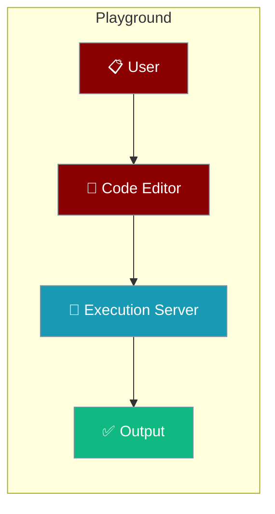
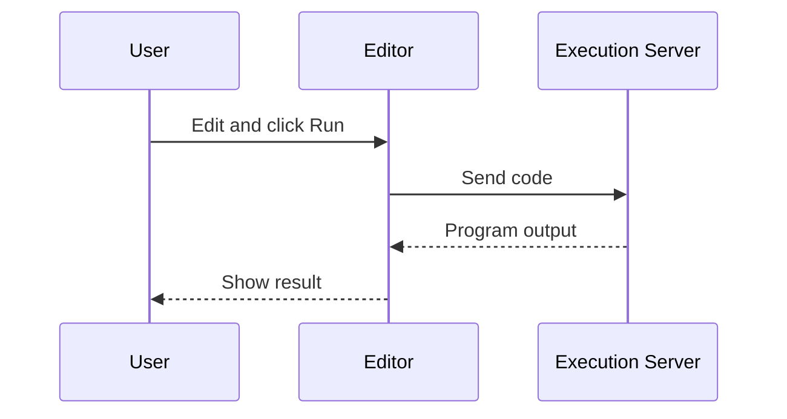

Run an Agent in your browser — the playground executes PraisonAI code with no local setup.

```python
from praisonaiagents import Agent

agent = Agent(instructions="You are a helpful assistant")
agent.start("Write a haiku about AI")
```



<iframe 
  id="codeExecutionFrame"
  src="https://code-execution-server-praisonai.replit.app/?code=import%20openai%0A%0Aclient%20%3D%20openai.OpenAI()%0Aresult%20%3D%20client.chat.completions.create(%0A%20%20%20%20model%3D%22gpt-3.5-turbo%22%2C%0A%20%20%20%20messages%3D%5B%0A%20%20%20%20%20%20%20%20%7B%22role%22%3A%20%22user%22%2C%20%22content%22%3A%20%22Hello%20World%22%7D%0A%20%20%20%20%5D%0A)%0A%0Aprint(result.choices%5B0%5D.message.content)" 
  width="100%" 
  height="800px" 
  frameborder="0"
  allow="clipboard-read; clipboard-write"
  scrolling="yes"
  onload="resizeIframe(this)"
></iframe>

## How to Use the Playground

1. The code editor is pre-loaded with a simple example using Praison AI Agents
2. Modify the code as needed for your experiments
3. Click "Run" to execute the code and see the results
4. Use the playground to test concepts from the course or your own ideas

## How It Works

You edit code in the browser, the execution server runs it, and the output streams back to the editor.



## Best Practices

<AccordionGroup>
<Accordion title="Start from the built-in example">
The editor is pre-loaded with a working snippet. Tweak the `instructions` and prompt before writing from scratch.
</Accordion>

<Accordion title="Keep experiments small">
The playground is for quick tests. Move larger projects to a local install with `pip install praisonaiagents`.
</Accordion>

<Accordion title="Use it to learn the SDK">
Try `Agent(...).start("…")` variations to see how instructions and prompts change the output.
</Accordion>
</AccordionGroup>

## Related

<CardGroup cols={2}>
  <Card title="Quick Start" icon="bolt" href="/docs/quickstart">
    Build your first agent locally.
  </Card>
  <Card title="Introduction" icon="book-open" href="/docs/introduction">
    Learn the core building blocks.
  </Card>
</CardGroup>