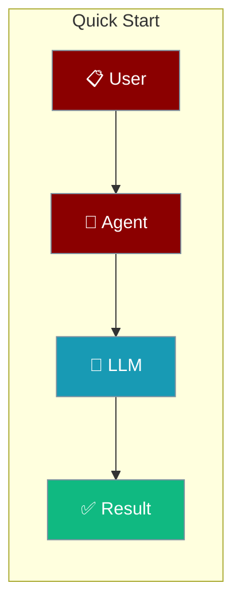
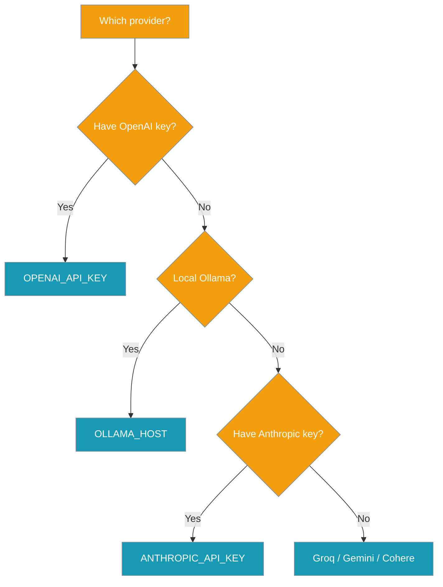
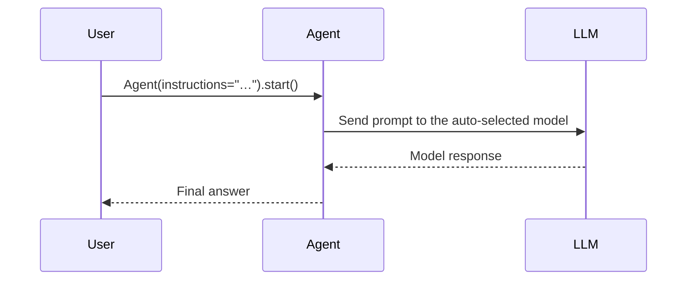

Create an Agent, set one API key, and run it in three lines of code.

```python
from praisonaiagents import Agent

agent = Agent(instructions="Summarise Photosynthesis")
agent.start()
```



Pick the provider whose key you already have — PraisonAI selects the matching model automatically.



# Basic

<Tabs>
  <Tab title="Code">
    <Steps>
      <Step title="Install Package">
        Install the PraisonAI Agents package:
        ```bash
        pip install praisonaiagents
        ```
      </Step>

      <Step title="Set API Key">
        Set the key for whichever provider you use — PraisonAI picks the right model automatically:

        <Tabs>
          <Tab title="OpenAI">
            ```bash
            export OPENAI_API_KEY="${OPENAI_API_KEY:?Set OPENAI_API_KEY in your shell}"
            praisonai "hello"
            ```
          </Tab>
          <Tab title="Anthropic">
            ```bash
            export ANTHROPIC_API_KEY="${ANTHROPIC_API_KEY:?Set ANTHROPIC_API_KEY in your shell}"
            praisonai "hello"
            ```
          </Tab>
          <Tab title="Gemini">
            ```bash
            export GEMINI_API_KEY="${GEMINI_API_KEY:?Set GEMINI_API_KEY in your shell}"
            praisonai "hello"
            ```
          </Tab>
          <Tab title="Groq">
            ```bash
            export GROQ_API_KEY="${GROQ_API_KEY:?Set GROQ_API_KEY in your shell}"
            praisonai "hello"
            ```
          </Tab>
          <Tab title="Ollama">
            ```bash
            export OLLAMA_HOST=http://localhost:11434
            praisonai "hello"
            ```
          </Tab>
        </Tabs>

        <Note>
        No `--model` flag needed — the matching provider's default model is selected automatically. See [Provider Auto-Detection](/docs/models#provider-auto-detection-no-config-first-run) for the full list.
        </Note>
      </Step>

      <Step title="Create Agents">
        Create `app.py`:
    <CodeGroup>
      ```python Single Agent
      from praisonaiagents import Agent, AgentTeam

      # Create a simple agent
      summarise_agent = Agent(instructions="Summarise Photosynthesis")

      # Run the agent
      team = AgentTeam(agents=[summarise_agent])
      team.start()
      ```

      ```python Multiple Agents
      from praisonaiagents import Agent, AgentTeam

      # Create agents with specific roles
      diet_agent = Agent(
          instructions="Give me 5 healthy food recipes",
      )

      blog_agent = Agent(
          instructions="Write a blog post about the food recipes",
      )

      # Run multiple agents
      team = AgentTeam(agents=[diet_agent, blog_agent])
      team.start()
      ```
    </CodeGroup>

<Tip>
For the absolute shortest Python entry point — no class instantiation — use `praisonai.run("agents.yaml")`. See [the one-liner guide](/docs/developers/wrapper#option-0-one-liner-simplest).
</Tip>

      </Step>

      <Step title="Run Agents">
        Execute your script:
        ```bash
        python app.py
        ```

        You'll see:
        - Agent initialization
        - Task execution progress
        - Final results

        <Tip>
        You have successfully CreatedAI Agents and made them work for you!
        </Tip>
      </Step>
    </Steps>
  </Tab>
  <Tab title="No Code">
    <Steps>
      <Step title="Install Package">
        Install the No Code PraisonAI Package:
        ```bash
        pip install praisonaiagents
        ```
      </Step>

      <Step title="Set API Key">
        ```bash
        export OPENAI_API_KEY="${OPENAI_API_KEY:?Set OPENAI_API_KEY in your shell}"
        ```
      </Step>

      <Step title="Create Config">
        Create `agents.yaml`:

    <CodeGroup>
      ```yaml Single Agent
      agents:  # Canonical
        summarise_agent:
          instructions: Summarise Photosynthesis
      ```

      ```yaml Multiple Agents
      agents:  # Canonical
        diet_agent:
          instructions: Give me 5 healthy food recipes
        blog_agent:
          instructions: Write a blog post about the food recipes
      ```
    </CodeGroup>

<Note>
You can automatically create `agents.yaml` using:
```bash
praisonai --init "your task description"
```
First time? Run [`praisonai setup`](/docs/cli/setup) to pick a provider and save your API key — `--init` will print provider guidance if no key is configured.
</Note>

      </Step>

      <Step title="Run Agents">
        Execute your config:
        ```bash
        praisonai agents.yaml
        ```
      </Step>
    </Steps>
  </Tab>
  <Tab title="JavaScript">
    <Steps>
      <Step title="Install Package">
        ```bash
        npm install praisonai
        ```
      </Step>
      <Step title="Set API Key">
        ```bash
        export OPENAI_API_KEY="${OPENAI_API_KEY:?Set OPENAI_API_KEY in your shell}"
        ```
      </Step>
      <Step title="Create File">
        Create `app.js` file

        ## Code Example

<CodeGroup>
```javascript Single Agent
const { Agent } = require('praisonai');
const agent = new Agent({ instructions: 'You are a helpful AI assistant' });
agent.start('Write a movie script about a robot in Mars');
```

```javascript Multi Agents
const { Agent, AgentTeam } = require('praisonai');

const researchAgent = new Agent({ instructions: 'Research about AI' });
const summariseAgent = new Agent({ instructions: 'Summarise research agent\'s findings' });

const team = new AgentTeam({ agents: [researchAgent, summariseAgent] });
team.start();
```
</CodeGroup>
      </Step>
      <Step title="Run Script">
        ```bash
        node app.js
        ```
      </Step>
    </Steps>
  </Tab>
  <Tab title="TypeScript">
    <Steps>
      <Step title="Install Package">
        <CodeGroup>
        ```bash npm
        npm install praisonai
        ```
        ```bash yarn
        yarn add praisonai
        ```
        </CodeGroup>
      </Step>
      <Step title="Set API Key">
        ```bash
        export OPENAI_API_KEY="${OPENAI_API_KEY:?Set OPENAI_API_KEY in your shell}"
        ```
      </Step>
      <Step title="Create File">
        Create `app.ts` file

        ## Code Example

<CodeGroup>
```javascript Single Agent
import { Agent } from 'praisonai';

const agent = new Agent({ 
  instructions: `You are a creative writer who writes short stories with emojis.`,
  name: "StoryWriter"
});

agent.start("Write a story about a time traveler")
```

```javascript Multi Agents
import { Agent, AgentTeam } from 'praisonai';

const storyAgent = new Agent({
  instructions: "Generate a very short story (2-3 sentences) about artificial intelligence with emojis.",
  name: "StoryAgent"
});

const summaryAgent = new Agent({
  instructions: "Summarize the provided AI story in one sentence with emojis.",
  name: "SummaryAgent"
});

const team = new AgentTeam({
  agents: [storyAgent, summaryAgent]
});

team.start()
```
</CodeGroup>
      </Step>
      <Step title="Run Script">
        ```bash
        npx ts-node app.ts
        ```
      </Step>
    </Steps>
  </Tab>
</Tabs>

<Note>
**Prerequisites**
- Python 3.10 or higher
- An API key for any supported provider (OpenAI, Anthropic, Google, Groq, Cohere) or a running Ollama instance — OpenAI is not required
- For the full list of providers, see [Models](/models)
</Note>

<Tip>
Don't have an OpenAI key? PraisonAI picks a default model that matches whichever provider credential you do have set — set `ANTHROPIC_API_KEY`, `GEMINI_API_KEY`, `GROQ_API_KEY`, or run a local `OLLAMA_HOST` and the same `praisonai` command works without `--model`. [Full precedence](/docs/cli/setup#what-happens-if-you-skip---model).
</Tip>

# Advanced

## Providing Detailed Tasks to Agents (Optional)

<Tabs>
  <Tab title="Code">
    <Steps>
      <Step title="Install PraisonAI">
        Install the core package:
        ```bash Terminal
        pip install praisonaiagents
        ```
      </Step>

      <Step title="Configure Environment">
        ```bash Terminal
        export OPENAI_API_KEY="${OPENAI_API_KEY:?Set OPENAI_API_KEY in your shell}"
        ```
        Generate your OpenAI API key from [OpenAI](https://platform.openai.com/api-keys)
        Use other LLM providers like Ollama, Anthropic, Groq, Google, etc. Please refer to the [Models](/models) for more information.
      </Step>

      <Step title="Create Agent">
        Create `app.py`:
    <CodeGroup>
      ```python Single Agent
      from praisonaiagents import Agent, Task, AgentTeam

      # Create an agent
      researcher = Agent(
          name="Researcher",
          role="Senior Research Analyst",
          goal="Uncover cutting-edge developments in AI",
          backstory="You are an expert at a technology research group",
          llm="gpt-4o"
      )

      # Define a task
      task = Task(
          name="research_task",
          description="Analyze 2024's AI advancements",
          expected_output="A detailed report",
          agent=researcher
      )

      # Run the agents
      team = AgentTeam(
          agents=[researcher],
          tasks=[task]
      )

      result = team.start()
      ```

      ```python Multiple Agents
      from praisonaiagents import Agent, Task, AgentTeam

      # Create multiple agents
      researcher = Agent(
          name="Researcher",
          role="Senior Research Analyst",
          goal="Uncover cutting-edge developments in AI",
          backstory="You are an expert at a technology research group",
          llm="gpt-4o"
      )

      writer = Agent(
          name="Writer",
          role="Tech Content Strategist",
          goal="Craft compelling content on tech advancements",
          backstory="You are a content strategist",
          llm="gpt-4o"
      )

      # Define multiple tasks
      task1 = Task(
          name="research_task",
          description="Analyze 2024's AI advancements",
          expected_output="A detailed report",
          agent=researcher
      )

      task2 = Task(
          name="writing_task",
          description="Create a blog post about AI advancements",
          expected_output="A blog post",
          agent=writer
      )

      # Run with hierarchical process
      team = AgentTeam(
          agents=[researcher, writer],
          tasks=[task1, task2],
          process="hierarchical",
          manager_llm="gpt-4o"
      )

      result = team.start()
      ```
    </CodeGroup>
      </Step>

      <Step title="Start Agents">
        Execute your script:
        ```bash Terminal
        python app.py
        ```

        You should see:
        - Agent initialization
        - Agents progress
        - Final results
        - Generated report
      </Step>
    </Steps>
  </Tab>
  <Tab title="No Code">
    <Steps>
      <Step title="Install No Code PraisonAI">
        Install the No Code PraisonAI Package:
        ```bash Terminal
        pip install praisonai
        ```
      </Step>

      <Step title="Set API Key">
        Set your OpenAI API key as an environment variable in your terminal:
        ```bash Terminal
        export OPENAI_API_KEY="${OPENAI_API_KEY:?Set OPENAI_API_KEY in your shell}"
        ```
      </Step>

      <Step title="Create a file">

        Create a new file `agents.yaml` with the basic setup:

```yaml
framework: praisonai
topic: create movie script about cat in mars
agents:  # Canonical: use 'agents' instead of 'roles'
  scriptwriter:
    instructions:  # Canonical: use 'instructions' instead of 'backstory' Expert in dialogue and script structure, translating concepts into
      scripts.
    goal: Write a movie script about a cat in Mars
    role: Scriptwriter
    tasks:
      scriptwriting_task:
        description: Turn the story concept into a production-ready movie script,
          including dialogue and scene details.
        expected_output: Final movie script with dialogue and scene details.
```

<Note>
You can automatically create `agents.yaml` file using
```bash Terminal
praisonai --init create movie script about cat in mars
```
First time? Run [`praisonai setup`](/docs/cli/setup) to pick a provider and save your API key — `--init` will print provider guidance if no key is configured.
</Note>

      </Step>

      <Step title="Start Agents">
        Execute your script:
        ```bash Terminal
        praisonai agents.yaml
        ```
      </Step>


    </Steps>
  </Tab>
</Tabs>


## Creating Custom Tool for Agents (Optional)

<Info>
Tools makes the Agent powerful.
</Info>
More information about tools can be found in the [Tools](/concepts/tools) section.

<Tabs>
  <Tab title="Code">
<Steps>
<Step title="Install PraisonAI">
Install the core package and duckduckgo_search package:
```bash Terminal
pip install praisonai duckduckgo_search
```
</Step>
<Step title="Create Tools and Agents">
```python
from praisonaiagents import Agent, Task, AgentTeam
from duckduckgo_search import DDGS
from typing import List, Dict

# 1. Tool
def internet_search_tool(query: str) -> List[Dict]:
    """
    Perform Internet Search
    """
    results = []
    ddgs = DDGS()
    for result in ddgs.text(keywords=query, max_results=5):
        results.append({
            "title": result.get("title", ""),
            "url": result.get("href", ""),
            "snippet": result.get("body", "")
        })
    return results

# 2. Agent
data_agent = Agent(
    name="DataCollector",
    role="Search Specialist",
    goal="Perform internet searches to collect relevant information.",
    backstory="Expert in finding and organising internet data.",
    tools=[internet_search_tool],
    reflection=False
)

# 3. Tasks
collect_task = Task(
    description="Perform an internet search using the query: 'AI job trends in 2024'. Return results as a list of title, URL, and snippet.",
    expected_output="List of search results with titles, URLs, and snippets.",
    agent=data_agent,
    name="collect_data",
)

# 4. Start Agents
team = AgentTeam(
    agents=[data_agent],
    tasks=[collect_task],
    process="sequential"
)

team.start()
```
</Step>
<Step title="Start Agents">
Run your script:
```bash Terminal
python app.py
```
</Step>
</Steps>
</Tab>

<Tab title="No Code">
<Steps>
<Step title="Install PraisonAI">
Install the core package and duckduckgo_search package:
```bash Terminal
pip install praisonai duckduckgo_search
```
</Step>
<Step title="Create Custom Tool">
<Info>
To add additional tools/features you need some coding which can be generated using ChatGPT or any LLM
</Info>
Create a new file `tools.py` with the following content:
```python
from duckduckgo_search import DDGS
from typing import List, Dict

# 1. Tool
def internet_search_tool(query: str) -> List[Dict]:
    """
    Perform Internet Search
    """
    results = []
    ddgs = DDGS()
    for result in ddgs.text(keywords=query, max_results=5):
        results.append({
            "title": result.get("title", ""),
            "url": result.get("href", ""),
            "snippet": result.get("body", "")
        })
    return results  
```
</Step>
<Step title="Create Agent">

Create a new file `agents.yaml` with the following content:
```yaml
framework: praisonai
topic: create movie script about cat in mars
agents:  # Canonical: use 'agents' instead of 'roles'
  scriptwriter:
    instructions:  # Canonical: use 'instructions' instead of 'backstory' Expert in dialogue and script structure, translating concepts into
      scripts.
    goal: Write a movie script about a cat in Mars
    role: Scriptwriter
    tools:
      - internet_search_tool # <-- Tool assigned to Agent here
    tasks:
      scriptwriting_task:
        description: Turn the story concept into a production-ready movie script,
          including dialogue and scene details.
        expected_output: Final movie script with dialogue and scene details.
```
</Step>

<Step title="Start Agents">

Execute your script:
```bash Terminal
praisonai agents.yaml
```
</Step>
</Steps>
</Tab>
</Tabs>
## How It Works

An Agent takes your instructions, calls the LLM behind the scenes, and returns the result.



## Best Practices

<AccordionGroup>
<Accordion title="Set keys in your shell, never inline">
Export `OPENAI_API_KEY` (or your provider's key) in your shell or a `.env` file. Never paste the raw string into `Agent(llm=...)`.
</Accordion>

<Accordion title="Start with the shortest shape">
`Agent(instructions="…").start()` is the shortest working agent. Add `name`, `role`, `tools`, or a full `Task` only when you need them.
</Accordion>

<Accordion title="Skip --model on first runs">
PraisonAI picks the right default for whichever provider credential you set. See [Provider Auto-Detection](/docs/models#provider-auto-detection-no-config-first-run).
</Accordion>

<Accordion title="Add tools progressively">
Give an agent a plain Python function via `tools=[...]` when it needs to search, fetch, or compute. Keep tool functions small and typed.
</Accordion>
</AccordionGroup>

## Related

<CardGroup cols={2}>
  <Card title="Models" icon="brain" href="/docs/models">
    Choose an LLM provider and model.
  </Card>
  <Card title="Tools" icon="wrench" href="/docs/tools">
    Extend agents with functions and integrations.
  </Card>
</CardGroup>
