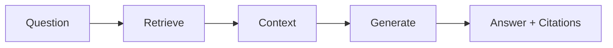

# RAG Overview

**Retrieval Augmented Generation (RAG)** combines the power of large language models with your own data. Instead of relying solely on the model's training data, RAG retrieves relevant information from your documents and uses it to generate accurate, grounded answers.

## How It Works



1. **Index**: Your documents are chunked and stored as embeddings
2. **Retrieve**: When you ask a question, relevant chunks are found
3. **Generate**: The LLM uses retrieved context to answer
4. **Cite**: Sources are tracked for transparency

## Architecture

PraisonAI's RAG is built on a simple principle:

> **Knowledge indexes; RAG answers with citations.**

- **Knowledge**: Handles document ingestion, chunking, embedding, and retrieval
- **RAG**: Thin orchestrator that combines Knowledge retrieval with LLM generation

This separation keeps the core SDK lean while providing powerful RAG capabilities.

## Quick Example

```python
from praisonaiagents import Agent

# Simplest approach - just works
agent = Agent(
    name="Research Assistant",
    knowledge=["research_paper.pdf", "data/"],
)

response = agent.start("What are the key findings?")
print(response)
```

## When to Use RAG

| Use Case | RAG Helps? |
|----------|------------|
| Q&A over documents | ✅ Yes |
| Summarizing reports | ✅ Yes |
| Code documentation lookup | ✅ Yes |
| General knowledge questions | ❌ No (use base LLM) |
| Real-time data | ❌ No (use tools/APIs) |

## Key Features

<CardGroup cols={2}>
  <Card title="Citations" icon="quote-left">
    Every answer includes source references
  </Card>
  <Card title="Streaming" icon="bolt">
    Real-time response streaming
  </Card>
  <Card title="Multi-Agent" icon="users">
    Share knowledge across agents
  </Card>
  <Card title="CLI Support" icon="terminal">
    Full CLI for indexing and querying
  </Card>
</CardGroup>

## Next Steps

<CardGroup cols={2}>
  <Card title="Quickstart" icon="rocket" href="/docs/rag/quickstart">
    Get started in 5 minutes
  </Card>
  <Card title="RAG Module" icon="cube" href="/docs/rag/module">
    Detailed API reference
  </Card>
  <Card title="CLI Commands" icon="terminal" href="/docs/rag/cli">
    Command-line usage
  </Card>
  <Card title="Citations" icon="quote-left" href="/docs/rag/citations">
    Working with sources
  </Card>
</CardGroup>
