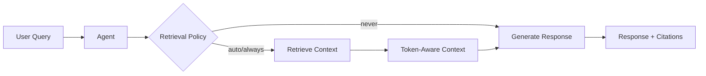

## Overview

The Agent-first retrieval system provides a unified way to configure how agents retrieve and use knowledge. All retrieval behavior is controlled through a single `retrieval_config` parameter.



## Quick Start

```python
from praisonaiagents import Agent

agent = Agent(
    name="Research Agent",
    instructions="Answer questions based on the provided documents.",
    knowledge=["docs/", "papers.pdf"],
    retrieval_config={
        "policy": "auto",           # auto, always, never
        "top_k": 5,                 # Number of chunks to retrieve
        "citations": True,          # Include source citations
        "max_context_tokens": 4000, # Token limit for context
    }
)

# Chat with automatic retrieval
response = agent.chat("What are the key findings?")
print(response)
```

## Retrieval Configuration

### Full Configuration Options

```python
from praisonaiagents import Agent, RetrievalConfig, RetrievalPolicy, CitationsMode

config = RetrievalConfig(
    # Core settings
    enabled=True,                          # Enable/disable retrieval
    policy=RetrievalPolicy.AUTO,           # auto, always, never
    
    # Retrieval parameters
    top_k=5,                               # Number of chunks to retrieve
    min_score=0.0,                         # Minimum relevance score (0.0-1.0)
    max_context_tokens=4000,               # Token budget for context
    
    # Advanced retrieval
    rerank=False,                          # Enable reranking for better relevance
    hybrid=False,                          # Use hybrid retrieval (dense + keyword)
    
    # Citations
    citations=True,                        # Include source citations
    citations_mode=CitationsMode.APPEND,   # append, inline, hidden
    
    # Vector store
    vector_store_provider="chroma",        # chroma, mongodb, etc.
    collection_name="default",             # Collection name
    persist_path=".praison/knowledge",     # Storage path
)

agent = Agent(
    name="Agent",
    instructions="You are a helpful assistant.",
    knowledge=["documents/"],
    retrieval_config=config,
)
```

### Retrieval Policies

| Policy | Behavior |
|--------|----------|
| `auto` | Retrieve when query appears to need knowledge (keywords, questions) |
| `always` | Always retrieve for every query |
| `never` | Never retrieve (use only for generation) |

```python
from praisonaiagents import Agent, RetrievalPolicy

# Always retrieve
agent = Agent(
    knowledge=["docs/"],
    retrieval_config={"policy": "always"}
)

# Never retrieve (knowledge indexed but not used in chat)
agent = Agent(
    knowledge=["docs/"],
    retrieval_config={"policy": "never"}
)

# Auto-detect (default)
agent = Agent(
    knowledge=["docs/"],
    retrieval_config={"policy": "auto"}
)
```

## Agent Methods

### `agent.chat()` - Conversational Interface

The default method for conversation. Retrieval is controlled by policy and per-call overrides.

```python
# Normal chat (uses policy)
response = agent.chat("What is the main topic?")

# Force retrieval (override policy)
response = agent.chat("Hello", force_retrieval=True)

# Skip retrieval (override policy)
response = agent.chat("What is 2+2?", skip_retrieval=True)
```

### `agent.query()` - Structured Answer with Citations

Returns a structured result with answer, citations, and metadata.

```python
from praisonaiagents import Agent

agent = Agent(
    name="Research Agent",
    knowledge=["research_paper.pdf"],
    retrieval_config={"citations": True}
)

result = agent.query("What are the main findings?")

print(f"Answer: {result.answer}")
print(f"Context used: {len(result.context_used)} chars")

for citation in result.citations:
    print(f"  [{citation.id}] {citation.source}")
    print(f"      Score: {citation.score:.2f}")
    print(f"      Text: {citation.text[:100]}...")
```

### `agent.retrieve()` - Retrieval Only (No LLM)

Returns context without LLM generation. Useful for conditional retrieval workflows.

```python
# Retrieve context only
context_pack = agent.retrieve("What are the key points?")

print(f"Found {len(context_pack.citations)} sources")
print(f"Context: {context_pack.context[:500]}...")

# Use context in a custom workflow
if context_pack.citations:
    response = agent.chat(
        f"Based on this context, summarize: {context_pack.context}"
    )
```

## Multi-Agent with Shared Knowledge

Multiple agents can share the same knowledge base:

```python
from praisonaiagents import Agent
from praisonaiagents.knowledge import Knowledge

# Create shared knowledge instance
shared_knowledge = Knowledge(config={
    "vector_store": {
        "provider": "chroma",
        "config": {"collection_name": "shared_docs"}
    }
})

# Index documents once
shared_knowledge.add("company_docs/")

# Multiple agents share the same knowledge
analyst = Agent(
    name="Analyst",
    instructions="Analyze data from documents.",
    knowledge=shared_knowledge,
    retrieval_config={"policy": "always", "top_k": 10}
)

summarizer = Agent(
    name="Summarizer", 
    instructions="Summarize key points.",
    knowledge=shared_knowledge,
    retrieval_config={"policy": "always", "top_k": 5}
)

# Both agents use the same indexed knowledge
analysis = analyst.chat("What trends do you see?")
summary = summarizer.chat("Summarize the main points")
```

## Citation Modes

Control how citations appear in responses:

```python
from praisonaiagents import Agent, CitationsMode

# Append citations at the end (default)
agent = Agent(
    knowledge=["docs/"],
    retrieval_config={
        "citations": True,
        "citations_mode": "append"
    }
)

# Inline citations in the text
agent = Agent(
    knowledge=["docs/"],
    retrieval_config={
        "citations": True,
        "citations_mode": "inline"
    }
)

# Hidden citations (available in result.citations but not in text)
agent = Agent(
    knowledge=["docs/"],
    retrieval_config={
        "citations": True,
        "citations_mode": "hidden"
    }
)
```

## Advanced: Reranking and Hybrid Search

For better retrieval quality:

```python
agent = Agent(
    name="Research Agent",
    knowledge=["large_corpus/"],
    retrieval_config={
        "top_k": 20,              # Retrieve more initially
        "rerank": True,           # Rerank to get best results
        "hybrid": True,           # Use both dense and keyword search
        "max_context_tokens": 8000,
    }
)
```

## Legacy Configuration Migration

If you have existing code using `knowledge_config` or `rag_config`, they still work but are automatically migrated to `retrieval_config`:

```python
# Legacy (still works)
agent = Agent(
    knowledge=["docs/"],
    knowledge={"vector_store": {"provider": "chroma"}},
    rag_config={"top_k": 10}
)

# Recommended (unified)
agent = Agent(
    knowledge=["docs/"],
    retrieval_config={
        "vector_store_provider": "chroma",
        "top_k": 10
    }
)
```

## Next Steps

- [CLI Retrieval Commands](/docs/cli/retrieval) - Use retrieval from the command line
- [Knowledge Concepts](/docs/concepts/knowledge) - Learn about knowledge bases
- [Memory](/docs/concepts/memory) - Combine with agent memory
