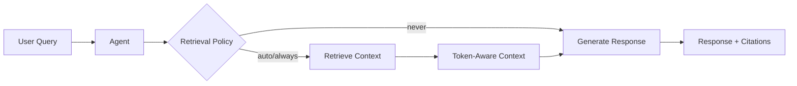

## Overview

The Agent-first retrieval system provides a unified way to configure how agents retrieve and use knowledge. All retrieval behavior is controlled through the `knowledge` parameter.



## Quick Start

```python
from praisonaiagents import Agent

agent = Agent(
    name="Research Agent",
    instructions="Answer questions based on the provided documents.",
    knowledge={
        "sources": ["docs/", "papers.pdf"],
        "retrieval_k": 5,        # Number of chunks to retrieve
        "rerank": True,          # Enable reranking for better results
    }
)

# Chat with automatic retrieval
response = agent.chat("What are the key findings?")
print(response)
```

## Knowledge Configuration

### Full Configuration Options

```python
from praisonaiagents import Agent, KnowledgeConfig

agent = Agent(
    name="Agent",
    instructions="You are a helpful assistant.",
    knowledge=KnowledgeConfig(
        # Knowledge sources
        sources=["documents/"],
        
        # Embedder configuration
        embedder="openai",
        embedder_config={"model": "text-embedding-3-small"},
        
        # Chunking strategy
        chunking_strategy="semantic",
        chunk_size=1000,
        chunk_overlap=200,
        
        # Retrieval parameters
        retrieval_k=5,                    # Number of chunks to retrieve
        retrieval_threshold=0.0,          # Minimum relevance score (0.0-1.0)
        
        # Reranking
        rerank=False,                     # Enable reranking for better relevance
        rerank_model=None,                # Custom rerank model
        
        # Auto-retrieval
        auto_retrieve=True,               # Automatically inject context
        
        # Vector store
        vector_store={"provider": "chroma", "collection_name": "default"},
    )
)
```

### Using Dict Configuration

```python
from praisonaiagents import Agent

# Simple configuration with dict
agent = Agent(
    name="Agent",
    knowledge={
        "sources": ["docs/"],
        "retrieval_k": 5,
        "retrieval_threshold": 0.3,
        "rerank": True,
    }
)
```

## Agent Methods

### `agent.chat()` - Conversational Interface

The default method for conversation with automatic retrieval.

```python
# Normal chat (uses auto-retrieval)
response = agent.chat("What is the main topic?")

# Force retrieval
response = agent.chat("Hello", force_retrieval=True)

# Skip retrieval
response = agent.chat("What is 2+2?", skip_retrieval=True)
```

### `agent.query()` - Structured Answer with Citations

Returns a structured result with answer, citations, and metadata.

```python
from praisonaiagents import Agent

agent = Agent(
    name="Research Agent",
    knowledge={
        "sources": ["research_paper.pdf"],
        "retrieval_k": 5,
    }
)

result = agent.query("What are the main findings?")

print(f"Answer: {result.answer}")
print(f"Context used: {len(result.context_used)} chars")

for citation in result.citations:
    print(f"  [{citation.id}] {citation.source}")
    print(f"      Score: {citation.score:.2f}")
    print(f"      Text: {citation.text[:100]}...")
```

### `agent.retrieve()` - Retrieval Only (No LLM)

Returns context without LLM generation. Useful for conditional retrieval workflows.

```python
# Retrieve context only
context_pack = agent.retrieve("What are the key points?")

print(f"Found {len(context_pack.citations)} sources")
print(f"Context: {context_pack.context[:500]}...")

# Use context in a custom workflow
if context_pack.citations:
    response = agent.chat(
        f"Based on this context, summarize: {context_pack.context}"
    )
```

## Multi-Agent with Shared Knowledge

Multiple agents can share the same knowledge base:

```python
from praisonaiagents import Agent
from praisonaiagents import Knowledge

# Create shared knowledge instance
shared_knowledge = Knowledge(config={
    "vector_store": {
        "provider": "chroma",
        "config": {"collection_name": "shared_docs"}
    }
})

# Index documents once
shared_knowledge.add("company_docs/")

# Multiple agents share the same knowledge
analyst = Agent(
    name="Analyst",
    instructions="Analyze data from documents.",
    knowledge={
        "sources": shared_knowledge,
        "retrieval_k": 10,
    }
)

summarizer = Agent(
    name="Summarizer", 
    instructions="Summarize key points.",
    knowledge={
        "sources": shared_knowledge,
        "retrieval_k": 5,
    }
)

# Both agents use the same indexed knowledge
analysis = analyst.chat("What trends do you see?")
summary = summarizer.chat("Summarize the main points")
```

## Advanced: Reranking

For better retrieval quality with large knowledge bases:

```python
agent = Agent(
    name="Research Agent",
    knowledge={
        "sources": ["large_corpus/"],
        "retrieval_k": 20,         # Retrieve more initially
        "rerank": True,            # Rerank to get best results
        "rerank_model": None,      # Uses default reranker
    }
)
```

## Next Steps

- [CLI Retrieval Commands](/docs/cli/retrieval) - Use retrieval from the command line
- [Knowledge Concepts](/docs/concepts/knowledge) - Learn about knowledge bases
- [Memory](/docs/concepts/memory) - Combine with agent memory
