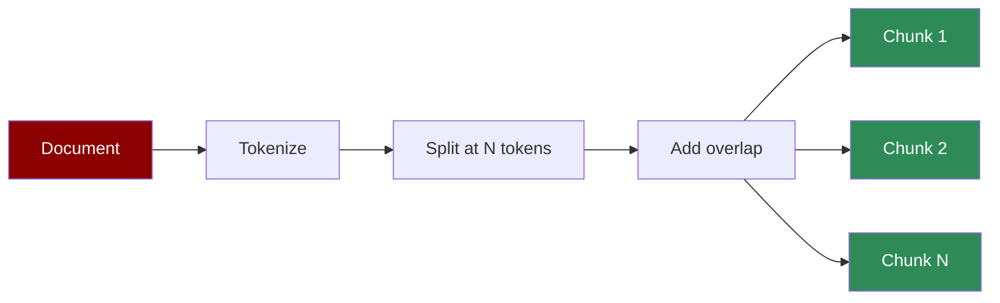

The simplest and fastest chunking strategy. Splits text into fixed-size token chunks with optional overlap.

## Quick Start

<CodeGroup>
```python Agent with Token Chunking
from praisonaiagents import Agent

agent = Agent(
    instructions="Answer questions from documents.",
    knowledge={
        "sources": ["document.pdf"],
        "chunker": {
            "type": "token",
            "chunk_size": 256,
            "chunk_overlap": 50
        }
    }
)

response = agent.start("Summarize the main points")
```

```python Direct API
from praisonaiagents.knowledge.chunking import Chunking

chunker = Chunking(
    chunker_type="token",
    chunk_size=256,
    chunk_overlap=50,
    tokenizer_or_token_counter="gpt2"
)

chunks = chunker.chunk("Your document text here...")
for chunk in chunks:
    print(f"Tokens: {chunk.token_count}")
    print(chunk.text[:100])
```
</CodeGroup>

## When to Use

<CardGroup cols={2}>
  <Card title="Good For" icon="check">
    - Speed-critical applications
    - Uniform chunk sizes needed
    - Simple documents without structure
    - High-volume processing
  </Card>
  <Card title="Consider Alternatives" icon="xmark">
    - Documents with natural sections
    - Topic-dependent content
    - Need semantic coherence
    - Complex nested structures
  </Card>
</CardGroup>

## Parameters

| Parameter | Type | Default | Description |
|-----------|------|---------|-------------|
| `chunk_size` | int | 512 | Number of tokens per chunk |
| `chunk_overlap` | int | 128 | Token overlap between chunks |
| `tokenizer` | str | `"gpt2"` | Tokenizer for counting tokens |

## Examples

### Small Chunks for Precision

```python
agent = Agent(
    instructions="Find specific details.",
    knowledge={
        "sources": ["technical_spec.pdf"],
        "chunker": {
            "type": "token",
            "chunk_size": 128,   # Small for precision
            "chunk_overlap": 32
        }
    }
)
```

### Large Chunks for Context

```python
agent = Agent(
    instructions="Understand overall themes.",
    knowledge={
        "sources": ["novel.txt"],
        "chunker": {
            "type": "token",
            "chunk_size": 1024,  # Large for context
            "chunk_overlap": 256
        }
    }
)
```

## How It Works



Token chunking is deterministic - the same document always produces the same chunks.
