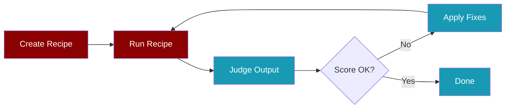

The Recipe Cycle Testing workflow helps you iteratively improve your AI agent recipes.



## Quick Start

<Steps>
  <Step title="Create a Recipe">
    ```bash
    praisonai recipe create "Research AI agent frameworks"
    ```
  </Step>
  <Step title="Run with Trace">
    ```bash
    praisonai recipe run my-recipe --save --name run1
    ```
  </Step>
  <Step title="Judge the Output">
    ```bash
    praisonai recipe judge run1 --yaml my-recipe/agents.yaml
    ```
  </Step>
  <Step title="Apply Fixes">
    ```bash
    praisonai recipe apply judge_plan.yaml --confirm
    ```
  </Step>
  <Step title="Repeat">
    Run cycles 2-5 until score reaches target threshold.
  </Step>
</Steps>

## Common Errors & Fixes

<AccordionGroup>
  <Accordion title="Tool Result Truncation">
    **Error**: `Tool 'tavily_search' result was truncated`
    
    **Cause**: Large search results exceed context window
    
    **Fix**: 
    - Use `--chunked` flag when judging
    - Reduce `max_results` in tool calls
    - Add instructions to summarize results
</Accordion>
  
  <Accordion title="Low Task Achievement Score">
    **Error**: `Task Achievement: 5.0/10`
    
    **Cause**: Agent output doesn't match expected format
    
    **Fix**:
    - Add clearer `expected_output` in steps
    - Include specific format requirements in action
    - Add verification instructions to backstory
</Accordion>
  
  <Accordion title="Hallucination Detected">
    **Error**: `Hallucination: 3.0/10`
    
    **Cause**: Agent generates unverified information
    
    **Fix**:
    - Add instruction to cite sources
    - Use `include_answer: true` in tavily_search
    - Add verification step in backstory
</Accordion>
  
  <Accordion title="Missing Goal">
    **Error**: `Recipe Goal: Not specified`
    
    **Cause**: No `goal` field in agents.yaml
    
    **Fix**: Add a clear, measurable goal:
    ```yaml
    goal: Research and compare top 5 AI frameworks
    ```
  </Accordion>
</AccordionGroup>

## Tool-Specific Fixes

<Tabs>
  <Tab title="tavily_search">
    **Issue**: Results truncated or incomplete
    
    ```yaml
    # Fix: Add specific instructions
    agents:
      researcher:
        backstory: |
          Expert researcher. Always verify completeness
          of search results before finalizing output.
          Cite sources for all claims.
    ```
  </Tab>
  <Tab title="search_web">
    **Issue**: Fallback to DuckDuckGo with limited results
    
    ```yaml
    # Fix: Set TAVILY_API_KEY for better results
    metadata:
      requires:
        env:
          - TAVILY_API_KEY
    ```
  </Tab>
  <Tab title="write_file">
    **Issue**: Approval required but not configured
    
    ```yaml
    # Fix: Add approve field
    approve:
      - write_file
    ```
  </Tab>
</Tabs>

## Cycle Results Example

| Cycle | Score | Fixes Applied | Key Issue |
|-------|-------|---------------|-----------|
| 1 | 7.5/10 | 2 | Tool truncation warnings |
| 2 | 6.67/10 | 6 | Hallucination detection |
| 3 | 4.5/10 | 5 | Output format issues |
| 4 | 4.5/10 | 5 | Verification needed |
| 5 | 4.5/10 | - | Stable, needs manual tuning |

<Note>
Cycle 1 achieved **7.5/10** with improved truncation detection. Subsequent cycles may vary based on LLM responses and tool result sizes.
</Note>

<Warning>
If scores plateau, manual intervention is needed. Review the backstory and action prompts directly.
</Warning>

## Best Practices

<CardGroup cols={2}>
  <Card title="Start Simple" icon="seedling">
    Use 1 agent for simple tasks. Add agents only when needed.
  </Card>
  <Card title="Be Specific" icon="bullseye">
    Use concrete values in actions, not variables.
  </Card>
  <Card title="Set Goals" icon="flag">
    Always include a measurable `goal` field.
  </Card>
  <Card title="Verify Output" icon="check">
    Add verification instructions to agent backstory.
  </Card>
</CardGroup>

## CLI Reference

```bash
# Create recipe
praisonai recipe create "goal" [--no-optimize]

# Run with trace
praisonai recipe run <name> --save --name <trace-id>

# Judge trace
praisonai recipe judge <trace-id> --yaml <file> [--chunked]

# Apply fixes
praisonai recipe apply <plan.yaml> --confirm

# Optimize (automated cycles)
praisonai recipe optimize <path> --iterations 5 --threshold 8.0
```
