Transform any topic into a comprehensive learning guide by automatically discovering, scraping, and synthesizing content from documentation, GitHub, StackOverflow, and blogs.


## Quick Start

<Tabs>
  <Tab title="CLI">
    ```bash
    praisonai recipe run ai-skill-generator \
      --var topic="react hooks"
    ```
  </Tab>
  <Tab title="Python">
    ```python
    from praisonai import recipe

    result = recipe.run(
        "ai-skill-generator",
        input={"topic": "kubernetes pods"}
    )
    print(result.output)
    ```
  </Tab>
</Tabs>

## How It Works

<Steps>
  <Step title="Source Discovery">
    AI-powered search finds **8 relevant URLs**:
    - 2 documentation sources
    - 2 GitHub repositories
    - 2 StackOverflow Q&As
    - 2 blog tutorials
  </Step>
  <Step title="Parallel Scraping">
    All 8 sources scraped simultaneously with **type-specific extraction**:
    - Docs → API references, examples
    - GitHub → Code patterns, implementations
    - StackOverflow → Problems, solutions
    - Blogs → Tutorials, explanations
  </Step>
  <Step title="AI Synthesis">
    Content combined into **SKILL.md** format:
    - Quick Start
    - Core Concepts
    - Essential Patterns
    - Common Pitfalls
  </Step>
</Steps>

## Source Types

```mermaid
flowchart TB
    subgraph Sources["8 Sources (2 each)"]
        D["📚 Docs"]
        G["💻 GitHub"]
        S["❓ StackOverflow"]
        B["📝 Blogs"]
    end
    
    D --> E1["API Reference"]
    D --> E2["Official Examples"]
    G --> E3["Code Patterns"]
    G --> E4["Implementations"]
    S --> E5["Common Problems"]
    S --> E6["Best Solutions"]
    B --> E7["Tutorials"]
    B --> E8["Deep Dives"]
    
    style D fill:#8B0000,color:#fff
    style G fill:#8B0000,color:#fff
    style S fill:#8B0000,color:#fff
    style B fill:#8B0000,color:#fff
    style E1 fill:#189AB4,color:#fff
    style E2 fill:#189AB4,color:#fff
    style E3 fill:#189AB4,color:#fff
    style E4 fill:#189AB4,color:#fff
    style E5 fill:#189AB4,color:#fff
    style E6 fill:#189AB4,color:#fff
    style E7 fill:#189AB4,color:#fff
    style E8 fill:#189AB4,color:#fff
```



## Agents

<CardGroup cols={3}>
  <Card title="Source Finder" icon="magnifying-glass">
    **Tool**: `identify_sources`
    
    Discovers 8 high-quality URLs
  </Card>
  <Card title="Scraper" icon="download">
    **Tool**: `scrape_source`
    
    Extracts content in parallel
  </Card>
  <Card title="Synthesizer" icon="wand-magic-sparkles">
    **Model**: GPT-4o-mini
    
    Creates SKILL.md output
  </Card>
</CardGroup>

## Output Format

The generated `SKILL-{topic}.md` follows Anthropic's format:

<AccordionGroup>
  <Accordion title="Quick Start" icon="rocket">
    Get up and running in minutes with installation commands and basic examples.
  </Accordion>
  <Accordion title="Core Concepts" icon="lightbulb">
    Essential knowledge everyone needs to understand the topic.
  </Accordion>
  <Accordion title="Essential Patterns" icon="code">
    Common usage patterns with working code examples.
  </Accordion>
  <Accordion title="Common Pitfalls" icon="triangle-exclamation">
    Mistakes to avoid and how to fix them.
  </Accordion>
</AccordionGroup>

## Configuration

<ParamField path="topic" type="string" required>
  The topic to generate a skill guide for.
  
  **Examples**: `"react hooks"`, `"kubernetes pods"`, `"python decorators"`
</ParamField>

<ParamField path="sources_per_type" type="integer" default="2">
  Number of sources to find per type (docs, github, stackoverflow, blog).
</ParamField>

<ParamField path="max_workers" type="integer" default="4">
  Maximum parallel scraping workers.
</ParamField>

## Requirements

<AccordionGroup>
  <Accordion title="Environment Variables" icon="key">
    ```bash
    export OPENAI_API_KEY="sk-..."
    ```
    
    <Tip>
    For better search results, also set:
    ```bash
    export TAVILY_API_KEY="tvly-..."
    ```
    </Tip>
  </Accordion>
  <Accordion title="Dependencies" icon="box">
    The recipe uses built-in tools from `praisonaiagents`:
    - `search_web` - Multi-provider search
    - `web_crawl` - Content extraction
    
    No additional packages required.
  </Accordion>
</AccordionGroup>

## Example Output

Running with `topic="react hooks"` produces:

```markdown
# React Hooks

> A comprehensive skill guide for React Hooks

---

## Quick Start

```bash
npm install react
```

```jsx
import { useState, useEffect } from 'react';

function Counter() {
  const [count, setCount] = useState(0);
  return <button onClick={() => setCount(count + 1)}>{count}</button>;
}
```

---

## Core Concepts

Hooks let you use state and other React features without writing a class...

---

## Essential Patterns

### useState Pattern
```jsx
const [state, setState] = useState(initialValue);
```

### useEffect Pattern
```jsx
useEffect(() => {
  // Side effect
  return () => { /* cleanup */ };
}, [dependencies]);
```

---

## Common Pitfalls

❌ **Don't call hooks conditionally**
```jsx
// Wrong
if (condition) {
  const [state, setState] = useState();
}
```

✅ **Always call at top level**
```jsx
// Correct
const [state, setState] = useState();
if (condition) {
  // use state here
}
```
```

## Pipeline Details

| Stage | Agent | Tool | Output |
|-------|-------|------|--------|
| **Discover** | source_finder | `identify_sources` | 8 URLs |
| **Scrape** | scraper (×8) | `scrape_source` | Content |
| **Synthesize** | synthesizer | — | SKILL.md |

<Info>
The scraping stage runs in **parallel** with up to 4 workers, making it fast even with 8 sources.
</Info>

## Custom Tools

The recipe includes these custom tools in `tools.py`:

| Tool | Signature | Description |
|------|-----------|-------------|
| `identify_sources` | `(topic: str) -> List[Dict]` | Find 8 URLs (2 per source type) |
| `scrape_source` | `(url: str, source_type: str) -> Dict` | Scrape with type-specific extraction |
| `format_skill_md` | `(content: Dict) -> str` | Format as SKILL.md |

## Related Recipes

<CardGroup cols={2}>
  <Card title="Research Pipeline" icon="flask" href="/docs/recipes/research-pipeline">
    Deep research with parallel keyword generation
  </Card>
  <Card title="URL to Blog" icon="link" href="/docs/recipes/url-to-blog">
    Transform URLs into blog posts
  </Card>
</CardGroup>
