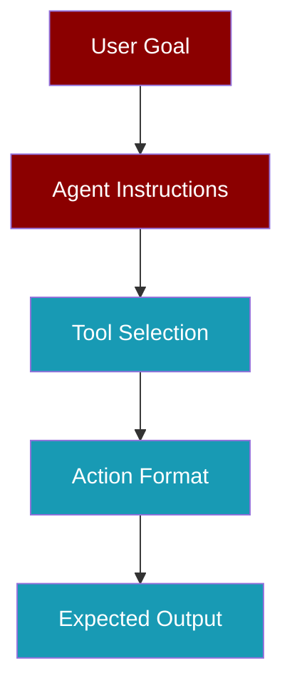

A strong prompt ensures your recipe agents complete tasks accurately.



## The Strong Prompt Template

<CodeGroup>
```yaml agents.yaml
metadata:
  name: my-recipe
  requires:
    env:
      - OPENAI_API_KEY

goal: [SPECIFIC, MEASURABLE GOAL]

agents:
  researcher:
    role: [SPECIFIC ROLE]
    goal: [AGENT-SPECIFIC GOAL]
    backstory: |
      [EXPERTISE DESCRIPTION]
      
      CRITICAL INSTRUCTIONS:
      1. Always verify completeness before finalizing output
      2. Cite sources for all factual claims
      3. Follow the exact output format specified
      4. If data is incomplete, state what is missing
      5. Never fabricate information
    tools:
      - [TOOL_NAME]
    llm: gpt-4o-mini

steps:
  - agent: researcher
    action: |
      Use [TOOL] to [SPECIFIC ACTION].
      Return [EXACT FORMAT] with:
      - [FIELD 1]
      - [FIELD 2]
      - [FIELD 3]
    expected_output: |
      [EXACT FORMAT DESCRIPTION]
```
</CodeGroup>

## Key Elements

<AccordionGroup>
  <Accordion title="1. Specific Goal">
    **Bad**: `Research AI`
    
    **Good**: `Research and compare the top 5 AI agent frameworks with features, pros, cons, and use cases`
  </Accordion>
  
  <Accordion title="2. Detailed Backstory">
    Include:
    - Expertise description
    - Verification requirements
    - Output format rules
    - Error handling instructions
</Accordion>
  
  <Accordion title="3. Concrete Actions">
    **Bad**: `Search for information about {{topic}}`
    
    **Good**: `Use tavily_search to find the top 5 AI agent frameworks released in 2024-2025. Return a numbered list with name, key features, and comparison.`
  </Accordion>
  
  <Accordion title="4. Exact Expected Output">
    **Bad**: `A report`
    
    **Good**: `A numbered list of 5 frameworks, each with: name, 3 key features, pros (2), cons (2), best use case`
  </Accordion>
</AccordionGroup>

## Example: Research Recipe

```yaml
metadata:
  name: ai-frameworks-research
  requires:
    env:
      - OPENAI_API_KEY
      - TAVILY_API_KEY

goal: Research and compare top 5 AI agent frameworks with features and use cases

agents:
  researcher:
    role: AI Framework Analyst
    goal: Find and compare the latest AI agent frameworks
    backstory: |
      Expert researcher specializing in AI frameworks and tools.
      
      CRITICAL INSTRUCTIONS:
      1. Verify all information before including in output
      2. Include source URLs for each framework
      3. Compare frameworks objectively
      4. If search results are incomplete, make additional searches
      5. Format output exactly as specified
    tools:
      - tavily_search
    llm: gpt-4o-mini

steps:
  - agent: researcher
    action: |
      Use tavily_search to find the top 5 AI agent frameworks in 2024-2025.
      For each framework, find: name, key features, pros, cons, best use case.
      Return a numbered list with all details and source URLs.
    expected_output: |
      A numbered list of 5 AI frameworks:
      1. [Name]
         - Features: [3 key features]
         - Pros: [2 advantages]
         - Cons: [2 disadvantages]
         - Best for: [use case]
         - Source: [URL]
```

## Prompt Checklist

<Steps>
  <Step title="Goal is Specific">
    Can you measure if the goal was achieved?
  </Step>
  <Step title="Backstory has Instructions">
    Does it include verification and format rules?
  </Step>
  <Step title="Action is Concrete">
    No variables, specific tool and format?
  </Step>
  <Step title="Expected Output is Exact">
    Describes the exact structure?
  </Step>
</Steps>

<Tip>
Run `praisonai recipe judge` after each run to identify prompt weaknesses.
</Tip>
