Extract content from any URL and transform it into a comprehensive, interactive blog post automatically published to WordPress.

```mermaid
flowchart LR
    A["🔗 URL"] --> B["📥 Extract"]
    B --> C["🔎 Research"]
    C --> D["📝 Write"]
    D --> E["📤 Publish"]
    
    style A fill:#8B0000,color:#fff
    style B fill:#189AB4,color:#fff
    style C fill:#189AB4,color:#fff
    style D fill:#189AB4,color:#fff
    style E fill:#8B0000,color:#fff
```



## Quick Start

<Tabs>
  <Tab title="With URL">
    ```bash
    praisonai recipe run url-to-blog-generator \
      --var url="https://example.com/article"
    ```
  </Tab>
  <Tab title="Auto Topic">
    ```bash
    praisonai recipe run url-to-blog-generator
    ```
    Without a URL, searches for trending AI topics.
  </Tab>
</Tabs>

## Pipeline Stages

<Steps>
  <Step title="URL Extraction">
    Uses Tavily Extract to get:
    - Full page content
    - Key points and arguments
    - Data and statistics
    - Quotes and statements
  </Step>
  <Step title="Research">
    Tavily search finds 10 related sources:
    - Additional context
    - Expert opinions
    - Recent developments
    - Practical applications
  </Step>
  <Step title="Image Description">
    Creates an infographic prompt:
    - Visualizes main concepts
    - Clean, modern design
    - Key data points
  </Step>
  <Step title="Blog Writing">
    Generates Gutenberg-formatted post:
    - Tables for data
    - Lists for key points
    - Source attribution
    - British English
  </Step>
  <Step title="WordPress Publish">
    Publishes to WordPress:
    - Category: AI
    - Author: praison
    - Status: publish
  </Step>
</Steps>

## Agents

<CardGroup cols={2}>
  <Card title="URL Crawler" icon="spider-web">
    **Tools**: tavily_extract, tavily_search
    
    Extracts content from any URL
  </Card>
  <Card title="Researcher" icon="magnifying-glass">
    **Tool**: tavily_search
    
    Finds 10 related sources
  </Card>
  <Card title="Image Generator" icon="palette">
    **Model**: GPT-4o-mini
    
    Creates infographic descriptions
  </Card>
  <Card title="Blog Writer" icon="pen">
    **Model**: GPT-4o-mini
    
    Writes Gutenberg-formatted posts
  </Card>
</CardGroup>

## Requirements

<AccordionGroup>
  <Accordion title="Environment Variables" icon="key">
    ```bash
    export OPENAI_API_KEY="sk-..."
    export TAVILY_API_KEY="tvly-..."
    ```
  </Accordion>
  <Accordion title="WordPress Setup" icon="wordpress">
    Requires `praisonaiwp` CLI configured:
    ```bash
    pip install praisonaiwp
    praisonaiwp config --site mer.vin --user praison
    ```
  </Accordion>
</AccordionGroup>

## Example Output

| Metric | Value |
|--------|-------|
| **Judge Score** | 7.63/10 |
| **Agents** | 5 |
| **Steps** | 5 |
| **Tokens** | ~2500 |

<Tip>
Works best with article URLs that have clear, structured content. News sites, blogs, and documentation pages work well.
</Tip>

## Related Recipes

<CardGroup cols={2}>
  <Card title="Image to Blog" icon="image" href="/docs/recipes/image-to-blog">
    Generate blogs from images
  </Card>
  <Card title="WordPress Publisher" icon="wordpress" href="/docs/recipes/wordpress-publisher">
    Standalone publishing module
  </Card>
</CardGroup>
