A2A (Agent-to-Agent) enables standardized communication between agents.

```mermaid
graph LR
    subgraph "A2A Protocol"
        A1[🤖 Agent 1] <--> P[📡 A2A]
        P <--> A2[🤖 Agent 2]
    end
    
    classDef agent fill:#6366F1,stroke:#7C90A0,color:#fff
    classDef protocol fill:#F59E0B,stroke:#7C90A0,color:#fff
    
    class A1,A2 agent
    class P protocol
```



## Quick Start

<Steps>
<Step title="Create an Agent with A2A Card">
```rust
use praisonai::{Agent, A2A, A2AAgentCard};

// First create your agent
let agent = Agent::new()
    .name("Support Agent")
    .instructions("Help users with support questions")
    .build()?;

// Create A2A card for discovery
let card = A2AAgentCard::new()
    .name("Support Agent")
    .description("Handles customer support")
    .url("http://localhost:8080");

// Start A2A server
let a2a = A2A::new()
    .card(card)
    .build()?;
```
</Step>

<Step title="Connect to Remote Agent">
```rust
use praisonai::A2A;

// Connect to another agent
let remote = A2A::connect("http://agent-b:8080").await?;

// Send a task
let task = remote.create_task("Summarize this document").await?;
let result = remote.get_task_result(&task.id).await?;
```
</Step>
</Steps>

---

## A2A Components

| Component | Description |
|-----------|-------------|
| `A2AAgentCard` | Agent's public identity and capabilities |
| `A2ATask` | Work unit sent between agents |
| `A2A` | Protocol handler for communication |

---

## Related

<CardGroup cols={2}>
  <Card title="Handoffs" icon="arrow-right-arrow-left" href="/docs/rust/handoffs">
    Agent delegation
  </Card>
  <Card title="Agent Teams" icon="users" href="/docs/rust/agent-team">
    Multi-agent
  </Card>
</CardGroup>
