A2A enables agents to communicate and collaborate with each other directly.

```mermaid
graph LR
    subgraph "A2A Communication"
        A1[🤖 Agent A] --> M[📨 Message]
        M --> A2[🤖 Agent B]
        A2 --> R[📬 Response]
        R --> A1
    end
    
    classDef agent fill:#6366F1,stroke:#7C90A0,color:#fff
    classDef message fill:#F59E0B,stroke:#7C90A0,color:#fff
    
    class A1,A2 agent
    class M,R message
```



## Quick Start

<Steps>
<Step title="Create Communicating Agents">
```rust
use praisonai::{Agent, a2a::A2AChannel};

let researcher = Agent::new()
    .name("researcher")
    .build()?;

let writer = Agent::new()
    .name("writer")
    .build()?;

let channel = A2AChannel::new();
channel.connect(&researcher, &writer);
```
</Step>

<Step title="Send Messages">
```rust
use praisonai::a2a::{A2AMessage, A2AChannel};

// Agent A sends to Agent B
channel.send(A2AMessage::new(
    "researcher",
    "writer",
    "Here is the research data..."
)).await?;

// Agent B receives
let msg = channel.receive("writer").await?;
println!("From {}: {}", msg.from, msg.content);
```
</Step>
</Steps>

---

## How It Works


---

## Configuration Options

```rust
use praisonai::a2a::{A2AConfig, A2AChannel};

let config = A2AConfig::new()
    .timeout_seconds(30)
    .max_queue_size(100)
    .async_mode(true);

let channel = A2AChannel::with_config(config);
```

| Option | Type | Default | Description |
|--------|------|---------|-------------|
| `timeout_seconds` | `u64` | `60` | Message timeout |
| `max_queue_size` | `usize` | `1000` | Queue capacity |
| `async_mode` | `bool` | `true` | Async delivery |

---

## Best Practices

<AccordionGroup>
  <Accordion title="Define clear message formats">
    Use structured messages so agents understand each other.
  </Accordion>
  
  <Accordion title="Handle timeouts gracefully">
    Set appropriate timeouts and handle message delivery failures.
  </Accordion>
  
  <Accordion title="Avoid circular dependencies">
    Design agent communication to prevent infinite loops.
  </Accordion>
</AccordionGroup>

---

## Related

<CardGroup cols={2}>
  <Card title="Handoffs" icon="arrows-repeat" href="/docs/rust/handoffs">
    Agent handoffs
  </Card>
  <Card title="Workflows" icon="sitemap" href="/docs/rust/workflows">
    Multi-agent workflows
  </Card>
</CardGroup>
