A2A (Agent-to-Agent) enables standardized communication between agents.

```mermaid
graph LR
    subgraph "A2A Protocol"
        A1[🤖 Agent 1] <--> P[📡 A2A]
        P <--> A2[🤖 Agent 2]
    end
    
    classDef agent fill:#6366F1,stroke:#7C90A0,color:#fff
    classDef protocol fill:#F59E0B,stroke:#7C90A0,color:#fff
    
    class A1,A2 agent
    class P protocol
```



## Quick Start

<Steps>
<Step title="Enable A2A">
```rust
use praisonai::{Agent, A2AConfig};

let agent = Agent::new()
    .name("Agent A")
    .a2a(true)  // Enable A2A protocol
    .build()?;
```
</Step>

<Step title="Connect Agents">
```rust
use praisonai::A2AClient;

let client = A2AClient::connect("http://agent-b:8080").await?;
let response = client.send("Hello from Agent A").await?;
```
</Step>
</Steps>

---

## Protocol Features

| Feature | Description |
|---------|-------------|
| Discovery | Find other agents |
| Messaging | Send/receive messages |
| Tasks | Delegate work |
| State | Share context |

---

## Related

<CardGroup cols={2}>
  <Card title="Handoffs" icon="arrow-right-arrow-left" href="/docs/rust/handoffs">
    Agent delegation
  </Card>
  <Card title="Agent Teams" icon="users" href="/docs/rust/agent-team">
    Multi-agent
  </Card>
</CardGroup>
