Agent Flow provides a visual way to build complex agent workflows.

```mermaid
graph LR
    subgraph "Agent Flow"
        S[📥 Start] --> A1[🤖 Agent 1]
        A1 --> C{Check}
        C --> A2[🤖 Agent 2]
        C --> A3[🤖 Agent 3]
        A2 --> E[📤 End]
        A3 --> E
    end
    
    classDef io fill:#6366F1,stroke:#7C90A0,color:#fff
    classDef agent fill:#F59E0B,stroke:#7C90A0,color:#fff
    
    class S,E io
    class A1,A2,A3,C agent
```



## Quick Start

<Steps>
<Step title="Define Flow">
```rust
use praisonai::AgentFlow;

let flow = AgentFlow::new()
    .start(intake_agent)
    .then(router_agent)
    .branch(|result| {
        if result.contains("technical") {
            tech_agent
        } else {
            general_agent
        }
    })
    .end();

flow.run("Help me with something").await?;
```
</Step>
</Steps>

---

## Flow Components

| Component | Description |
|-----------|-------------|
| `start(agent)` | Entry point |
| `then(agent)` | Sequential step |
| `branch(fn)` | Conditional routing |
| `parallel([agents])` | Run in parallel |
| `loop(agent)` | Repeat until done |

---

## Related

<CardGroup cols={2}>
  <Card title="Workflows" icon="sitemap" href="/docs/rust/flow">
    Workflow patterns
  </Card>
  <Card title="Conditions" icon="code-branch" href="/docs/rust/conditions">
    Conditional logic
  </Card>
</CardGroup>
