```mermaid
graph LR
    Input[📝 Input] --> Check{Check Condition}
    Check -->|True| AgentA[🤖 Agent A]
    Check -->|False| AgentB[🤖 Agent B]
    
    classDef decision fill:#F59E0B,stroke:#7C90A0,color:#fff
    classDef agent fill:#8B0000,stroke:#7C90A0,color:#fff
    
    class Check decision
    class AgentA,AgentB agent
```

```mermaid
graph LR
    Input[📝 Input] --> A1[🤖 Agent 1]
    Input --> A2[🤖 Agent 2]
    Input --> A3[🤖 Agent 3]
    A1 --> Combine[📋 Combine]
    A2 --> Combine
    A3 --> Combine
    
    classDef agent fill:#8B0000,stroke:#7C90A0,color:#fff
    classDef combine fill:#10B981,stroke:#7C90A0,color:#fff
    
    class A1,A2,A3 agent
    class Combine combine
```

```mermaid
graph LR
    Input[📝 Input] --> R1[🔄 Pass 1]
    R1 --> R2[🔄 Pass 2]
    R2 --> R3[🔄 Pass 3]
    R3 --> Output[✅ Output]
    
    classDef pass fill:#F59E0B,stroke:#7C90A0,color:#fff
    classDef io fill:#10B981,stroke:#7C90A0,color:#fff
    
    class R1,R2,R3 pass
    class Input,Output io
```

AgentFlow provides advanced workflow patterns for complex agent orchestration.

```mermaid
graph TB
    subgraph "AgentFlow Patterns"
        Input[📝 Input] --> Route{🔀 Route}
        Route -->|Pattern A| Agent1[🤖 Agent 1]
        Route -->|Pattern B| Agent2[🤖 Agent 2]
        Agent1 --> Parallel[⚡ Parallel]
        Agent2 --> Parallel
        Parallel --> Loop[🔄 Loop]
        Loop --> Output[✅ Output]
    end
    
    classDef input fill:#6366F1,stroke:#7C90A0,color:#fff
    classDef route fill:#F59E0B,stroke:#7C90A0,color:#fff
    classDef agent fill:#8B0000,stroke:#7C90A0,color:#fff
    classDef output fill:#10B981,stroke:#7C90A0,color:#fff
    
    class Input input
    class Route,Parallel,Loop route
    class Agent1,Agent2 agent
    class Output output
```



## Quick Start

<Steps>

<Step title="Simple Flow">
```rust
use praisonai::{Agent, AgentFlow};

let flow = AgentFlow::new()
    .agent(Agent::simple("Process the input")?)
    .agent(Agent::simple("Enhance the output")?);

let result = flow.run("Hello world").await?;
```
</Step>

<Step title="With Patterns">
```rust
use praisonai::{AgentFlow, FlowStep, Route, Parallel};
use std::sync::Arc;

let agent = Arc::new(Agent::simple("Handle this")?);

let flow = AgentFlow::new()
    .step(FlowStep::Route(Route {
        condition: Box::new(|input| input.contains("urgent")),
        if_true: Arc::clone(&agent),
        if_false: None,
    }));
```
</Step>

</Steps>

---

## Flow Patterns

### Route

Conditional branching based on input:

```rust
use praisonai::{AgentFlow, FlowStep, Route};
use std::sync::Arc;

let urgent_handler = Arc::new(Agent::simple("Handle urgent requests")?);
let normal_handler = Arc::new(Agent::simple("Handle normal requests")?);

let flow = AgentFlow::new()
    .step(FlowStep::Route(Route {
        condition: Box::new(|input| input.contains("urgent")),
        if_true: urgent_handler,
        if_false: Some(normal_handler),
    }));

let result = flow.run("This is urgent!").await?;
```



---

### Parallel

Execute multiple agents simultaneously:

```rust
use praisonai::{AgentFlow, FlowStep, Parallel};
use std::sync::Arc;

let analyzer1 = Arc::new(Agent::simple("Analyze sentiment")?);
let analyzer2 = Arc::new(Agent::simple("Extract keywords")?);
let analyzer3 = Arc::new(Agent::simple("Summarize content")?);

let flow = AgentFlow::new()
    .step(FlowStep::Parallel(Parallel {
        agents: vec![analyzer1, analyzer2, analyzer3],
    }));

let result = flow.run("Analyze this text").await?;
```



---

### Loop

Iterate over a collection:

```rust
use praisonai::{AgentFlow, FlowStep, Loop};
use std::sync::Arc;

let processor = Arc::new(Agent::simple("Process this item")?);

let flow = AgentFlow::new()
    .step(FlowStep::Loop(Loop {
        agent: processor,
        items: vec!["Item 1".into(), "Item 2".into(), "Item 3".into()],
    }));

let result = flow.run("Process all items").await?;
```

---

### Repeat

Execute the same agent multiple times:

```rust
use praisonai::{AgentFlow, FlowStep, Repeat};
use std::sync::Arc;

let refiner = Arc::new(Agent::simple("Improve and refine this text")?);

let flow = AgentFlow::new()
    .step(FlowStep::Repeat(Repeat {
        agent: refiner,
        times: 3,  // Refine 3 times
    }));

let result = flow.run("Initial draft").await?;
```



---

## Combining Patterns

Chain multiple patterns:

```rust
let flow = AgentFlow::new()
    .agent(Agent::simple("Preprocess")?)           // Simple step
    .step(FlowStep::Parallel(Parallel { ... }))    // Parallel analysis
    .step(FlowStep::Route(Route { ... }))          // Conditional
    .agent(Agent::simple("Finalize")?);            // Final step

let result = flow.run("Input").await?;
```

---

## FlowStep Types

| Type | Purpose | When to Use |
|------|---------|-------------|
| `Agent` | Single agent step | Simple processing |
| `Route` | Conditional branch | Different paths based on input |
| `Parallel` | Concurrent execution | Independent analyses |
| `Loop` | Iterate over items | Process collections |
| `Repeat` | Multiple passes | Iterative refinement |

---

## Best Practices

<AccordionGroup>
  <Accordion title="Start simple">
    Begin with linear flows, add patterns as needed.
  </Accordion>
  
  <Accordion title="Use Arc for shared agents">
    Wrap agents in Arc when they're used in multiple steps.
  </Accordion>
  
  <Accordion title="Test patterns individually">
    Verify each pattern works before combining.
  </Accordion>
</AccordionGroup>

---

## Related

<CardGroup cols={2}>
  <Card title="AgentTeam" icon="users" href="/docs/rust/agent-team">
    Simpler multi-agent coordination
  </Card>
  <Card title="Agent" icon="robot" href="/docs/rust/agent">
    Individual agent API
  </Card>
</CardGroup>
