AgentTeam orchestrates multiple agents to work together on complex tasks.

```mermaid
graph LR
    subgraph "AgentTeam (Sequential)"
        Task[📝 Task] --> R[🔍 Researcher]
        R --> W[✍️ Writer]
        W --> E[📝 Editor]
        E --> Result[✅ Result]
    end
    
    classDef task fill:#6366F1,stroke:#7C90A0,color:#fff
    classDef agent fill:#8B0000,stroke:#7C90A0,color:#fff
    classDef result fill:#10B981,stroke:#7C90A0,color:#fff
    
    class Task task
    class R,W,E agent
    class Result result
```



## Quick Start

<Steps>

<Step title="Create Team">
```rust
use praisonai::{Agent, AgentTeam, Process};

let team = AgentTeam::new()
    .agent(Agent::simple("Research topics thoroughly")?)
    .agent(Agent::simple("Write engaging content")?)
    .agent(Agent::simple("Edit for clarity")?)
    .process(Process::Sequential)
    .build();
```
</Step>

<Step title="Run Team">
```rust
let result = team.start("Write about AI in healthcare").await?;
println!("{}", result);
```
</Step>

</Steps>

---

## Process Types


| Process | Description | Use Case |
|---------|-------------|----------|
| `Sequential` | One after another | Pipeline (research → write → edit) |
| `Parallel` | All at once | Independent analysis |
| `Hierarchical` | Manager delegates | Complex coordination |

---

## Examples

### Sequential Pipeline

```rust
use praisonai::{Agent, AgentTeam, Process};

let researcher = Agent::new()
    .name("researcher")
    .instructions("Find accurate information on topics")
    .build()?;

let writer = Agent::new()
    .name("writer")
    .instructions("Write clear, engaging articles")
    .build()?;

let editor = Agent::new()
    .name("editor")
    .instructions("Edit for grammar and clarity")
    .build()?;

let team = AgentTeam::new()
    .agent(researcher)
    .agent(writer)
    .agent(editor)
    .process(Process::Sequential)
    .build();

let article = team.start("Write about quantum computing").await?;
```

### Parallel Analysis

```rust
use praisonai::{Agent, AgentTeam, Process};

let team = AgentTeam::new()
    .agent(Agent::simple("Analyze from technical perspective")?)
    .agent(Agent::simple("Analyze from business perspective")?)
    .agent(Agent::simple("Analyze from user perspective")?)
    .process(Process::Parallel)
    .build();

let analysis = team.start("Evaluate this product idea").await?;
```

---

## Builder Methods

| Method | Type | Description |
|--------|------|-------------|
| `.agent(agent)` | `Agent` | Add an agent |
| `.process(p)` | `Process` | Set execution order |
| `.verbose(bool)` | `bool` | Enable logging |
| `.build()` | - | Create the team |

---

## Context Passing

In sequential mode, each agent receives the previous agent's output:


---

## Best Practices

<AccordionGroup>
  <Accordion title="Specialized agents">
    Give each agent a focused role for better results.
  </Accordion>
  
  <Accordion title="Clear handoffs">
    Sequential agents should have complementary instructions.
  </Accordion>
  
  <Accordion title="Use parallel for independence">
    Only use parallel when agents don't depend on each other.
  </Accordion>
</AccordionGroup>

---

## Related

<CardGroup cols={2}>
  <Card title="Agent" icon="robot" href="/docs/rust/agent">
    Individual agent API
  </Card>
  <Card title="AgentFlow" icon="diagram-project" href="/docs/rust/agent-flow">
    Advanced workflow patterns
  </Card>
</CardGroup>
